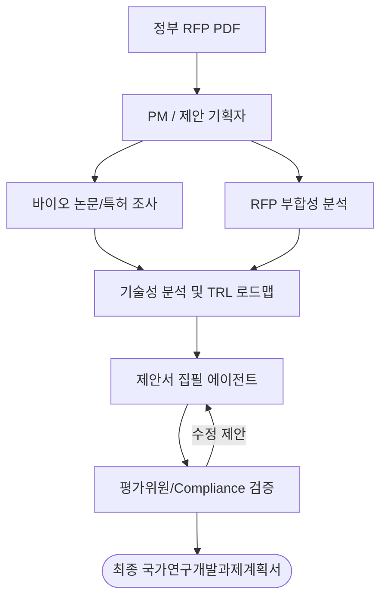

# 바이오 국가과제 수주 연구기획 워크플로우 (Bio-R&D Proposal Workflow)

> 정부 부처(과학기술정보통신부, 보건복지부 등) 국가 R&D 과제 수주를 위한 바이오 연구제안서(RFP) 분석, 특허 및 생명과학 논문 조사, 연구계획서 작성을 수행하는 지능형 멀티 에이전트 작업공간입니다.

## 에이전트 토폴로지 및 역할 분담 (Agent Topology)

국가과제 평가지표에 맞춘 제안서 작성을 위해 다음과 같이 전문 에이전트를 조율합니다.

### 에이전트 역할 및 권한
- **PM / 제안 기획자** ([pm](file:///Users/och/.agents/skills/oma-pm/SKILL.md)): 정부 공고 RFP를 기반으로 연구 목표 및 연차별 마일스톤(TRL 단계)을 수립하고 기획 태스크를 분배합니다.
- **바이오 논문/특허 조사** ([scholar](file:///Users/och/.agents/skills/oma-scholar/SKILL.md)): PubMed, BioRxiv, USPTO 특허를 검색하여 표적 바이오마커, 전임상/임상 데이터, 기술적 독창성 근거를 수집하고 `.knows.yaml` 형태로 축적합니다.
- **RFP 부합성 분석** ([market](file:///Users/och/.agents/skills/oma-market/SKILL.md)): 국가 연구개발 공고문(RFP) 요구사항과 제안 연구의 기술 수준을 비교하여 공백 영역 및 필수 부합 항목 매트릭스를 구성합니다.
- **제안서 집필 에이전트** ([academic-writer](file:///Users/och/.agents/skills/oma-academic-writer/SKILL.md)): 국가연구개발과제계획서 표준 양식에 맞추어 **정부 과제 전용 공식 문체(개조식 문장 및 명사형 종결어미)**로 제안서를 작성합니다.
- **평가위원/Compliance 검증** ([qa](file:///Users/och/.agents/skills/oma-qa/SKILL.md)): 국가 R&D 평가지표(가점 요인, 예산 적정성, 규제 대응 - 생명윤리 IRB/IACUC, 기술성숙도 TRL 증빙) 부합 여부를 사전 평가합니다.

---

## 핵심 운영 원칙 (Core Principles)

1. **RFP 100% 매핑 (RFP Alignment)**: 정부가 제시한 연구 범위 및 최종 성과 지표(논문, 특허, 기술이전 등)와 연구 계획을 1:1로 정확하게 매핑합니다.
2. **기술성숙도(TRL) 실증 (TRL Verification)**: 연구 시작 시점 TRL과 종료 시점 TRL을 명확히 제시하고, 단계별 검증 방법(In vitro, In vivo, 임상 Phase)을 학술적으로 증명합니다.
3. **정부 과제 공식 문체 준수 (Official R&D Prose)**: 모호하거나 주관적인 수식어(예: 세계 최초, 혁신적)를 배제하고, 명확한 수치 정보와 개조식 형태로 가독성을 극대화합니다.
4. **생명윤리 및 규제 준수 (Bio-Compliance)**: IRB(인간대상연구), IACUC(동물실험), LMO(유전자변형생물체) 등 바이오 연구 필수 심의 일정을 마일스톤에 반영합니다.

---

## 작업 공간 구조 (Workspace Map)

- [ARCHITECTURE.md](ARCHITECTURE.md) — 국가과제 제안서 파이프라인 및 데이터 흐름도.
- [docs/PLANS.md](docs/PLANS.md) — 바이오 연구기획 계획서 작성 규칙.
- [docs/design-docs/core-beliefs.md](docs/design-docs/core-beliefs.md) — 생명과학 연구 윤리 및 제안 신뢰성 원칙.
- [docs/plans/designs/001-research-workflow-design.md](docs/plans/designs/001-research-workflow-design.md) — 바이오 논문, 특허 메타데이터 및 RFP 매핑 스키마 설계.
- [docs/plans/work/tech-debt-tracker.md](docs/plans/work/tech-debt-tracker.md) — RFP 미충족 요건 및 기술 장벽 극복 계획 트래커.
- [docs/CODE-REVIEW.md](docs/CODE-REVIEW.md) — R&D 평가위원 기준 사전 검증 및 국가과제 문체 체크리스트.
- [docs/QUALITY-SCORE.md](docs/QUALITY-SCORE.md) — 연구 타당성, 차별성, 사업성 평가 루브릭.
- [docs/SECURITY.md](docs/SECURITY.md) — 기밀 바이오 데이터 및 특허 출원 정보 보안 지침.
