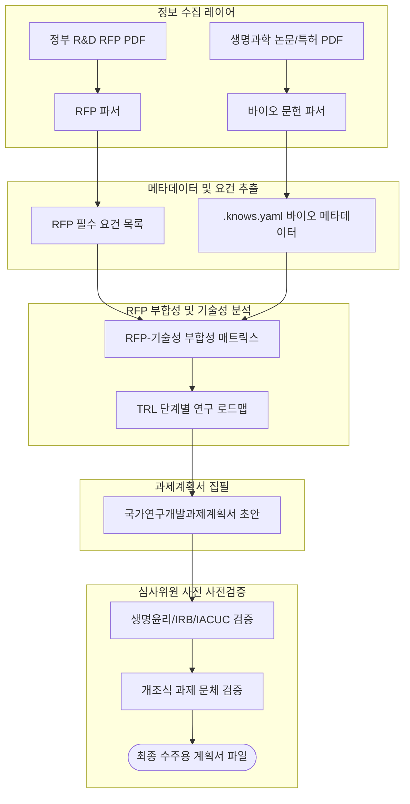

# 바이오 국가과제 제안서 아키텍처 (Bio-R&D Architecture)

이 문서는 국가 R&D 과제 공고(RFP) 분석부터 최종 과제계획서 작성까지의 바이오 연구기획 파이프라인 아키텍처를 정의합니다.

## 레이어 정의 및 데이터 흐름

### 1. 정보 수집 레이어 (Ingestion Layer)
- **대상**: 정부 부처 공고 RFP 문서, 표적 바이오 및 의학 논문(PubMed/PMC), 핵심 선행특허문서.
- **역할**: 비정형 텍스트 데이터를 구조화된 텍스트로 정규화하고 관련 표/그림 데이터를 분리합니다.

### 2. 메타데이터 및 요건 추출 (Extraction Layer)
- **대상**: 정규화된 문서 데이터.
- **역할**: 
  - 정부 RFP에서 **필수 연구 목표, 지원 규모, 연차별 성과 기준, 지원 조건**을 자동으로 파싱하여 리스트화합니다.
  - 생명과학 논문에서 **표적 유전자/단백질, 적용 동물모델(Animal Model), 투여 경로 및 농도(Dose), TRL 성적**을 발췌해 `.knows.yaml` 파일로 매핑합니다.

### 3. RFP 부합성 및 기술성 분석 (Synthesis Layer)
- **역할**: 
  - 추출된 RFP 요건과 매핑 가능한 선행 바이오 기술 데이터의 정합성을 측정하여 `rfp-alignment-matrix.md`를 구성합니다.
  - 1차년도(In vitro), 2차년도(In vivo), 3차년도(전임상 독성/효능평가) 등으로 이어지는 TRL 연차별 마일스톤 로드맵을 작성합니다.

### 4. 과제계획서 집필 (Drafting Layer)
- **역할**: 정부 표준 과제계획서의 각 섹션(연구개발 필요성, 연구개발 목표 및 내용, 연구개발 성과 활용방안 등)을 작성합니다.

### 5. 심사위원 사전 사전검증 (Verification Layer)
- **역할**: 
  - 바이오 R&D 계획서 심사 기준인 **독창성, 연구 설계의 타당성, 연구비 책정의 적절성, 생명윤리 규정 준수 여부**를 엄격히 필터링합니다.
  - 가독성을 극대화하기 위해 개조식 표현 및 가시적 표/다이어그램 배치 규칙을 검증합니다.
