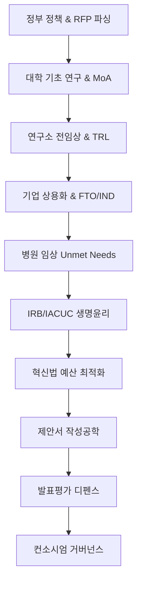

# 산·학·연·병 바이오 R&D 국가과제 수주 실무 핸드북 (통합 Portal)

> **본 핸드북은 대학(학), 연구소(연), 기업(민간/산), 병원(병)이 공동으로 국가 바이오 R&D 과제를 기획하고 최종 수주(선정 99점 목표)하기 위해 필요한 10대 핵심 실무 가이드를 통합 매핑한 마스터 가이드라인입니다.**
> 아래의 각 장은 세부 에이전트를 통해 집필된 약 10페이지 분량(총 100페이지 상당)의 전문 가이드라인으로 연결되어 있습니다.

---

## 🗺️ 전체 챕터 로드맵 & 요약

---

## 📂 챕터별 세부 실무 가이드 (상세 링크)

### 📌 제1장. 정부 R&D 정책 분석 및 RFP 정밀 파싱 가이드
- **핵심 타겟**: 총괄 기획자, 기업 전략 부서
- **요약**: 국가 바이오 5개년 계획 및 부처별(과기정통부, 보건복지부, 산업부) 공고의 성격 해체. 공고문(RFP) 내 명시되지 않은 숨은 가점, 핵심 정량 지표 추출 기법 및 필수 매핑 프레임워크 제공.
- **상세 문서 바로가기**: [ch01_policy_structure.md](file:///Users/och/Desktop/오창현/코딩/research-planning/docs/plans/designs/handbook/ch01_policy_structure.md)

### 📌 제2장. 대학 기초연구 지원 체계 및 표적 검증 전략
- **핵심 타겟**: 대학교수(PI), 포스트닥터, 연구원
- **요약**: 기초 단계 학술 독창성(Novelty) 도출을 위한 문헌 MeSH 네트워크 스크리닝. 작용 기전(MoA) 검증에 필수적인 열역학 및 반응 속도론 수식($K_D$, $IC_{50}$ to $K_i$ 변환) 및 선행 데이터의 통계적 유의성(Rigor, Z'-factor, 검정력) 설계 가이드.
- **상세 문서 바로가기**: [ch02_univ_basic_research.md](file:///Users/och/Desktop/오창현/코딩/research-planning/docs/plans/designs/handbook/ch02_univ_basic_research.md)

### 📌 제3장. 연구소 전임상 최적화 및 TRL 마일스톤 설계
- **핵심 타겟**: 국책/민간 연구소 책임연구원
- **요약**: 선도물질(Lead) 도출, In vitro/In vivo 효능 검증 프로세스. 데이터 편향 통제(G*Power 기반 동물 수 산정) 및 기술성숙도(TRL) 단계별(TRL 1~5) 구체적 마일스톤 설계와 기술이전(Tech Transfer) 패키징 전략.
- **상세 문서 바로가기**: [ch03_inst_preclinical.md](file:///Users/och/Desktop/오창현/코딩/research-planning/docs/plans/designs/handbook/ch03_inst_preclinical.md)

### 📌 제4장. 기업 상용화 기획, FTO 및 IND 대응 전략
- **핵심 타겟**: 기업 연구소장, 사업개발(BD) 담당자, RA 전문가
- **요약**: 특허 선행조사 및 FTO(Freedom to Operate) 장벽 극복 전략. 공정개발(CMC) 기획(MCB/WCB 구축, GMP 적합성) 및 비임상-임상 진입을 위한 IND(임상시험계획) 신청 가이드 및 ROI 분석.
- **상세 문서 바로가기**: [ch04_corp_commercialization.md](file:///Users/och/Desktop/오창현/코딩/research-planning/docs/plans/designs/handbook/ch04_corp_commercialization.md)

### 📌 제5장. 병원 중개·임상연구 기획 및 Unmet Needs 정의
- **핵심 타겟**: 병원 임상의사(MD-PhD), 중개연구소원
- **요약**: 임상 현장의 미충족 수요(Unmet Clinical Needs) 정의 프로세스. 인체유래물(조직, 혈액 등) 및 바이오뱅크 분양·연계 연구 설계. 연구자 주도 임상(IIT)과 의뢰자 주도 임상(SIT)의 유기적 다리 놓기 기획.
- **상세 문서 바로가기**: [ch05_hosp_translational.md](file:///Users/och/Desktop/오창현/코딩/research-planning/docs/plans/designs/handbook/ch05_hosp_translational.md)

### 📌 제6장. 생명윤리 규제(IRB/IACUC) 및 준수 가이드라인
- **핵심 타겟**: 산학연병 임상/동물실험 총괄 실무자
- **요약**: 기관생명윤리위원회(IRB) 심의 승인 로드맵 및 동의 면제 심의 가이드. 실험동물운영위원회(IACUC) 동물 수 산정 기준(G*Power 파라미터), 동물 복지 및 인도적 종점(Humane Endpoint) 설정과 유전자 치료제 규제법 대응.
- **상세 문서 바로가기**: [ch06_ethics_regulations.md](file:///Users/och/Desktop/오창현/코딩/research-planning/docs/plans/designs/handbook/ch06_ethics_regulations.md)

### 📌 제7장. 국가 R&D 예산 설계 및 편성 최적화 실무
- **핵심 타겟**: 행정 지원 부서, 컨소시엄 예산 기획자
- **요약**: 국가연구개발혁신법 기준 예산 배분 한도 및 위탁개발비(40% 제한) 설계법. 학생인건비 통합관리제 계상 기준(학사 130만, 석사 220만, 박사 300만) 및 ZEUS 연구장비 심의 요건. 기업 규모별 매칭 펀드 산정 공식 및 부가가치세 처리 가이드.
- **상세 문서 바로가기**: [ch07_budget_optimization.md](file:///Users/och/Desktop/오창현/코딩/research-planning/docs/plans/designs/handbook/ch07_budget_optimization.md)

### 📌 제8장. 제안서 집필 공학 및 시각화(MoA/Gantt) 설계
- **핵심 타겟**: 제안서 주집필자(PI), 시각 디자이너
- **요약**: 심사위원이 읽기 편한 개조식 문체, 명사형 종결어미 구조화 및 핵심 키워드 레이아웃. 복잡한 생물학적 기전(MoA) 및 약리 작용의 아키텍처 다이어그램 설계. 1장(연구 필요성)의 절대 설득력을 확보하는 P-S-I-A 프레임워크.
- **상세 문서 바로가기**: [ch08_writing_visualization.md](file:///Users/och/Desktop/오창현/코딩/research-planning/docs/plans/designs/handbook/ch08_writing_visualization.md)

### 📌 제9장. 평가 및 디펜스(발표 평가) 대응 가이드
- **핵심 타겟**: 총괄 주관책임자(PI)
- **요약**: 서면 및 발표 평가 프로세스의 위원 성향 분석 및 방어 시나리오. 심사위원의 3대 지적 패턴(독창성 결여, 통계적 신뢰성 부족, 예산 과다)에 대응하는 Q&A 매트릭스 템플릿. 선정 후 협약 및 1차년도 마일스톤 관리.
- **상세 문서 바로가기**: [ch09_evaluation_defense.md](file:///Users/och/Desktop/오창현/코딩/research-planning/docs/plans/designs/handbook/ch09_evaluation_defense.md)

### 📌 제10장. 산학연병 컨소시엄 협력 모델 및 거버넌스
- **핵심 타겟**: 총괄 책임자, 공동연구기관 부책임자, 행정 책임자
- **요약**: 산학연병 컨소시엄의 최적 R&R 매핑 및 3단계 거버넌스(운영, 자문, 위기관리위원회) 구축. 성과 소유권(Conception vs Reduction) 및 공동 IP 분배, 기술 라이선싱(Upfront/Milestone) 계약 가이드라인 및 위험 오답노트.
- **상세 문서 바로가기**: [ch10_consortium_governance.md](file:///Users/och/Desktop/오창현/코딩/research-planning/docs/plans/designs/handbook/ch10_consortium_governance.md)

---

## 🛠️ 수주 준비 자가 진단 가이드 (99점 게이트)
계획서 제출 전, 아래 체크리스트를 기반으로 각 주체가 책임을 완료했는지 검증하십시오.

1. **RFP 정합성**: 정부 공고문의 기술 요건과 연구 범위가 제안서 본문에 100% 매핑되었는가?
2. **학술적/기술적 Rigor**: $K_D$, $IC_{50}$ 등 주요 약리 수치에 대해 에러바(오차막대)와 $p$-value 통계 처리가 명시되었는가?
3. **생명윤리 정밀성**: IACUC 동물 수 산출에 G*Power 수치($f$ effect size, $\alpha$, $1-\beta$)를 제시하였는가?
4. **FTO(특허 회피)**: 경쟁 특허 청구항 분석을 통한 당사 기술의 특허 침해 회피 논리가 수립되었는가?
5. **예산 무결성**: 위탁연구비가 직접비에서 위탁연구비를 제외한 금액의 40%를 넘지 않는가?
