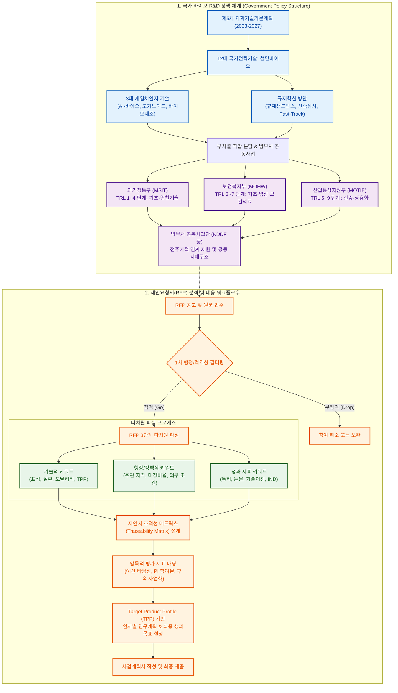
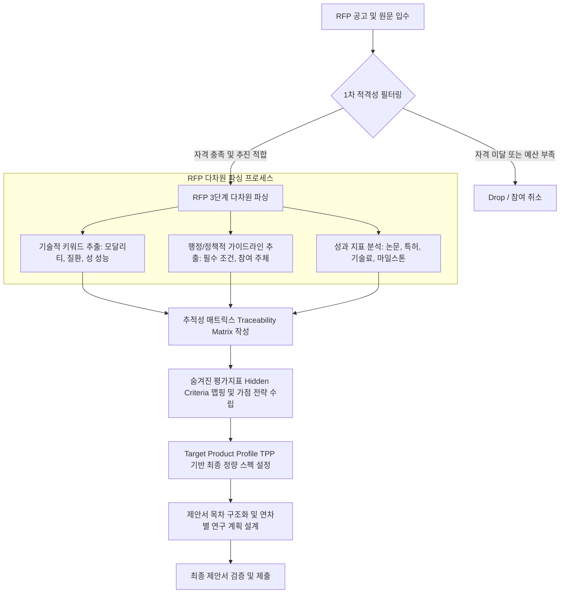

# 제1장. 정부 바이오 R&D 정책 환경 및 제안요청서(RFP) 분석 방법론



## 1. 국가 바이오 R&D 정책 기조 및 5개년 과학기술기본계획

### 1.1. 제5차 과학기술기본계획(2023-2027)과 첨단바이오
* **정책적 배경 및 기본 방향**:
  * 제5차 과학기술기본계획은 향후 5년간(2023~2027년)의 국가 과학기술 정책 방향을 제시하는 최상위 법정 계획임.
  * 국가 생존과 기술 주권 확보를 위한 '12대 국가전략기술'을 지정하고, 이 중 **'첨단바이오(Advanced Biotechnology)'**를 국가 핵심 전략 분야로 집중 육성함.
  * 기술적 한계 돌파를 통한 신시장 선점 및 고령화, 기후변화 등 국가 사회적 현안 해결을 목표로 설정함.
* **첨단바이오 분야 중점 육성 기술 군**:
  * **합성생물학(Synthetic Biology)**: 바이오 부품·회로의 설계·제작 기술 고도화, 인공세포 제작 및 바이오 파운드리 구축을 통한 유용 물질 생산 자동화 인프라 확보.
  * **유전자·세포치료(Gene & Cell Therapy)**: 차세대 유전자 가위(CRISPR 등) 기반 치료제, CAR-T/CAR-NK 등 면역세포치료제 원천기술 개발 및 유전자 전달체(Vector) 국산화.
  * **감염병 백신·치료제(Vaccine & Therapeutics)**: 메신저 리보핵산(mRNA) 플랫폼 기술 확보, 항바이러스제 후보물질 발굴 다변화 및 차세대 신속 백신 제조 기술 개발.
  * **디지털 헬스케어(Digital Healthcare)**: 의료 빅데이터 연계 AI 진단 솔루션, 웨어러블 디바이스 기반 라이프로그 분석 및 분산형 임상시험(DCT) 기술 표준화.
* **정부 바이오 R&D 투자 규모 추이 및 중장기 전망**:
  * 정부 총 R&D 예산 중 바이오헬스 분야 투자 비중은 매년 지속 증가 추세에 있으며, 연간 약 4조 원 규모를 돌파함.
  * 초격차 기술 개발 지원을 위해 기초원천 연구에 대한 지속적 투자와 함께 다부처 공동 협력 사업의 비중이 점진적으로 확대되는 경향을 보임.

### 1.2. 국가 바이오헬스 신산업 규제혁신 방안
* **핵심 규제 완화 및 제도 정비 방향**:
  * **규제 샌드박스(Regulatory Sandbox)**: 혁신 신기술 기반 제품·서비스에 대해 기존 법령상의 규제를 면제 또는 유예하여 조기 시장 진입 및 안전성 실증 기회 부여.
  * **혁신의료기기 신속심사 제도**: AI 융합 의료기기, 디지털 치료기기(DTx) 등 기존 인허가 체계로 평가가 어려운 기술에 대해 전문 평가 트랙을 신설하고 허가 소요 기간을 최대 80일 이상 단축.
  * **의약품 및 바이오제품 인허가 가속화(Fast-Track)**: 첨단바이오의약품 대상 우선심사 및 동반심사 제도 적용을 통해 비임상 단계부터 식약처 전문 인력이 밀착 컨설팅을 제공하는 프로그램 운영.
* **정책적 정합성(Policy Alignment) 기반 R&D 과제 기획 전략**:
  * 과제 제안서 작성 시 해당 기술이 정부의 어떤 규제 혁신 로드맵과 매칭되는지 명시하는 것이 필수적임.
  * 특히 보건복지부 및 식품의약품안전처의 신의료기술평가 유예 제도 활용 계획 또는 임상 진입 시 규제 대응 로드맵(IND 승인 전략 등)을 제안서 내 구체화하여 실현 가능성을 입증해야 함.

### 1.3. 3대 게임체인저 기술 및 첨단바이오 이니셔티브
* **정부 지정 3대 게임체인저 분야**:
  * **AI-바이오 융합 (AI for Science)**: 단백질 구조 예측 AI 플랫폼 고도화, 생성형 AI 기반 신약 후보물질 선도형 발굴 및 합성 생물 데이터 표준 AI 학습 생태계 구축.
  * **오가노이드 및 생체모사칩 (Organoid & Organ-on-a-Chip)**: 인간 장기 유사체 기반 비임상 대체 시험법 표준화, 다중장기 칩(Multi-organ-on-a-chip) 연계 약물 스크리닝 플랫폼 고도화.
  * **바이오 제조 및 친환경 바이오화학**: 바이오매스 원료 기반 고부가가치 화학물질 생산, 미생물 공장 기반 생분해성 신소재 대량 합성 공정 최적화.
* **글로벌 선도형 첨단바이오 이니셔티브**:
  * 해외 우수 대학·연구소와의 국제 공동연구 의무화 과제 신설 및 글로벌 탑티어 연구 네트워크(예: 보스턴-코리아 프로젝트) 참여 유도.
  * 연구개발 단계부터 글로벌 특허 확보 및 글로벌 인증(FDA, EMA 등) 규제 표준 부합화를 강제하는 평가 방식 적용.

---

## 2. 범부처 및 부처별 바이오 R&D 사업 구조 및 특징

정부 바이오 R&D는 과학기술정보통신부, 보건복지부, 산업통상자원부 등 3대 부처가 핵심 축을 이루며 주도하고 있으며, 부처 간 칸막이를 제거하기 위한 범부처 공동사업의 비중이 확대되고 있음.

### 2.1. 부처별 역할 분담 및 기술성숙도(TRL) 연계 구조
* **과학기술정보통신부 (MSIT)**:
  * **역할**: 기초 연구 진흥, 미래 유망 원천기술 확보, 디지털 바이오 플랫폼 및 대형 연구 장비 인프라 구축.
  * **기술 성숙 단계 (TRL)**: **TRL 1단계(기초이론/정의) ~ 4단계(연구실 규모 부품/시스템 개발)** 중심 지원.
  * **주요 사업**: 바이오·의료기술개발사업, 뇌과학원천기술개발사업, 디지털바이오혁신지원사업 등.
* **보건복지부 (MOHW)**:
  * **역할**: 환자 대상 보건의료 현장 연계 기술 개발, 보건의료 빅데이터 인프라 연계, 신약·의료기기 임상시험 및 제품 인허가 승인 지원.
  * **기술 성숙 단계 (TRL)**: **TRL 3단계(실험실 규모 물질/시스템 검증) ~ 7단계(시제품 성능 평가/임상시험)** 중심 지원.
  * **주요 사업**: 보건의료기술연구개발사업, 의료기기기술개발사업, 한의약혁신기술개발사업 등.
* **산업통상자원부 (MOTIE)**:
  * **역할**: 바이오 분야 고부가가치 제품의 상용화, 스케일업(Scale-up) 공정 고도화, 신소재 생산 인프라 고도화 및 비즈니스 모델(BM) 창출 중심 실증 R&D 지원.
  * **기술 성숙 단계 (TRL)**: **TRL 5단계(파일럿 규모 제작/부품 검증) ~ 9단계(상용화/양산 및 판매)** 중심 지원.
  * **주요 사업**: 바이오산업기술개발사업, 백신실증기반구축사업, 저탄소소재부품장비기술개발사업 등.

### 2.2. 주요 부처별 바이오 R&D 사업 구조 및 평가지표 특성 비교

| 부처구분 | 주관 부서 및 주요 대상 | TRL 범위 | 예산 특징 및 지원 성격 | 중점 투자 분야 | 주요 평가 지표 및 지향점 |
| :--- | :--- | :--- | :--- | :--- | :--- |
| **과기정통부<br>(MSIT)** | 대학, 국공립연구소,<br>정부출연연구기관(CRI) | TRL 1 ~ 4 | 기초 원천연구 위주,<br>장기적·모험적 투자 선호 | 기초과학, 합성생물학, 뇌과학,<br>줄기세포 원천기술, 디지털바이오 | 특허(조기 확보), SCI 논문 건수/JCR 상위 비율, 원천기술 이전 실적 |
| **보건복지부<br>(MOHW)** | 병원(의료원), 의과대학,<br>바이오 벤처기업 | TRL 3 ~ 7 | 병원 인프라 활용 연계,<br>환자 친화적 임상 단계 중점 | 신약 비임상/임상, 첨단 재생의료,<br>의료기기 적합성, 디지털 헬스케어 | 신약 파이프라인(IND/NDA), 임상시험 진입 및 승인 건수, 보건의료 편익 |
| **산업통상자원부<br>(MOTIE)** | 중소·중견·대기업,<br>테크노파크(TP) 등 실증기관 | TRL 5 ~ 9 | 사업화 및 상용화 목적,<br>민간 매칭펀드 비율 높음 | 바이오의약품 양산 공정,<br>바이오화학 신소재, 장비 국산화 | 매출액 증대, 신규 고용 창출,<br>투자유치(VC), 실증 시험 성적서 |

### 2.3. 범부처 공동사업(Joint Ministry Projects)의 구조 및 추진 체계
* **추진 배경**:
  * 부처 간 중복 투자를 방지하고 기초-원천-임상-사업화로 이어지는 전주기적 지원 체계를 구축하여 국가 연구개발 예산의 효율성을 극대화하기 위함.
* **주요 범부처 사업단 운영 예시**:
  * **국가신약개발사업단 (KDDF)**: 과기정통부, 복지부, 산업부가 공동으로 출연하여 신약 발굴부터 임상 2상 단계까지 전주기 지원 및 글로벌 라이선스 아웃(L/O) 극대화를 목표로 운영.
  * **범부처전주기의료기기연구개발사업단**: 복지부, 산업부, 과기정통부, 식약처가 공동 참여하여 시장 친화적 의료기기 개발, 임상 실증, 인허가 규제 대응까지 통합 원스톱 서비스 제공.
  * **범부처재생의료기술개발사업단**: 과기정통부와 복지부가 공동으로 재생의료 핵심 원천기술부터 임상 적용 단계의 유전자·세포 치료제 개발 전반을 지원.
* **범부처 공동사업 추진 체계 및 지배구조(Governance)**:
  * 각 부처에서 공무원 및 분야별 민간 전문가가 참여하는 '범부처 공동 사업 이사회' 및 '사업단장 중심의 독립 재단법인' 체계로 운영됨.
  * 예산은 각 부처별 분담 비율에 따라 별도 예산 편성 후 사업단 통합 계정으로 관리·집행됨.
  * 부처 간 장벽이 낮아 개별 부처 사업 대비 타겟 기술의 임상 진입 및 사업화 연계 여부를 매우 엄격하게 평가하는 성향을 보임.

---

## 3. 체계적 제안요청서(RFP) 파싱 방법론 및 키워드 추출 가이드

정부 과제 수주의 성패는 공고문과 함께 제공되는 제안요청서(RFP, Request for Proposal)의 명시적 요구사항과 묵시적 지향점을 정확히 분석하고 이를 사업계획서에 반영하는 것에서 시작됨.

### 3.1. RFP 구성요소의 구조적 해부
표준 바이오 R&D RFP는 대개 다음의 5대 핵심 영역으로 구성되며, 각 영역별 해석 주의사항은 다음과 같음.

* **가. 지원 목적 및 배경 (Objective & Background)**:
  * 부처가 본 과제를 기획하게 된 정책적 배경 및 해결하고자 하는 국가·사회적 당면 과제가 명시됨.
  * 제안서 서론(연구개발의 필요성) 작성 시 본 섹션의 단어 및 통계 수치를 그대로 인용하여 기획 목적과의 완벽한 정합성을 나타내야 함.
* **나. 지원 분야 및 개발 내용 (Scope of Work)**:
  * 본 과제에서 반드시 개발해야 하는 필수 스펙(Target Product Profile, TPP 등), 대상 질환군, 활용 기술 모달리티가 나열됨.
  * **'~을 포함할 것', '~에 한함'** 등의 한정어구에 주의하여 필수 요건 누락 시 서류 탈락 사유가 됨을 인지해야 함.
* **다. 지원 규모 및 기간 (Budget & Timeline)**:
  * 연차별 정부출연금 한도 및 총 연구기간이 표기됨.
  * TRL 단계 상승에 소요되는 비임상/임상 비용을 고려하여 적정 연차별 예산 배분 계획을 수립해야 하며, 다년도 과제일 경우 연차별 진도관리(Go/No-Go) 마일스톤 설계가 요구되는지 확인 필요.
* **라. 신청 자격 및 가점·감점 사항 (Eligibility & Incentives)**:
  * 주관연구개발기관의 주체(기업 필수 여부, 영리/비영리 구분) 및 기업 규모별 민간부담금 매칭 비율이 명시됨.
  * 특허 출원, 신기술 인증, 우수 기업 지정 등의 가점 항목을 사전에 분석하여 가점 확보 전략 수립 필수.
* **마. 성과 목표 및 평가지표 (KPIs & Deliverables)**:
  * 정량적 성과(특허, 논문, 기술이전, IND 승인 등)와 정성적 성과 목표 가이드라인 제시.
  * RFP상 명시된 KPI 가이드라인은 최종 도달해야 할 '최소 기준(Minimum Requirement)'이므로, 제안서에는 이를 초과 달성할 수 있는 도전적 목표를 설정하는 것이 유리함.

### 3.2. 핵심 키워드 및 요구사항 추출 프로세스
RFP 파싱은 3가지 차원의 키워드를 도출하는 다차원 추출법을 적용함.

```
[RFP 원문 입수]
       │
       ▼
┌──────────────────────────────────────────────┐
│ 1단계: 기술적 키워드 (Technical Keywords)     │
│  - 표적(Target), 질환(Indication), 물질 등    │
└──────────────────────────────────────────────┘
       │
       ▼
┌──────────────────────────────────────────────┐
│ 2단계: 정책적/행정적 키워드 (Policy Keywords) │
│  - 주관 자격, 매칭 펀드, 규제 가이드라인 등  │
└──────────────────────────────────────────────┘
       │
       ▼
┌──────────────────────────────────────────────┐
│ 3단계: 성과 지표 키워드 (KPI Keywords)        │
│  - 특허, IND 신청, 유효성 검증 성적서 등    │
└──────────────────────────────────────────────┘
```

* **1단계: 기술적 키워드(Technical Keywords) 추출**:
  * **핵심 항목**: 표적 질환(Target Indication), 타겟 모달리티(ADC, 합성신약, 표적단백질분해제 등), 시험계(In vitro / In vivo), 검증 지표.
  * **추출 기법**: 명사 중심의 핵심 기술 키워드를 추출하고, 동등한 범주의 동의어 및 유사어 매핑 테이블을 작성하여 제안서 내 다양한 용어로 분산 배치.
* **2단계: 정책적/행정적 키워드(Administrative Keywords) 추출**:
  * **핵심 항목**: '공동연구 필수', '임상 의사 참여 필수', '중소기업 주관 필수', '기술료 징수 기준' 등.
  * **추출 기법**: 의무 조항을 나타내는 법률적 용어('~하여야 한다', '~필수', '~에 한하여')를 별도 리스트화하여 과제 컨소시엄 구성 단계에서 즉시 검토 및 반영.
* **3단계: 성과 지표 키워드(KPI Keywords) 추출**:
  * **핵심 항목**: 특허 등록건수, 비임상 유효성 데이터 패키지 확보, 글로벌 IND 승인, GLP 독성 시험 성적서 등.
  * **추출 기법**: 연차별 최종 마일스톤에 해당하는 정량 성과 단어들을 추출하여 제안서 '최종 목표 및 성과지표' 작성부와 100% 매칭.

### 3.3. 숨겨진 평가지표 및 평가위원 평가 기준 맵핑(Hidden Criteria Mapping)
RFP에 직접 노출되지 않으나 평가위원이 중점적으로 검토하는 암묵적 지표(Hidden Criteria)를 파악하고 선제 대응해야 함.

* **암묵적 지표 1: 예산 배분의 현실성 및 타당성**:
  * **실제 검토 기준**: 제시된 연구 예산이 실제 실험용 원부자재 구매 및 CRO 위탁 연구 비용에 적절히 배분되었는지 여부.
  * **대응 방안**: 위탁 연구 비용 산출 시 공신력 있는 CRO 견적서 수준의 단가 계산 내역을 세부 예산서에 첨부하여 타당성 입증.
* **암묵적 지표 2: 주관 연구책임자의 과제 수행 역량 및 시간 배분**:
  * **실제 검토 기준**: 연구책임자(PI)의 최근 5년간 동 분야 연구 실적 및 참여율(동시 수행 과제 수 제한 규정 준수 여부).
  * **대응 방안**: 참여율 관리 현황표 및 최근 대표 논문/특허 리스트를 본 과제 제안서와의 직간접적 연관성 중심으로 재구성하여 제시.
* **암묵적 지표 3: 과제 종료 후 상용화 연계 시나리오의 진실성**:
  * **실제 검토 기준**: 과제 종료 후 후속 투자 유치 또는 자체 사업화 추진 여력.
  * **대응 방안**: 제안서 후반부에 사업화 로드맵 작성 시 주관기관의 재무 상태, VC 투자 유치 이력, 사업화 전담 인력의 역량을 구체적 수치와 함께 서술.

#### 제안서 추적성 매트릭스(Traceability Matrix) 설계안
RFP 요구사항과 제출용 사업계획서 목차 간의 1:1 매칭 여부를 점검하기 위한 검증 도구를 구축하여 최종 누락 사항이 없음을 평가위원에게 직관적으로 제시함.

| RFP 요구사항 일련번호 | RFP 요구 내용 및 핵심 스펙 | 계획서 해당 목차 및 페이지 | 매칭 핵심 내용 및 정량 스펙 제시안 | 비고 (보완 사항 등) |
| :--- | :--- | :--- | :--- | :--- |
| **REQ-01** | 비임상 유효성 검증 (In vivo 포함) | 2장 2절 (p.14) | 마우스 모델 기반 종양 억제능(TGI > 50%) 제시 | CRO 위탁 시험 계획 연계 |
| **REQ-02** | 해외 GLP 독성 시험 개시 | 2장 4절 (p.28) | 연차별 IND 패키지용 단회/반복 투여 독성 진입 | 2차년도 하반기 개시 |
| **REQ-03** | 중소기업 주관 및 병원 위탁 컨소시엄 | 3장 1절 (p.35) | (주)AAA 주관 - BBB대학병원 임상 연구자 위탁 참여 | 협약서 초안 확보 완료 |

### 3.4. RFP 파싱 및 제안서 설계의 논리적 흐름도 (Mermaid Flowchart)
다음 흐름도는 RFP 공고시점부터 핵심 요구사항을 파싱하여 제안서 세부 목차 및 타겟 스펙(KPI)을 정렬하고 구조화하는 전체 라이프사이클을 나타냄.



* **구조 설계 설명**:
  * **1차 적격성 필터링 단계**: 행정적 불합격 요소를 선제적으로 거르기 위한 관문으로, 주관 자격 및 부채 비율 등의 제한조건 충족 여부를 판정함.
  * **RFP 다차원 파싱 프로세스**: 추출된 각 영역의 키워드 세트를 상호 참조(Cross-reference)하여 컨소시엄 구성안 및 실험 설계의 뼈대를 생성함.
  * **추적성 매트릭스 작성 단계**: RFP에 요구된 개발 범위가 제안서 목차에 누락 없이 할당되었는지를 시스템적으로 검증하는 정렬 단계임.
  * **최종 스펙 설정 단계**: 도출된 명시적·암묵적 요구 지표를 바탕으로 연구진이 달성 가능한 최고 수준의 수치적 목표를 성과지표에 투영하여 계획을 고도화함.
