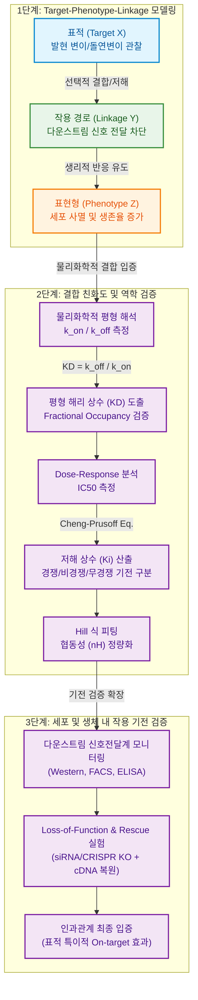

# 제2장 대학 기초연구 지원 체계 및 표적 검증 전략 (Basic Research Framework & Target Validation)

본 장은 대학 및 연구소 등 기초연구 단계에서 수행되는 신규 표적(Target) 발굴, 작용 기전(Mechanism of Action, MoA) 규명, 그리고 선행 연구 데이터의 과학적 타당성(Rigor of Prior Data) 입증을 위한 방법론적 프레임을 제시함. 과제제안서(RFP) 상의 학술적 신규성을 국가연구개발과제 평가지표에 최적화하여 도출하고, 물리화학적 및 통계적 수식에 기반하여 연구 데이터의 재현성을 증명하는 실무 지침을 제공함.

---

## 2.1 대학 기초연구 프레임워크 및 학술적 독창성(Academic Novelty) 도출

### 2.1.1 기초연구의 학술적 독창성 정의 및 평가 지표
- **학술적 독창성(Academic Novelty)의 다차원적 정의**
  - **New Target (신규 표적)**: 기존에 질환 연관성이 보고되지 않았거나, 신약 개발 표적으로 시도된 적이 없는 신규 단백질/유전자/대사물질 제시.
  - **New Modality (신규 모달리티)**: 동일 표적에 대해 기존 저분자 화합물이나 단클론 항체의 한계를 극복하는 PROTAC(Proteolysis Targeting Chimeras), ADC(Antibody-Drug Conjugates), mRNA, CGT(Cell and Gene Therapy) 등의 신규 모달리티 적용.
  - **New Mechanism (신규 작용 기전)**: 표적 단백질의 발현 억제뿐만 아니라 알로스테릭 조절(Allosteric Regulation), 이량체화 차단(Dimerization Inhibition), 또는 상전이(Phase Separation) 조절 등 독창적인 작용 경로 제시.
  - **New Indication (신규 적응증)**: 기존 승인 약물 또는 타겟의 신규 작용 기전을 규명하여 치료 대안이 없던 난치성 질환(Unmet Medical Needs)으로의 확장 가능성 입증.

- **평가위원이 요구하는 독창성의 깊이와 학술적 파급효과**
  - **논리적 인과관계의 명확성**: 표적의 발현 변이와 질환의 임상적 병리 현상 간의 인과적 연결고리(Causal Relationship)가 기전적으로 설명되어야 함. 단순 상관관계(Correlation) 제시만으로는 대학 기초 원천 과제 선정평가에서 낮은 점수를 획득함.
  - **차별적 타당성(Differentiated Feasibility)**: 기존 경쟁 연구 그룹 대비 제안 기술이 갖는 기술적 분화점 및 학술적 도약 가능성을 정량적으로 서술해야 함.
  - **IP(Intellectual Property) 연계성**: 학술적 독창성이 특허 청구범위(Claims)의 신규성(Novelty) 및 진보성(Inventive Step)으로 직접 전환될 수 있는 구조적 연계성을 보여주어야 함.

- **신규성 검증을 위한 문헌 분석 방법론**
  - **PubMed 및 Web of Science 기반 MeSH(Medical Subject Headings) 단어망 분석**:
    - 검색 쿼리를 통한 표적명과 질환명의 교차 검색 수행.
    - 최근 5개년 내 발표된 국외 우수 저널(Impact Factor $\ge 10$) 논문 및 리뷰 논문을 전수 분석하여 학술적 공백 영역(Research Gap) 규명.
  - **특허 데이터베이스(KIPRIS, Lens.org, USPTO) 교차 스크리닝**:
    - 학술 논문뿐만 아니라 경쟁사 및 선행 특허의 청구범위에 제안하고자 하는 서열, 화학 구조식, 용도가 포함되어 있는지 여부를 스크리닝함.
    - 출원년도별, 출원인별 매핑을 통해 대상 기술이 특허 장벽에 막혀 있지 않은 원천 영역임을 선제적으로 입증함.

### 2.1.2 연구 가설(Scientific Hypothesis)의 논리적 구조화
- **가설 수립 및 검증의 4단계 프레임워크**
  1. **관찰(Observation)**: 환자 샘플, 공공 데이터베이스(TCGA, GEO 등) 또는 스크리닝을 통해 질환군에서 특정 표적의 비정상적 발현 변이나 돌연변이 발견.
  2. **의문(Question)**: 발견된 표적의 발현 변이가 질환의 유도, 악화, 혹은 치료제 내성 획득에 결정적인 드라이버(Driver) 역할을 하는가에 대한 질문 제기.
  3. **가설 설정(Hypothesis Formulation)**: "표적 X의 특이적 저해 또는 발현 억제는 신호전달 Y 경로의 불활성화를 유도하고, 결과적으로 암세포의 침윤(Invasion) 및 성장을 정량적으로 차단할 것이다"라는 식의 구체적 명제 수립.
  4. **검증 체계(Verification Protocol)**: 세포 수준(In vitro) 및 개체 수준(In vivo)에서의 유전자 기능 상실(Loss-of-Function) 및 기능 획득(Gain-of-Function) 실험을 통한 다각적 검증 체계 매핑.

- **'Target-Phenotype-Linkage' 가설 구조 모델**
  - **Target (원인 인자)**: 표적 단백질 또는 표적 경로 ($X$).
  - **Linkage (작용 경로/기전)**: 다운스트림 신호 차단, 분해 유도, 유전자 전사 저해 ($Y$).
  - **Phenotype (결과적 표현형)**: 세포 사멸(Apoptosis), 종양 성장 억제, 내성 극복, 면역 활성화 ($Z$).
  - **작성 원칙**: "표적 $X$의 선택적 결합을 통해 $Y$ 신호 경로를 차단함으로써 질환 표현형 $Z$를 유도함" 형태의 표준적 인과 논리를 구축함.

```
[Target: 표적 X의 억제] ➔ (Linkage: Y 경로 활성 억제) ➔ [Phenotype: 종양 퇴행 및 생존율 증가]
```



- **최신 생명공학 툴킷을 활용한 가설 입증 프로세스**
  - **CRISPR-Cas9 기반의 표적 넉아웃(Knock-Out, KO)**: 표적 유전자를 세포주에서 영구적으로 결손시켜 발현 유무에 따른 세포 표현형 변화를 비교함으로써 표적 유효성(Target Validation) 검증.
  - **환자 유래 오가노이드(Patient-Derived Organoid, PDO)**: 2차원 세포 배양 모델의 한계를 극복하고 인간 장기 및 종양 미세환경을 모사한 3차원 입체 배양 모델에서 약물 반응성과 작용 경로를 검증하여 인체 임상 결과 예측력 제고.
  - **유도만능줄기세포(iPSC) 유래 질환 모델**: 난치성 질환 환자의 체세포로부터 역분화 줄기세포를 유도하고, 이를 질환 관련 표적 분화 세포(예: 심근세포, 신경세포)로 분화시켜 표적 제어 효과의 생리학적 유효성 입증.

---

## 2.2 작용 기전(Mechanism of Action, MoA) 검증 전략 및 가설 구체화

### 2.2.1 분자 및 생화학적 수준의 결합 친화도(Binding Affinity) 정량화
- **리간드-수용체 상호작용의 물리화학적 평형 해석**
  - 수용체($R$) 또는 단백질 Target($B$)과 리간드 또는 약물($A$)의 결합 반응 모델은 가역적인 단일 부위 결합(1:1 Binding model)을 기초로 분석함.
  - 리간드와 수용체의 결합 및 해리 과정은 다음과 같음:

    $$A + B \underset{k_{off}}{\overset{k_{on}}{\rightleftharpoons}} AB$$

    여기서 $k_{on}$은 결합 속도 상수(Association rate constant, $M^{-1}s^{-1}$), $k_{off}$는 해리 속도 상수(Dissociation rate constant, $s^{-1}$)임.
  - 시간 $t$에 따른 복합체 $[AB]$의 생성 및 소멸 속도 방정식은 다음과 같이 정의됨:

    $$\frac{d[AB]}{dt} = k_{on}[A][B] - k_{off}[AB]$$

  - 평형 상태(Equilibrium)에 도달하면 복합체의 농도 변화가 없으므로($\frac{d[AB]}{dt} = 0$), 위 공식은 다음과 같이 변환됨:

    $$k_{on}[A][B] = k_{off}[AB]$$

  - 이를 평형 해리 상수(Equilibrium Dissociation Constant, $K_D$, $M$)에 대해 정리하면 다음과 같은 물리화학적 유도 공식을 도출할 수 있음:

    $$K_D = \frac{[A][B]}{[AB]} = \frac{k_{off}}{k_{on}}$$

    - $K_D$ 값이 작을수록 결합 속도($k_{on}$) 대비 해리 속도($k_{off}$)가 느리다는 것을 의미하므로, 타겟 단백질과 약물 간의 결합 친화도(Affinity)가 강력함을 정량적으로 입증함.
  - 리간드 농도 $[L]$에 따른 표적 단백질의 결합 분율(Fractional Occupancy, $\theta$)은 수용체 전체 농도를 $[B]_{total} = [B] + [AB]$로 두었을 때 다음과 같이 유도됨:

    $$\theta = \frac{[AB]}{[B]_{total}} = \frac{[AB]}{[B] + [AB]}$$

  - 위 $K_D$ 공식에서 $[AB] = \frac{[A][B]}{K_D}$를 대입하여 리간드 농도 $[L]$ (여기서 $[A] = [L]$)에 대해 정리하면 다음의 등식을 얻음:

    $$\theta = \frac{\frac{[L][B]}{K_D}}{[B] + \frac{[L][B]}{K_D}} = \frac{\frac{[L]}{K_D}}{1 + \frac{[L]}{K_D}} = \frac{[L]}{[L] + K_D}$$

    - 이 식에 의해 약물 농도 $[L]$이 평형 해리 상수 $K_D$와 정확히 같아지는 시점($[L] = K_D$)에서 수용체의 50%가 약물과 결합 상태($\theta = 0.5$)에 놓이게 됨을 수학적으로 증명할 수 있음.

- **반수최대억제농도($IC_{50}$)와 저해 상수($K_i$)의 상호 변환 관계**
  - **Cheng-Prusoff 방정식의 유도 및 적용**:
    - 효소 또는 수용체에 대한 저해제의 가역적 경쟁적 억제(Competitive Inhibition) 모델에서, 실험적으로 측정된 $IC_{50}$ 값은 기질(Substrate) 또는 경쟁 리간드의 농도에 의존적임.
    - 실제 결합 친화도를 나타내는 절대 지표인 저해 상수(Inhibition Constant, $K_i$)를 산출하기 위해 Cheng-Prusoff 공식을 적용함:

      $$K_i = \frac{IC_{50}}{1 + \frac{[S]}{K_m}}$$

      여기서 $[S]$는 기판 또는 리간드의 농도(Substrate Concentration), $K_m$은 저해제가 없는 상태에서의 Michaelis-Menten 상수(Michaelis Constant)임.
    - **적용의 한계 및 주의사항**:
      - 본 공식은 저해제가 효소의 활성 부위에 경쟁적으로만 작용하고, 효소-저해제 결합이 단순 1:1 결합 모형을 충족하는 경우에만 유효함.
      - 타겟 단백질의 총 농도 $[E]_{total}$이 저해 상수의 추정치보다 충분히 낮아야 함($[E]_{total} \ll IC_{50}$). 만약 고농도의 효소를 사용하는 스크리닝 에세이의 경우, 약물이 결합하여 기질 농도를 크게 변화시키는 "Tight-binding" 현상이 발생하여 오차가 급격히 증가하므로 Morrison 방정식을 대안으로 사용하여 $K_i^{app}$를 도출해야 함.
  - **비경쟁적(Non-competitive) 및 무경쟁적(Uncompetitive) 저해 기전에서의 Cheng-Prusoff 공식 적용**:
    - **비경쟁적 저해 (Non-competitive Inhibition)**: 저해제가 효소-기질 복합체($ES$)와 자유 효소($E$)에 동일한 친화도로 결합함. 이 경우 기질 농도가 저해 효능에 영향을 미치지 않으므로 저해 상수는 실험값과 동일함:

      $$K_i = IC_{50}$$

    - **무경쟁적 저해 (Uncompetitive Inhibition)**: 저해제가 오직 효소-기질 복합체($ES$)에만 결합함. 이 경우 기질 농도 $[S]$가 높을수록 복합체가 많아져 저해 효능이 상승하므로 다음과 같은 변환식을 적용함:

      $$K_i = \frac{IC_{50}}{1 + \frac{K_m}{[S]}}$$

  - **농도-반응 곡선(Dose-Response Curve)과 Hill 식을 통한 협동성(Cooperativity) 정량화**:
    - 약물 농도 $[I]$의 변화에 따른 타겟 활성의 저해율($\% \text{ Inhibition}$)은 Hill 계수(Hill coefficient, $n_H$)를 포함한 비선형 회귀 모델(4-Parameter Logistic Equation)을 활용하여 적합(Fitting)시킴:

      $$\% \text{ Inhibition} = \text{Bottom} + \frac{\text{Top} - \text{Bottom}}{1 + \left(\frac{IC_{50}}{[I]}\right)^{n_H}}$$

      - $n_H = 1$: 독립적인 단일 부위 결합(Non-cooperative binding)을 따름.
      - $n_H > 1$: 양의 협동성(Positive cooperativity). 하나의 약물 분자가 타겟 복합체에 결합 시 다음 약물 분자의 결합 활성이 증가함을 나타냄 (S자형 곡선의 기울기가 가팔라짐).
      - $n_H < 1$: 음의 협동성(Negative cooperativity). 수용체 간의 음성 알로스테릭 상호작용 또는 불균일한 타겟 결합 부위가 혼재함을 지표화함.

### 2.2.2 세포 및 생체 내(In vitro / In vivo) 작용 기전 규명 프로세스
- **표적 특이적 다운스트림 신호전달계(Downstream Signaling Cascade) 모니터링**
  - **Western Blotting을 통한 단백질 인산화(Phosphorylation) 분석**:
    - 약물 처리 농도 시간 경로에 따라 표적 신호전달 축의 핵심 인자(예: EGFR $\rightarrow$ AKT $\rightarrow$ mTOR)의 인산화 변화 수준 정량화.
    - 총 단백질량(Total form) 대비 인산화 단백질(Phospho form)의 비율을 하우스키핑 단백질(GAPDH, $\beta$-actin)로 표준화하여 정밀 분석함.
  - **FACS(Flow Cytometry) 기반 신호 전달 세부 모니터링**:
    - 세포 투과성 형광 프로브를 활용해 약물 투여 후 세포 내 활성산소종(ROS) 농도 변화, 칼슘 유입 농도($[Ca^{2+}]_i$), 혹은 막전위(Mitochondrial Membrane Potential)의 정량적 시계열 흐름 계측.
  - **Multiplex ELISA 및 Phospho-ELISA**:
    - 세포 용해물(Cell lysate) 또는 혈청 샘플 내의 다양한 다운스트림 사이토카인 및 인산화 단백질을 피코그램($pg/mL$) 단위까지 정량 검출하여 단일 경로 분석 오류 방지.

- **표적 매개 표현형 변화(Phenotypic Assay)의 인과관계 입증**
  - **Loss-of-Function & Rescue(구조/복원) 병행 실험 설계 규칙**:
    - 약물 투여 결과가 표적에 결합하여 나타난 직접적 효과인지 혹은 비특이적 오프타겟(Off-target) 효과인지 입증하기 위해 Rescue 실험이 반드시 동반되어야 함.
    - **실험 모델 구성 프로토콜**:
      1. **Gene Knock-down/Knock-out**: siRNA 또는 CRISPR-Cas9을 이용해 세포 내 표적 단백질 $X$의 발현을 넉아웃시킴 $\rightarrow$ 약물 투여 시와 동일한 표현형(예: 암세포 사멸)이 관찰되는지 확인.
      2. **Rescue (유전자 복원)**: siRNA가 인식하지 못하는 침묵 변이형(Silent Mutant) 또는 CRISPR-resistant cDNA를 트랜스펙션하여 단백질 $X$를 다시 과발현시킴.
      3. **Causal Proof**: 단백질 $X$가 복원된 세포주에서는 약물 투여에 의한 세포사멸 효과가 사라지거나 확연히 둔화됨을 증명함. 이 대조 실험의 부재는 제안서 신뢰성에 치명적인 약점으로 평가됨.

```
[표적 X 억제제 처리] ➔ 암세포사멸 유도 (Phenotype)
[siRNA로 표적 X 제거] ➔ 암세포사멸 유도
[siRNA + 표적 X cDNA 복원(Rescue)] ➔ 억제제 처리해도 세포 생존 복원 ➔ 인과성 최종 입증
```

  - **RNA-seq 기반 전사체(Transcriptome) 프로파일링 및 유전체 네트워크 규명**:
    - 약물 처리 전후의 전사체 발현 변화량($\log_2 \text{Fold Change}$)을 Volcano Plot으로 매핑.
    - 차별 발현 유전자(DEG, Differentially Expressed Genes)를 추출하고, GO(Gene Ontology) 분석 및 KEGG Pathway Enrichment 분석을 수행하여 다운스트림 신호의 거시적 변동 경로 규명.

---

## 2.3 선행 데이터의 과학적 타당성 및 재현성 검증(Rigor of Prior Data)

### 2.3.1 스크리닝 분석법의 품질 지표 및 신뢰성 평가
- **Z'-factor (High-Throughput Screening 분석 평가 지표)**
  - 신규 신약 후보물질 스크리닝 또는 유효성 검증 에세이(Assay)가 얼마나 높은 신뢰성을 가지고 데이터 간 간섭이 없이 명확히 분리되는지 수치화하는 표준 지표임.
  - Z'-factor의 정의 및 계산 공식은 다음과 같음:

    $$Z' = 1 - \frac{3(\sigma_{pos} + \sigma_{neg})}{|\mu_{pos} - \mu_{neg}|}$$

    여기서 $\sigma_{pos}$와 $\sigma_{neg}$는 각각 양성 대조군(Positive Control, 약물 최고 농도 또는 최대 억제 상태)과 음성 대조군(Negative Control, Vehicle 또는 비처리 상태) 데이터의 표준편차(Standard Deviation)임. $\mu_{pos}$와 $\mu_{neg}$는 각 대조군의 산술평균값(Mean)임.
  - **Z'-factor 범위별 데이터 품질 판정 기준**:
    - $0.5 \le Z' < 1.0$: 매우 우수하고 신뢰할 수 있는 에세이 상태(Excellent Assay). 신약 스크리닝에 완벽히 적합한 분석계 수준임.
    - $0 < Z' < 0.5$: 데이터 판독 경계 수준(Marginal Assay). 신호 간 중첩 영역이 존재하므로 분석법의 최적화가 추가적으로 요구됨.
    - $Z' \le 0$: 대조군 간의 신호 분리가 불가능하여 분석 장비, 시약의 농도 또는 피펫팅 오류 등으로 스크리닝 에세이로 사용할 수 없는 상태(Unusable).
  - **변동계수(CV, Coefficient of Variation) 한계치 관리 방안**:
    - 실험 데이터 자체의 정밀도를 계량화하기 위해 반복 실험군 내 변동계수($CV$)를 계산함:

      $$CV (\%) = \frac{\sigma}{\mu} \times 100$$

      여기서 $\sigma$는 표준편차, $\mu$는 평균값임.
    - 국가 R&D 선행 연구 데이터로서의 Rigor를 인정받기 위해서는 각 플레이트 내 웰(Well) 간 편차(Intra-plate CV) 및 플레이트 간 편차(Inter-plate CV)가 각각 **$10\%$ 이하**로 유지되어야 함을 데이터와 함께 명시해야 함.

- **MSR (Minimum Significant Ratio) 계산을 통한 측정 간/날짜 간(Inter-day/Intra-day) 재현성 평가**
  - 독립된 다중 실험 일차에 걸쳐 수행된 반복 실험 데이터($IC_{50}$ 또는 $EC_{50}$)의 날짜 간 분산과 측정 일관성을 평가하기 위해 MSR 지표를 산정함.
  - 계산 공식은 각 측정값의 $\log_{10}$ 스케일 변환을 기초로 함:

    $$MSR = 10^{2\sqrt{2} \cdot SD_{\log_{10}(IC_{50})}}$$

    여기서 $SD_{\log_{10}(IC_{50})}$는 동일 물질을 서로 다른 실험 날짜 및 세션에서 측정하여 얻은 $\log_{10}(IC_{50})$ 값들의 표준편차임.
  - **데이터 재현성 해석 기준**:
    - $MSR \le 2.0$: 동일 시료에 대해 측정 변수가 안정적이며 극히 우수한 시간적 재현성을 나타내는 지표임.
    - $MSR > 3.0$: 분석계 배지의 오염, 효소 활성도 편차 또는 작업자 편향에 의해 동일 조건에서도 3배 이상의 편차 데이터가 산출됨을 지표화하므로, 해당 에세이에 기반해 작성된 선행 연구 데이터는 평가에서 제외될 가능성이 높음.

### 2.3.2 데이터 편향 제어 및 통계적 통제 방안 (Rigor of Prior Data)
- **랜덤화(Randomization) 및 맹검화(Blinding) 적용 프로토콜**
  - **치료군 배치 랜덤화 알고리즘 (In vivo)**:
    - 개체 간 체중 또는 초기 종양 부피 편차에 의한 계통적 편향(Systematic Bias)을 제거하기 위해 의사난수 생성기(Pseudo-random Number Generator) 또는 블록 무작위 배정(Block Randomization) 기법을 사용해 마우스를 실험군으로 배치함.
    - 대조군과 투여군의 평균 체중 및 종양 부피 초깃값이 통계적으로 동등한 분산(Equi-variance)을 갖도록 설정함.
  - **이중 맹검(Double-blind Trial) 구조화 설계**:
    - **약물 투약 및 측정 분리 프로토콜**:
      - 약물을 준비 및 라벨링하는 작업자와 실제 동물에게 약물을 투약하고 종양 크기를 측정하는 기록 책임자를 상호 분리함.
      - 측정 시점에서는 마우스 케이지에 부착된 식별표를 코드화(Code A, Code B 등)하여 측정자의 주관적 판단에 의해 종양 크기가 억제되는 방향으로 관찰되는 오류(Observer Bias)를 차단함.

- **샘플 수 산정(Sample Size Calculation)과 통계적 검정력(Statistical Power)**
  - **통계적 검정과 제1종/제2종 오류 통제**:
    - 제1종 오류($\alpha$, 유의수준): 실제 효과가 없음에도 가설이 참이라고 판정할 확률. 바이오 기초 연구에서는 일반적으로 $\alpha = 0.05$로 통제함.
    - 제2종 오류($\beta$): 실제 유의미한 효능이 있음에도 대조군과의 편차에 가려 귀무가설을 채택할 확률. 검정력(Power, $1-\beta$)은 일반적으로 $80\%$ ($\beta=0.20$) 또는 $90\%$ ($\beta=0.10$)로 설정함.
  - **효과 크기(Effect Size, Cohen's $d$) 및 샘플 수 산출 수식**:
    - 대조군과 처리군 간의 평균 차이 강도를 비교하기 위해 Cohen's $d$를 활용함:

      $$d = \frac{|\mu_1 - \mu_2|}{s_{pooled}}$$

    - 여기서 $s_{pooled}$는 가중 평균 합동 표준편차(Pooled Standard Deviation)로 다음과 같이 정의됨:

      $$s_{pooled} = \sqrt{\frac{(n_1-1)s_1^2 + (n_2-1)s_2^2}{n_1+n_2-2}}$$

      $n_1, n_2$는 군별 샘플 수, $s_1, s_2$는 각 군의 표준편차임.
    - 유의수준 $\alpha$와 검정력 $1-\beta$가 주어졌을 때 양측 검정 기준 군당 필요한 동물 수($n$)는 대략 다음 공식에 수렴함:

      $$n \approx \frac{2(Z_{\alpha/2} + Z_{\beta})^2}{d^2} + 0.25 \cdot Z_{\alpha/2}^2$$

      - 여기서 $Z_{\alpha/2}$와 $Z_{\beta}$는 각각 임계 정규분포값임. (예: $\alpha=0.05$일 때 $Z_{\alpha/2}=1.96$, $1-\beta=0.80$일 때 $Z_{\beta}=0.84$)
      - 선행 연구 데이터의 설계 시 효과 크기 $d$가 유효하게 산출되었으며, 이에 기반한 $N$ 수가 합리적으로 추정되었음을 입증해야 무리한 실험 비용 예산 삭감 및 동물 복지 준수 평가 기준 통과가 원활하게 진행됨.

- **다중 비교(Multiple Comparisons) 오류 제어를 위한 보정 기법**
  - **다중 비교 오류(Family-wise Error Rate, FWER) 팽창**:
    - 3개 이상의 비교군(예: 대조군, 저농도군, 고농도군, 병용투여군)에 대해 각각 $t$-test를 무차별 반복할 경우, 제1종 오류 발생 확률이 $1-(1-\alpha)^k$ (여기서 $k$는 비교 횟수)로 증가하여 통계적 타당성이 상실됨.
  - **주요 통계 보정 기법**:
    - **Bonferroni Correction**: 가장 엄격한 보정법으로, 각 단일 검정의 기준 유의수준을 전체 비교 개수 $m$으로 나누어 산정함:
      
      $$\alpha_{new} = \frac{\alpha_{target}}{m}$$
      
      단, 비교군 개수가 많아질수록 검정력이 급격히 약화되는 단점이 있음.
    - **Tukey's HSD (Honestly Significant Difference)**: 일원배치 분산분석(One-way ANOVA)을 수행한 후, 모든 군 간의 일대일 쌍별 비교(Pairwise comparison) 시 유용한 표준 방법임.
    - **Benjamini-Hochberg FDR (False Discovery Rate) 제어 기법**: 대규모 다중 분석(예: RNA-seq DEG 도출)에서 주로 사용되며, 발견된 유의미한 가설 중 참이 아닌 유효 가설의 비율을 설정치(예: $FDR < 0.05$) 미만으로 선별 관리함.
