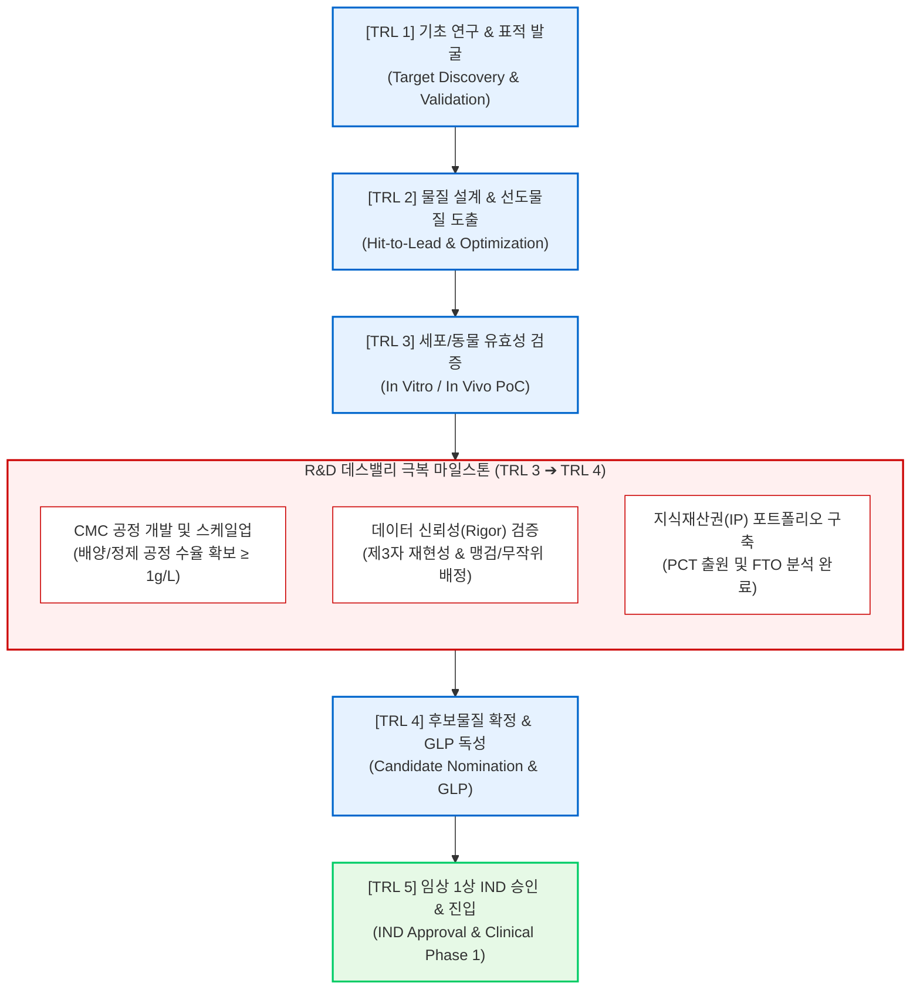

# 제3장. 연구소 주도 비임상 연구 최적화 및 기술성숙도(TRL) 연계 전략

---

## 본 장의 개요 (Key Highlights)
> [!NOTE]
> 본 장은 연구소(정부출연연구기관, 대학연구소, 민간연구소 등)가 주관하는 바이오 국가 R&D 과제 기획 시 핵심 평가 기준이 되는 **비임상 연구 최적화 방법론**, **데이터 신뢰성(Rigor) 확보를 위한 통계학적 검증 모델**, 그리고 **기술성숙도(TRL) 마일스톤 수립 및 기술이전(L/O) 패키징 로드맵**을 다룸. 평가위원의 서면 및 대면 평가 시 원천 기술의 신뢰도를 입증하고 사업화 가능성을 극대화하기 위한 정량적 설계 가이드를 제시함.

---

## 1. 연구소 주도 비임상 연구 최적화 (Preclinical Research Optimization)

### 1.1 선도물질 최적화 (Lead Optimization) 프레임워크 및 고도화 전략
* **구조-활성 관계(SAR, Structure-Activity Relationship) 분석 및 분자 설계 고도화**
  * 표적 단백질과 후보물질 간의 3차원 입체 구조정보(X-ray 결정학, Cryo-EM 등)를 기반으로 활성 포켓(Active Pocket) 내 결합 모드 분석.
  * 계산화학적 모델링(Molecular Docking, Molecular Dynamics Simulation)을 통해 정전기적 상호작용(Electrostatic Interaction), 수소 결합(Hydrogen Bonding), 소수성 상호작용(Hydrophobic Interaction)의 결합 자유에너지($\Delta G$)를 정밀 계산 및 최적화함.
  * 소분자 화합물 후보물질의 경우, Pharmacophore 모델링 및 Scaffold 치환을 통해 약물 활성을 높이는 동시에 CYP450 억제, hERG 채널 차단 등 심독성 유발 작용기(toxicophore)를 원천 제거하는 분자 구조 변경(De-risking) 설계 수행.
* **신규 항체 및 바이오 의약품의 아미노산 서열 최적화 (Humanization & Affinity Maturation)**
  * 비인간 유래(Mouse, Rat 등) 항체의 면역원성을 최소화하기 위해 인간 항체 골격(Framework Region, FR)에 상보성 결정 지역(CDR)을 이식하는 CDR Grafting 및 활성 유지를 위한 Back Mutation 구조 설계.
  * 파지 디스플레이(Phage Display) 및 Yeast 디스플레이 스크리닝 플랫폼을 활용한 무작위 변이 유도 라이브러리(Random Mutagenesis Library)를 설계하고, 표적 항원에 대한 평형 해리 상수($K_D$) 값을 기존 대비 10배 이상 향상시키는 친화도 성숙(Affinity Maturation) 단계 적용.
  * 면역원성 예측 실리코(In silico) 툴을 활용하여 T세포 에피토프(T-cell Epitope)를 예측 및 제거(De-immunization)하고, 항체의 장기 보관 안정성 확보를 위해 탈아미드화(Deamidation), 산화(Oxidation), 응집(Aggregation) 유발 아미노산 서열 잔기를 치환하여 물리화학적 물성 고도화.

### 1.2 In Vitro (세포 수준) 실험 설계 최적화 및 물성 평가 표준화
* **실시간 타겟 결합 속도론(Kinetic Profiling) 기반 정량 측정**
  * 표적 단백질과 후보물질 간의 단순 결합 여부 판정을 넘어 SPR(Surface Plasmon Resonance) 또는 BLI(Bio-Layer Interferometry) 장비를 활용한 동역학 분석 정례화.
  * 결합 속도 상수($k_{on}$), 해리 속도 상수($k_{off}$), 최종 평형 해리 상수($K_D = k_{off} / k_{on}$)를 도출하며, 측정의 신뢰도를 확보하기 위해 최소 5개 농도 이상의 구배 조건 하에 반복 측정하여 오차 범위를 제시함.
  * 생리적 활성 온도($37^\circ\text{C}$) 및 pH 조건 변화에 따른 결합 안정성을 검증하여 생체 내 약물 표적 결합 유지 시간(Residence Time, $\tau = 1/k_{off}$)의 우월성을 수치화함.
* **농도 의존적 세포 효능 정량화 및 작용 기전(MoA) 검증**
  * 단일 농도에서의 단편적 억제율 표기를 지양하고, 최소 8~10개 농도 구간을 설정하여 시그모이드 용량-반응 곡선(Sigmoidal Dose-Response Curve)을 통한 반수최대억제농도($IC_{50}$) 또는 반수최대효과농도($EC_{50}$) 값 산출.
  * 세포 사멸(Apoptosis) 유도능 평가 시 MTT/CCK-8 기반의 단순 세포 대사량 측정 외에, Cell Titer-Glo(ATP 측정) 및 FACS(Flow Cytometry)를 활용한 Annexin V/PI 이중 염색 분석을 통해 Apoptosis 유도 비율을 정량적으로 증빙함.
  * 하위 신호전달 경로(Downstream Signaling) 차단 효과를 Western Blot, ELISA, 또는 Multiplex assay로 정량 분석하여 작용 기전(Mechanism of Action, MoA)을 분자적 수준에서 명확히 입증함.
* **타겟 선택성(Selectivity) 및 이종 간 교차 반응성(Cross-reactivity) 검증**
  * 온-타겟(On-target) 효능 외에 오프-타겟(Off-target) 독성을 선제적으로 배제하기 위해 유사 패밀리 수용체(Family Receptors) 및 키나아제 패널(Kinase Panel)에 대한 결합 유무와 억제능을 비교하여 선택성 지수(Selectivity Index) 도출.
  * 비임상 동물 실험 단계로의 순조로운 진입을 유도하기 위해 인간 타겟 단백질 외에 실험동물 종(Mouse, Rat, Dog, Cynomolgus Monkey 등) 유래 타겟 단백질에 대한 교차 반응성 분석 데이터를 ELISA 또는 SPR을 활용해 사전 확보함.

### 1.3 In Vivo (동물 모델) 효능 평가 모델 구축 및 PK/PD 연계 설계
* **표준화된 질환 동물 모델(In Vivo Disease Models) 명세 구축**
  * 후보물질의 특성에 최적화된 마우스 계통(BALB/c Nude, NOD-SCID, NSG, C57BL/6 등)의 성별, 주령(Age), 개체수($N$ 수)를 명시하고 표준 온도($22\pm2^\circ\text{C}$), 습도($50\pm10\%$) 등 사육 기준 제시.
  * 세포주 유래 이종이식(CDX, Cell Line-derived Xenograft) 및 환자 유래 조직 이종이식(PDX, Patient-derived Xenograft) 종양 모델 수립 시, 접종하는 세포 수(Inoculation cell number), 종양 현탁액 조성(Matrigel 혼합비 등) 및 접종 부위(Subcutaneous, Orthotopic 등)를 프로토콜화함.
  * 면역관문억제제 등 면역 작용제 기전인 경우, 동종이식(Syngeneic Mouse Model) 또는 인간 조혈모세포 이식 면역 재구성 마우스(Humanized Mouse Model)의 선제적 설계를 적용함.
* **약동학/약력학(PK/PD, Pharmacokinetics/Pharmacodynamics) 연계성 분석**
  * 시험 물질 투여 후 시간별 혈중 약물 농도 추이를 비구획 분석(Non-compartmental Analysis)을 통해 반감기($t_{1/2}$), 최고혈중농도($C_{max}$), 곡선하면적($AUC_{last}$, $AUC_{inf}$), 클리어런스($CL$), 분포용적($V_{ss}$) 등의 PK 파라미터로 산출함.
  * 타겟 조직(종양 조직, 뇌 조직 등) 내 약물 축적도(Biodistribution) 분석과 함께 투여 농도에 따른 표적 단백질 변성/신호 전달 억제 정도를 In Vivo 수준에서 검증하는 PK/PD 상관관계(Correlation) 플롯 제시.
* **종양 성장 억제율(TGI, Tumor Growth Inhibition) 계산 방식의 표준화**
  * 종양 부피($V$)는 장경($L$)과 단경($W$)을 사용하여 다음 공식으로 산정함:
    $$V = \frac{W^2 \times L}{2}$$
  * 종양 성장 억제율(TGI)은 대조군(Control) 대비 약물 투여군의 종양 부피 변화량을 백분율로 산출하는 정밀 공식을 적용함:
    $$\text{TGI } (\%) = \left( 1 - \frac{V_{\text{Treatment, Day } d} - V_{\text{Treatment, Day } 0}}{V_{\text{Control, Day } d} - V_{\text{Control, Day } 0}} \right) \times 100$$
  * 실험 신뢰성 제고를 위해 종양 이식 후 평균 종양 부피가 약 $100\sim150\text{ mm}^3$에 도달하는 시점에 난수 생성 기반의 군 분배(Randomization)를 수행하여 최초 투여 시점의 군별 편차를 배제함.
  * 투여 기간 중 동물 건강 지표로 체중(Body Weight) 변화를 주 2~3회 측정하고 대조군 대비 $20\%$ 이상 체중이 감소하거나 빈사 상태에 이르는 동물이 있을 경우, 이를 조기에 안락사 처리하는 인도적 종점(Humane Endpoint) 규정을 연구계획서에 구체적으로 명시함.

---

## 2. 데이터 신뢰도(Rigor) 및 재현성(Reproducibility) 확보 방안

### 2.1 연구계획서 단계의 데이터 엄격성(Rigor) 요구 표준
* **글로벌 인허가 기관 및 주요 저널 수준의 연구 엄격성(Scientific Rigor) 기준 도입**
  * 연구 제안의 바탕이 된 선행 데이터의 출처, 선행 연구 결과의 통계적 타당성, 샘플 크기 설계 오류 유무 등을 사전 자체 평가하는 '선행 연구 분석 프레임워크' 적용.
  * 세포주의 정체성 인증(Authentication of Cell Lines)을 위해 1차년도 과제 개시 직후 분양 기관 공인 인증서 및 STR(Short Tandem Repeat) 분석 결과서 확보 계획 제시.
  * 분석 시약 및 항체에 대한 로트 번호(Lot Number), 공급처, 순도(Purity) 분석 데이터를 실험 노트에 의무적으로 기록하는 관리 체계 구축.
* **실험 편향(Bias) 제어 및 블라인드 설계 프로토콜**
  * **무작위 배정(Randomization)**: 실험 동물의 임의 배정으로 인한 편향을 제거하기 위해 컴퓨터 난수 생성 프로그램(예: R, SPSS, Excel 등) 또는 블록 무작위 배정(Block Randomization) 기법을 사용해 실험군을 배치하고 계획서에 이를 명시함.
  * **맹검법(Blinding)**: 시험 물질의 처리를 담당하는 실험자와 최종 효능 평가(종양 크기 측정, 조직 분석, 세포 수 카운팅 등) 및 통계 처리를 수행하는 연구자를 이원화하는 이중 맹검(Double-blind study) 설계 체계 의무화.

### 2.2 통계적 유의성(Statistical Power) 분석 및 표본 크기 산출 공식
* **검정력 분석(Power Analysis)을 통한 동물 표본 크기($N$ 수) 산출 프로세스**
  * 단순히 과거 관행에 따른 마우스 수 산정이 아닌, 효과 크기(Effect Size), 유의수준($\alpha$), 검정력($1-\beta$)의 3대 요소를 바탕으로 한 표본 크기 결정의 정량적 근거 수립.
  * 독립표본 t-검정(Independent t-test)에서 두 집단 간 평균 차이 검증을 위한 Cohen's $d$ 효과 크기 공식 적용:
    $$d = \frac{|\mu_1 - \mu_2|}{\sigma_{\text{pooled}}}$$
    $$\sigma_{\text{pooled}} = \sqrt{\frac{s_1^2 + s_2^2}{2}}$$
    (여기서 $\mu_1, \mu_2$는 각 집단의 평균값, $s_1^2, s_2^2$는 각 집단의 분산값임)
  * 일원분산분석(One-way ANOVA)의 경우 효과 크기 $f$ 값을 설정하고 통계 분석 툴(G\*Power 등)에 유의수준 $\alpha = 0.05$, 검정력 $1-\beta = 0.80$, 효과 크기 $f = 0.40$을 적용하여 산출된 그룹당 마우스 수를 제안서에 삽입함.
    * *계산 사례 기재법*: "G\*Power v3.1.9 분석 결과, 두 집단 간 TGI 차이를 검증하기 위해 유의수준 5%, 검정력 80%를 가정했을 때 군당 필요 마우스 수는 최소 8마리임. 탈락율 10%를 고려하여 최종 군당 9마리씩 총 36마리를 사용하여 통계적 유의성 확보 계획 설계."
* **p-value 및 오차 막대(Error Bar)의 엄격한 표기 및 해석 규칙**
  * 모든 유효성 분석 그래프의 오차 막대는 데이터 자체의 변동성(Variability)을 나타내는 **표준편차(SD, Standard Deviation)**로 표기하는 것을 원칙으로 삼음. 평균값 추정의 불확실성을 축소하여 보이려는 목적으로 표준오차(SEM, Standard Error of the Mean)를 무분별하게 오용하는 행위를 금지함.
  * 통계적 유의성 임계치인 p-value는 단측(One-tailed) 검정의 임의 적용을 금지하고 원칙적으로 양측(Two-tailed) 검정을 수행함.
  * 다중 비교(Multiple Comparison) 분석 시, 개별 비교에 따른 제1종 오류(Type I Error)의 누적 증가 현상을 방지하기 위해 사후 검정(Post-hoc Test)인 Bonferroni, Tukey, Dunnett 방법론을 적용하여 유의 확률 보정($p_{adj}$)을 필히 수행함.

### 2.3 통계 검증 규칙 테이블 (Statistical Validation Rules)

| 실험 유형 | 독립변수 및 종속변수 특성 | 귀무가설 ($H_0$) 설정 | 적합한 통계 분석 기법 | 사후 분석 검정법 (Post-hoc) |
| :--- | :--- | :--- | :--- | :--- |
| **In Vitro 효능 대조 (2개 군)** | • 독립: 약물 처리 유무 (범주형)<br>• 종속: 세포 생존율 (연속형) | 두 군 간 세포 생존율의 평균 차이가 없음. | **Independent Student's t-test** (정규성 만족 시)<br>**Mann-Whitney U-test** (비모수 분석) | 해당 없음 |
| **시간별 종양 성장 대조 (3개 군 이상)** | • 독립: 약물 농도 및 시간 (다변수)<br>• 종속: 종양 부피 (연속형) | 시간에 따른 각 군별 종양 부피 변화의 차이가 없음. | **Two-way Repeated Measures ANOVA** | **Tukey's HSD** (모든 군 간 비교)<br>**Dunnett's test** (대조군과 투여군 간 비교) |
| **다양한 약제 투여 후 최종 TGI 비교** | • 독립: 투여 약제 종류 (범주형)<br>• 종속: 최종일 종양 부피 (연속형) | 투여 약제에 따른 최종 종양 부피 평균값에 차이가 없음. | **One-way ANOVA** (정규성 및 등분산성 만족 시)<br>**Kruskal-Wallis test** (비모수 분석) | **Bonferroni correction** (제1종 오류 통제)<br>**Dunn's test** (비모수 분석 사후 검정) |
| **생존율 평가 (In Vivo)** | • 독립: 투여 약제 군 (범주형)<br>• 종속: 생존 기간 (시간-사건 데이터) | 투여 군 간 누적 생존율 곡선상에 차이가 없음. | **Log-rank (Mantel-Cox) test** | **Bonferroni-adjusted Log-rank test** |

---

## 3. 기술성숙도(TRL) 단계별 정합성 및 기술이전(Tech Transfer) 마일스톤 설계

### 3.1 바이오 의약품 R&D 분야 TRL 단계별 정의 및 마일스톤 매핑

```
[TRL 1: 표적 유전자/단백질 발굴]
       │
[TRL 2: 선도물질(Hit/Lead) 설계 및 도출]
       │
[TRL 3: 세포/동물 효능 검증 (In vitro / In vivo PoC)]
       │  ◀─── [R&D 데스밸리: 공정성 CMC 및 데이터 신뢰성 Gap 보완]
[TRL 4: 비임상 후보물질 확정 및 GLP 독성 진입/완료]
       │
[TRL 5: 임상 1상 IND 신청/승인 및 임상 시험 개시]
```



* **TRL 단계별 바이오 R&D 정량적 기술 요건**
  * **TRL 1단계 (기초 연구 단계)**: 표적 유전자/단백질 발굴 및 질환 발병 기전의 상관관계 규명. 타겟 타당성(Target Validation) 평가 완료.
  * **TRL 2단계 (실험실 수준 개념 정립)**: 선도물질(Hit-to-Lead)의 물리화학적 특성 확보. 항체 가변 영역 서열 확정, 저분자 화합물 후보 구조 도출.
  * **TRL 3단계 (실험실 수준 유효성 입증)**: 질환 동물 모델(In Vivo) 효능 평가 완료. 종양성장억제율(TGI) 또는 활성 마커 정량 분석 통계적 우위 확보. 타겟 결합 기전(MoA) 최초 검증 완료.
  * **TRL 4단계 (비임상 GLP 진입 및 시험 완료)**: 임상 진입용 최종 후보물질(Candidate) 1종 확정. 생산 세포주 구축 및 CMC(화학·제조·품질관리) 공정 개발 착수(순도 $\ge 95\%$ 확보). 식약처/FDA 가이드라인 기반 GLP(우수실험실기준) 독성 시험(단회/반복 투여 독성 등) 승인 신청 또는 최종 보고서 확보 완료.
  * **TRL 5단계 (임상 1상 시험 진입)**: 상업화 임상용 시료(GMP 생산 시료) 확보. 임상시험계획서(IND) 신청 및 규제기관 승인 획득 완료. 임상 1상 개시 및 내약성/최대허용량(MTD) 평가.
* **TRL 3단계 $\to$ TRL 4단계 진입 시 'R&D 데스밸리' 극복 전략**
  * 연구소 주도 연구에서 주로 발생하는 '생산성 결여' 문제를 극복하기 위해, TRL 3단계 후반부부터 공정개발 전문가(CMC 파트)를 기획 단계에 조기 참여시킴.
  * 기초 실험실 수준의 간이 정제법을 지양하고 상용화가 가능한 배양(Bioreactor) 및 정제(Chromatography) 공정 스케일업(Scale-up) 시뮬레이션을 수행하여, TRL 4단계 진입 시 대량 시료 생산 수율 저하 리스크를 예방함.

### 3.2 기술성숙도(TRL) 단계별 핵심 산출물 및 평가 기준 대조표

| TRL 단계 | 핵심 마일스톤 목표 | 정량적 평가 기준 및 요건 | 필수 증빙서류 및 산출물 |
| :---: | :--- | :--- | :--- |
| **TRL 1** | **타겟 발굴 및 검증** | • 타겟 발현도 대조군 대비 2배 이상 확인<br>• siRNA/shRNA 기반 타겟 knock-down 효능 입증 | • SCI급 논문 게재 자료<br>• 타겟 발현 분석 원본 이미지 |
| **TRL 2** | **선도물질 도출** | • Target affinity $K_D \le 100\text{ nM}$<br>• Hit 화합물 유도체 합성 수량 20종 이상 | • 특허 출원 명세서<br>• 화합물 라이브러리 목록 및 구조 데이터 |
| **TRL 3** | **In Vivo 효능 입증** | • In vitro $IC_{50} \le 10\text{ nM}$<br>• In vivo 질환 모델 TGI $\ge 60\%$ (통계적 유의성 확보) | • 동물 실험 성적서 (IACUC 승인서 첨부)<br>• 통계 처리 Raw Data 및 그래프 자료 |
| **TRL 4** | **비임상 후보 확정 및<br>GLP 독성 진입** | • 최종 후보 물질 1종 선정 (생산 수율 $\ge 1\text{ g/L}$)<br>• 비임상 시료 순도 $\ge 95\%$ 달성<br>• GLP 독성 프로토콜 확정 및 시험 개시 | • 후보물질 선정 보고서<br>• CMC 예비 분석 성적서 및 분석법 보고서<br>• GLP CRO 계약서 및 시험 계획 승인서 |
| **TRL 5** | **임상 1상 IND 승인** | • 임상용 원료/완제 GMP 생산 완료<br>• GLP 독성 최종 보고서 확보 및 안전 역량 평가<br>• IND 승인 완료 및 임상 1상 개시 | • 임상시험계획(IND) 승인 통지서 (식약처/FDA)<br>• GLP 독성 시험 최종 보고서 원본<br>• 임상시험약물 GMP 성적서 (CoA) |

### 3.3 기술이전(Technology Transfer) 마일스톤 매핑 및 IP 연계 로드맵
* **마일스톤 단계별 지식재산권(IP) 포트폴리오 구축 전략**
  * **[Hit-to-Lead 단계]**: 신규 뼈대 구조(Scaffold) 또는 핵심 아미노산 결합 서열에 대해 넓은 청구범위를 갖는 물질 특허(Composition of Matter Patent)를 국내 우선 출원하여 선점적 지위를 확보함.
  * **[비임상 진입 단계]**: 적응증 확장성에 따른 용도 특허(Use Patent) 및 제형 최적화에 대한 조성물 특허(Formulation Patent)를 분할 출원하여 에버그리닝(Evergreening) 특허 장벽 설계.
  * **[글로벌 권리 확보]**: 국내 출원 후 12개월 이내에 우선권 주장을 동반한 PCT 국제 출원을 수행하며, 2차년도 종료 전 핵심 타겟 국가(US, EP, JP, CN) 개별국 진입(National Phase) 결정을 마쳐 FTO(Freedom to Operate) 침해 리스크를 종식함.
* **기술이전 패키지(Technology Transfer Package) 구성 표준 요건**
  * 대외 기술 수출 및 제약사 대상 라이선스 아웃(License-out)의 협상력을 극대화하기 위해 다음 구성 항목을 체계적으로 구조화한 기술이전 백서(Tech Transfer Package, TTP)를 상시 갱신 관리함.
    1. **Data Package (Rigor 보증)**: In vitro 및 In vivo 원본 데이터, 제3자 기관 재현성 시험 성적서, GLP 독성 시험 최종 승인 보고서.
    2. **CMC & Analytical Package**: 생산 세포주 이력 및 특성분석서(Cell Line History), 배양 및 정제 공정 운전 조건 가이드라인, 기준 및 시험방법(Specification & Test Methods), 시험분석법 밸리데이션(Method Validation) 데이터.
    3. **IP & Regulatory Package**: 특허장벽 FTO 심층 분석 보고서 및 특허 침해 예방 의견서, 임상시험계획서(IND) 허가 신청 초안, 규제기관(FDA, 식약처 등) 사전 질의응답 회의록(Pre-IND Meeting Minutes).
