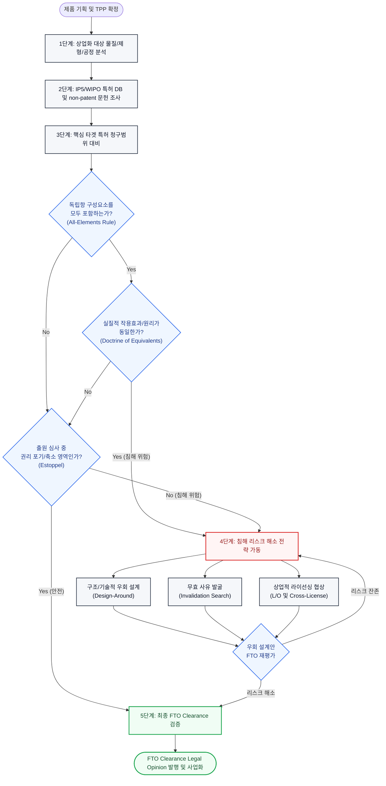
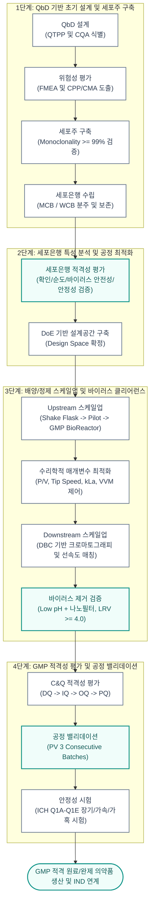

# 제4장. 기업 주도 상용화 개발 및 사업화 연계 전략

---

## 본 장의 개요 (Key Highlights)
> [!NOTE]
> 본 장은 기업 주도 바이오 국가 R&D 과제 기획 및 수행 시 성공적인 상업화를 견인하기 위한 핵심 전략을 다룸. 구체적으로 **특허 선행기술 조사 및 FTO(Freedom to Operate) 장벽 극복 전략**, **임상 시료 생산 및 공정 개발을 위한 CMC(화학·제조·품질관리) 설계와 MCB/WCB 구축 및 GMP 적합성 확보 방안**, 그리고 **글로벌 임상 진입을 위한 IND(임상시험계획) 신청 가이드라인 및 투자 대비 수익률(ROI), 시장 규모 분석을 포함한 경제성 평가 방법론**을 제시함. 상업적 성공 가능성을 극대화하고 인허가 장벽을 효과적으로 해소하기 위한 실무 지침서 역할을 목적으로 함.

---

## 1. 특허 선행기술 조사 및 FTO (Freedom to Operate) 장벽 극복 전략

### FTO 특허 장벽 해소 및 검증 경로 (FTO Clearance Path)


### 1.1 특허 선행기술 조사 (Prior Art Search) 방법론 및 검색식 설계
* **특허 DB 다각화 및 조사 범위 정의**
  * 주요 5개국(IP5: 한국 KIPO, 미국 USPTO, 유럽 EPO, 일본 JPO, 중국 CNIPA) 특허청 및 WIPO(세계지적재산권기구) 공식 DB 활용.
  * 상용 특허 검색 플랫폼(LexisNexis, Derwent Innovation, WIPS, Keywert 등)을 교차 사용하여 서지사항, 패밀리 특허, 소송 이력 분석 수행.
  * 조사 범위는 후보물질의 물질 특허(핵심 Scaffold, 아미노산 서열)에 국한하지 않고, 적응증(용도), 배합비(제형), 염/결정형, 생산 공정(정제 단계, 벡터 구조), 및 정량 분석법까지 포함하도록 구조화함.
* **검색 키워드 도출 및 논리 연산자(Boolean Operators) 결합**
  * 핵심 타겟 단백질/유전자명, 작용 기전, 대상 질환, 모노클로날/바이오시밀러/이중항체 등 타겟 물질의 유의어 및 파생어 리스트업.
  * 와일드카드(`*`, `?`) 및 근접 연산자(Near, Adj 등)를 사용하여 검색 정밀도(Precision)와 재현율(Recall)을 극대화함.
  * 특허분류코드(IPC, CPC)를 기술 도메인별로 추출 및 결합하여 키워드 검색의 한계를 보완하고 검색 누락(False Negative)을 최소화함.
  * *검색식 설계 표준 템플릿 예시*:
    ```text
    (Target Protein OR Target Receptor OR "Target Gene") AND (Antibody OR "Monoclonal Antibody" OR "Bispecific" OR "CAR-T") AND (Therapeutic Use OR Treatment OR Cancer OR "Solid Tumor") AND CPC:(A61K39/395 OR C07K16/28 OR C12N15/63)
    ```
* **비특허 문헌(Prior Art) 수집 및 검색 정교화**
  * PubMed, Google Scholar 등 학술지 논문 DB와 글로벌 임상시험 정보 등록 포털(ClinicalTrials.gov 등)을 연동하여 미출원 공지 기술에 대한 선행 유무를 교차 입증함.

### 1.2 FTO (Freedom to Operate) 침해 리스크 분석 및 평가 절차
* **FTO 분석의 법적 목적 및 핵심 분석 대상 정의**
  * 자사 개발 제품의 생산, 판매, 수출입 및 사용 행위가 타인의 유효 특허권을 침해할 리스크가 있는지 여부를 선제적으로 판별하기 위함.
  * 상업적 완제품의 구성 요소(원료 의약품, 완제 제형, 투여 경로, 치료 적응증, 제조 공정 등)를 분절하여 각 구성 항목 단위로 FTO 분석 대상을 매핑함.
* **특허 청구범위(Patent Claims)의 법적·기술적 해석 프로토콜**
  * **올인원 원칙(All-Elements Rule)의 적용**: 타겟 특허 독립항(Independent Claim)에 기재된 모든 개별 구성요소(Elements)를 자사 기술이 전부 포함(Reading on)하는지 정밀 대비함.
  * **균등론(Doctrine of Equivalents)적 침해 분석**: 자사 기술 중 일부 구성요소가 타겟 특허와 문언상(Literal) 일치하지 않더라도, 실질적으로 동일한 작용 효과(Function), 동일한 작동 원리(Way), 동일한 결과(Result)를 나타내며 치환이 용이한 경우(FWR Test) 균등 침해 리스크를 평가함.
  * **금반언의 원칙(Prosecution History Estoppel) 분석**: 타겟 특허의 출원 심사 단계(Office Action)에서 출원인이 심사관의 거절이유를 극복하기 위해 자진 삭제하거나 축소 보정한 범위에 자사 기술이 위치하여 침해 범위에서 제외될 수 있는지 심사이력(Wrapper) 분석.
  * 특허 만료일 계산 시 존속기간 연장 제도(PTE, Patent Term Extension) 유무를 분석하고 각 타겟 국가별 유효 상태(Active, Expired, Lapsed 등)를 실시간 모니터링함.

### 1.3 FTO 장벽 극복 및 특허 회피(De-risking) 전략
* **구조적/기술적 우회 설계 (Design-Around) 방안**
  * **소분자 화합물 분야**: 활성 포켓 내의 핵심 수소 결합 및 정전기적 상호작용은 유지하되, 타사 특허 청구범위 외각의 치환기 도입, 염(Salt) 변경, 이성질체(Enantiomer) 단독 분리, 또는 신규 공결정(Co-crystal)/결정다형(Polymorph) 형태로 신규 특허성 확보.
  * **바이오 의약품 분야**: 항체 가변 영역 내 특허화된 서열을 일부 치환하거나, 면역원성 감소를 위한 프레임워크(Framework Region) 백뮤테이션(Back Mutation)을 수행. 당쇄화 패턴 변경(Glyco-engineering) 및 단백질 융합 파트너(PEGylation 등) 변경을 통한 청구범위 탈출.
  * **제조공정 분야**: 타사 특허 청구범위에 기재된 배양 온도, pH 조건, 수지(Resin) 결합 용량, 버퍼 조성 및 크로마토그래피 용리(Elution) 순서를 대체할 수 있는 독자적 생산 공정 루트 설계.
* **권리성 무력화 및 비즈니스 연계 전략**
  * 무효자료 수집(Prior Art Search for Invalidation)을 통한 타겟 특허의 무효 심판(IPR/PGR/이의신청) 청구 포트폴리오 확보.
  * 자사 선사용권(Prior Use Right) 성립 요건 입증을 위해 기술 개발 시점의 연구 기록 및 공정 데이터 타임스탬프 관리.
  * 크로스 라이선싱(Cross-Licensing) 및 특허 양도, 제휴 파트너십 유치 등 상업적 라이선스 확보 로드맵 수립.

---

## 2. CMC (Chemistry, Manufacturing, and Controls) 디자인 및 스케일업(Scale-up) 계획

### CMC 스케일업 및 검증 생애주기 (CMC Scale-up Lifecycle)


### 2.1 원료의약품(DS) 및 완제의약품(DP) 공정 개발과 GMP 적합성
* **QbD (Quality by Design, 설계기반 품질고도화) 방법론 도입**
  * **QTPP (Target Product Quality Profile, 목표제품품질프로필)** 수립: 임상 의학적 목적에 근거한 제형, 투여 경로, 강도, 전달 용기 및 안정성 기준 확정.
  * **CQA (Critical Quality Attribute, 핵심품질특성)** 식별: 약물의 물리화학적 성질, 생물학적 활성(Potency), 순도(Purity), 불순물(HCP, HCD, Endotoxin, Bioburden), 면역원성 영향성 인자 도출.
  * **위험성 평가(Risk Assessment) 수행**: Failure Mode and Effects Analysis (FMEA) 기법을 활용하여 공정 변수(CPP)와 원료 특성(CMA)이 CQA에 미치는 영향력을 정량적 점수화(Severity $\times$ Occurrence $\times$ Detection)함.
  * **Design Space(설계공간) 구축**: DoE(Design of Experiments, 실험계획법)를 기반으로 다인자 요인설계 및 반응표면분석법(RSM)을 수행하여, 공정 품질을 보증하는 최적의 운전 영역(proven acceptable range)을 확정함.
* **제조소 적합성(GMP Compliance) 검증 및 장비 적격성 평가**
  * **C&Q (Commissioning & Qualification) 표준 절차**:
    1. DQ (Design Qualification, 설계적격성평가): 사용자 요구서(URS) 대비 설계 도면 일치 확인.
    2. IQ (Installation Qualification, 설치적격성평가): 배관, 배선, 부품의 사양서 일치 및 설치 상태 확인.
    3. OQ (Operational Qualification, 운전적격성평가): 무부하 운전 시 비상 차단, 온도/압력 제어 루프 작동 검증.
    4. PQ (Performance Qualification, 성능적격성평가): 실제 부하(배지, 버퍼 등) 투입 하에 공정 성능의 일관성 입증.
  * **공정 밸리데이션(PV, Process Validation)**: 연속 3개 배치(3 Consecutive Batches) 생산을 통해 설정된 Design Space 내에서 설계 기준에 부합하는 일관된 제품 생산 능력을 증빙함.
* **의약품 안정성 시험 설계 (ICH Q1A-Q1E 규격)**
  * **장기보존시험**: $25^\circ\text{C} \pm 2^\circ\text{C} / 60\% \pm 5\% \text{ RH}$ 또는 냉장 보관 조건($5^\circ\text{C} \pm 3^\circ\text{C}$), 최소 12개월 이상 수행.
  * **가속시험**: $40^\circ\text{C} \pm 2^\circ\text{C} / 75\% \pm 5\% \text{ RH}$ 또는 냉장 보관 약물의 경우 $25^\circ\text{C} \pm 2^\circ\text{C} / 60\% \pm 5\% \text{ RH}$, 최소 6개월 이상 수행.
  * **가혹시험**: 온도 구배 시험, 다습 조건, 광선(UV/Visible light, ICH Q1B 규격), 산/염기 및 강산화 조건에서의 물리화학적 분해 경로 규명 및 불순물(Degradant) 프로파일 확보.

### 2.2 세포주 구축 및 은행 관리 (MCB, WCB) 수립 전략
* **세포주 구축 이력 및 기원 검증 (Cell Line History & Traceability)**
  * Host Cell(예: CHO-DG44, CHO-K1, CHO-S 등) 및 발현 벡터의 기원 서류화.
  * 배양 전 과정에서의 무혈청(Serum-Free) 및 동물 유래 성분 배제(ADCF, Animal-Derived Component Free) 배지 적용을 통한 프리온 질환(TSE/BSE) 및 외래성 바이러스(Adventitious Virus) 유입 방지.
  * 단일 클론성(Monoclonality) 검증: 이중 한계 희석법(Double Limiting Dilution) 또는 단일 세포 분주 장비(Single-cell printer, FACS sorting)를 사용한 단일 클론 증빙 이미징 데이터 확보(FDA 권장 수준인 단일성 보증 확률 $\ge 99.0\%$ 입증).
* **세포은행(Cell Banking) 구축 및 유지 관리 체계**
  * **MCB (Master Cell Bank) 구축**: 단일성 검증이 완료된 최적 클론을 1차 증식 배양하여 대량의 바이알(통상 100~300 vial)로 분주, 액체질소 기상($-130^\circ\text{C}$ 이하)에 장기 보존함.
  * **WCB (Working Cell Bank) 구축**: MCB 중 1 vial을 해동(Thawing)하고 추가 계대 배양하여 상업 생산용 종균으로 직접 투입하기 위한 세포은행(vial 수 $\ge 200$)을 추가 구축함.
  * 세포은행 유지 시 교차 오염을 방지하기 위해 저장 용기 구획화 및 독립된 2개소 이상 분산 보관(Off-site Storage) 전략 수립.

### 2.3 세포은행(MCB/WCB) 특성분석 및 적격성 평가 항목 비교

| 분석 범주 | 세부 시험 검사 항목 | 검사 방법론 / 가이드라인 | MCB 적용 여부 | WCB 적용 여부 |
| :--- | :--- | :--- | :---: | :---: |
| **확인시험 (Identity)** | • Isoenzyme 패턴 분석<br>• 핵형 분석 (Karyotyping)<br>• 서열 분석 (DNA Sequencing) | • Isoelectric focusing (IEF)<br>• 중합효소연쇄반응 (PCR)<br>• 차세대 염기서열 분석 (NGS) | **필수 (All)** | **필수 (Identity)** |
| **순도 및 무균성 (Purity)** | • 세균 및 진균 부정시험<br>• 마이코플라스마 부정시험<br>• 엔도톡신 검사 | • 직접접종법 / 멤브레인 필터법<br>• 배양법 / DNA 염색법 / qPCR<br>• LAL (Limulus Amebocyte Lysate) | **필수** | **필수** |
| **외래성 바이러스 (Viral Safety)** | • 체외 바이러스 부정시험 (In vitro)<br>• 체내 바이러스 부정시험 (In vivo)<br>• 종 특이적 바이러스 부정시험 | • 지시 세포주(Indicator cells) 접종법<br>• 마우스/기니피그 접종 독성 평가<br>• RT-PCR, MAP/RAPD 시험법 | **필수 (Full Panel)** | **간이 (In vitro)** |
| **레트로바이러스 (Retro-virus)** | • 감염성 레트로바이러스 검증<br>• 전자현미경을 통한 바이러스 입자 관찰 | • 코-컬티베이션(Co-cultivation) / S+/L- 분석<br>• TEM (Transmission Electron Microscopy) | **필수** | **필수 (TEM)** |
| **유전적 안정성 (Genetic Stability)** | • 유전자 카피수 (Copy Number) 측정<br>• mRNA 및 발현 단백질 크기 확인 | • Southern Blot / qPCR 분석<br>• Northern Blot / SDS-PAGE | **필수 (최대 계대수)** | **선택 (제조 배치 단위)** |
| **생물학적 활성 (Viability)** | • 세포 생존력 및 생균 밀도 분석 | • Trypan Blue 염색법 / 자동 세포 카운터 | **필수** | **필수** |

### 2.4 스케일업(Scale-up) 공정 설계 및 장비 이관(Transfer)
* **Upstream 공정 (배양) 스케일업 요건 설계**
  * 실험실 규모(Shake Flask, 2~10L)에서 Pilot 생산(50~200L) 및 GMP 상업 생산(1000~2000L+) 스케일업 시 수리학적 매개변수 최적화.
  * **교반 및 포기 설계**: 교반 동력 밀도($P/V$), 교반 날개 끝 속도(Tip Speed, $\pi N D$), 산소전달계수($k_L a$), 및 단위 부피당 가스 주입량(VVM)을 매칭하여 배양조 내 사구(Dead Zone) 및 고전단(High Shear)에 의한 세포 사멸 방지.
  * **배양 배합 피딩**: Fed-batch 배양 시 영양 공급(Glucose, Amino acid 등) 시점 및 속도 제어, Perfusion(관류) 배양 시 세포 회수막(Cell Retention Device: ATF/TFF) 여과 선속도 제어 모델 수립.
* **Downstream 공정 (정제) 스케일업 및 바이러스 안전성 입증**
  * **크로마토그래피 스케일업**: 레진의 동적 결합 용량(DBC, Dynamic Binding Capacity)에 따른 선속도(Linear Velocity) 및 베드 높이(Bed Height) 비율 유지. 컬럼 압력 강하(Pressure Drop) 한계 범위를 정의하여 레진 압착 현상 예방.
  * **바이러스 클리어런스 (Virus Clearance Validation)**:
    * **외막 바이러스(Enveloped Virus)**: 저pH 불활화 공정(Low pH Inactivation: pH 3.5~3.8 조건 하에 $15\sim25^\circ\text{C}$에서 60~120분 유지) 또는 Triton X-100 등 계면활성제 불활화 공정 밸리데이션.
    * **비외막 바이러스(Non-enveloped Virus)**: 공정 종반부에 바이러스 제거 전용 나노필터(Virus Filtration, 평균 기공 크기 15~20nm) 여과 유량 및 압력 구배 제어.
    * 두 단계 이상의 독립적인 바이러스 제거 공정을 통해 총 Log Reduction Value(LRV) 합산치가 외막 바이러스 기준 $\ge 4.0$ 이상을 확보하도록 설계 및 검증함.

---

## 3. 임상시험계획(IND) 신청 가이드라인 및 경제성 Feasibility 분석

### 3.1 IND (Investigational New Drug) 승인 신청 프로세스 및 가이드라인
* **글로벌 규제기관별 IND 신청 구조 및 CTD (Common Technical Document) 작성**
  * ICH 가이드라인 기반 국제공통기술문서(CTD) 5개 모듈 구성 체계 적용.
    * **모듈 1 (Module 1)**: 지역 행정 정보 (국가별 신청서, 라벨링 정보 등).
    * **모듈 2 (Module 2)**: 요약문 (품질 요약(QOS), 비임상 요약, 임상 요약).
    * **모듈 3 (Module 3)**: 품질 자료 (CMC 데이터, 제조 공정, 원료/완제 관리 등).
    * **모듈 4 (Module 4)**: 비임상 시험 보고서 (약리, 약동, GLP 독성 시험 원본 보고서).
    * **모듈 5 (Module 5)**: 임상 시험 보고서 (이전 임상 결과가 있는 경우 또는 임상시험계획서(Protocol) 등).
  * 한국 식약처(MFDS), 미국 FDA, 유럽 EMA 등 타겟 규제 기관의 특수 요건(예: IND 신청 전 Pre-IND 미팅 수행을 통한 가이드라인 합의 등) 대응 계획 제시.
* **임상시험계획서 (Clinical Protocol) 핵심 요소 설계**
  * **임상 1상 설계 요건**: 건강한 피험자 또는 표준 치료에 실패한 암 환자를 대상으로 한 최초 인간 투여(FIH, First-in-Human) 시험 설계.
  * **일차/이차 평가변수(Primary/Secondary Endpoints)**: 안전성, 내약성(Tolerability), 약동학적(PK) 특성을 일차 변수로 설정하고, 탐색적 유효성(Efficacy, ORR, PFS 등)을 이차 변수로 설계.
  * **투여량 설정 근거**: 비임상 독성 시험(NOAEL, No Observed Adverse Effect Level) 데이터를 기준으로 관련 안전 계수(Safety Factor, 통상 10~100배)를 적용하여 최초 투여량(Starting Dose) 산출.
  * **용량 증량(Dose Escalation) 모델**: 전통적인 $3+3$ 설계 기법 또는 베이지안 연속 재평가 방법(CRM, Continual Reassessment Method)을 활용하여 최대허용량(MTD) 및 임상 2상 권장용량(RP2D) 결정 알고리즘 제시.

### 3.2 경제성 분석 (Feasibility Analysis) 및 시장성 예측 방법론
* **목표 시장 정의 및 규모 산정 (Market Sizing)**
  * **TAM (Total Addressable Market, 전체 이용 가능 시장)**: 질환군 전체의 글로벌 유병률 및 진단율에 따른 약물 시장 총액 산출.
  * **SAM (Serviceable Addressable Market, 유효 시장)**: 자사 후보 물질이 타겟팅하는 세부 치료 영역(예: 1차 라인 치료제, 바이오마커 양성 환자군 등)의 가용 시장 산출.
  * **SOM (Serviceable Obtainable Market, 수익 시장)**: 출시 초기 자사의 예상 경쟁 점유율(Market Share) 및 예상 약가(Pricing)를 기준으로 한 단기 실현 가능 매출액 도출.
  * 환자 역학 데이터(Epidemiology-based Bottom-up approach)를 활용한 상향식 매출 추정 모델 설계.
* **투자 대비 수익률 (ROI, Return on Investment) 및 순현재가치 (NPV) 산출 모형**
  * 향후 임상 1/2/3상 개발 및 품목허가(BLA/NDA), 상업 생산 시설 구축까지 소요될 **누적 R&D 비용(Capex & Opex)**의 연도별 할인율 반영 추정.
  * 성공 확률(PoS, Probability of Success)을 반영한 **임상 단계별 가중 순현재가치 (rNPV, risk-adjusted Net Present Value)** 공식 설계:
    $$\text{rNPV} = \sum_{t=0}^{N} \frac{CF_t \times P_t}{(1 + r)^t}$$
    (여기서 $CF_t$는 $t$년도의 순현금흐름, $P_t$는 $t$년도까지의 누적 임상 성공 확률, $r$은 가중평균자본비용(WACC) 등을 반영한 할인율임)
  * 특허 만료 후 제네릭/바이오시밀러 진입에 따른 매출 급감(Patent Cliff) 및 약가 인하 리스크를 시뮬레이션에 반영함.
* **기술가치평가 및 라이선스 아웃(L/O) 계약 구조 설계**
  * 선급금(Upfront Payment), 임상/상업화 단계별 마일스톤(Milestone Payments), 순매출액 대비 로열티(Royalty Rate)의 배분 비율 최적화 분석.
  * 동종 타겟 기술의 글로벌 거래 선례(Deal Precedents)와의 비교 분석을 통한 기술 가치의 벤치마킹 데이터 제시.
