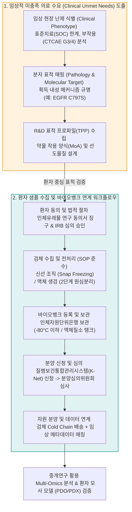
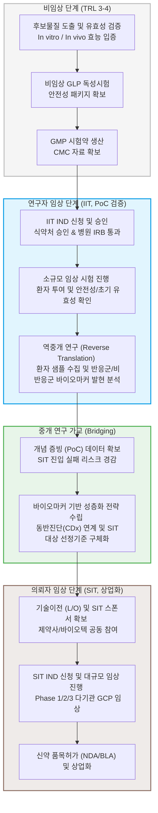

# 제5장. 병원 중심의 중개연구(Translational Research) 및 임상 프로토콜 설계 전략

---

## 본 장의 개요 (Key Highlights)
> [!NOTE]
> 본 장은 대학병원 및 연구중심병원 주도 하에 수행되는 바이오 메디컬 분야 국가 R&D 과제의 핵심 요소인 **임상적 미충족 의료 수요(Clinical Unmet Needs)의 과학적 도출**, **인체유래물(Human-derived Materials) 확보 및 바이오뱅크 연계 프로토콜**, 그리고 **연구자 주도 임상(IIT)과 의뢰자 주도 임상(SIT)의 유기적 연계 및 임상 프로토콜 설계 방법론**을 규정함. 의료 현장의 실제 수요를 기획 단계부터 반영하고, 생명윤리 규제를 준수하며, 선행 연구 성과를 신속하게 임상에 적용하기 위한 실무 가이드라인을 제시함.

---

## 1. 임상적 미충족 의료 수요(Clinical Unmet Needs) 정의 및 환자 중심 표적 개발

### 1.1 임상적 미충족 수요(Clinical Unmet Needs)의 도출 및 분석 프레임워크
* **임상 현장 미해결 난제(Medical Gap)의 과학적 규명**
  * 국가 R&D 바이오 분야 기획에서 가장 치명적인 탈락 사유 중 하나는 치료제 개발 필요성에 대한 주관적 서술 또는 학술적 유망성에만 의존하는 논리 구성임.
  * 평가위원을 설득하기 위해서는 실제 의료 현장에서 환자 및 임상 의사가 직면한 치료 실패 요인을 파악하고, 이를 극복하기 위한 수치 기반의 명확한 논리 구조(Unmet Medical Needs)를 제시해야 함.
  * **표준치료제(SOC)의 한계 분석**: 해당 적응증의 NCCN(National Comprehensive Cancer Network) 또는 ESMO(European Society for Medical Oncology) 임상 가이드라인 상 1차, 2차 표준치료요법의 한계를 객관적 반응률(ORR), 무진행생존기간(PFS), 전체생존기간(OS) 등 정량적 임상 수치와 함께 기술함.
  * **획득 내성(Acquired Resistance) 메커니즘 제시**: 표적 치료제 투여 후 발생하는 2차 돌연변이(예: EGFR 저해제 투여 후 T790M 및 C797S 변이 발생) 및 우회 신호전달 경로(Bypass Track) 활성화에 의한 내성 획득 기전을 환자의 유전적·분자병리적 관점에서 밝힘.
  * **안전성 및 독성(Toxicity Profile) 극대화 극복 필요성**: 기존 약제 투여군에서 관찰되는 중증 부작용(CTCAE Grade 3/4 이상 발생률)을 기재하여, 표적 선택성 향상을 통해 독성을 낮출 수 있는 신규 모달리티 개발의 당위성을 제시함.
* **임상 Unmet Needs 도출을 위한 3단계 분석 프레임워크**
  * **1단계 (Clinical Phenotype 분석)**: 환자의 질환 진행 상태, 생존율, 삶의 질(QoL) 저하 요인 및 임상적 사각지대 식별.
  * **2단계 (Pathology & Molecular Target 매핑)**: 표준 치료에 불응하거나 조기 재발하는 환자군의 병리조직학적 특징 및 오믹스(Omics) 수준의 변이 매칭.
  * **3단계 (R&D Target Profile 수립)**: 도출된 분자 표적을 제어하기 위한 약물의 최적 작용 양식(MoA) 및 치료 표적 프로파일(Target Product Profile, TPP) 정의.

### 1.2 환자 중심 표적 개발(Patient-Centric Target Development) 및 마커 기반 성층화
* **환자 유래 오믹스 데이터(Clinical Omics) 기반 표적 검증**
  * TCGA(The Cancer Genome Atlas), ICGC(International Cancer Genome Consortium), GEO(Gene Expression Omnibus) 등 공인된 인간 질환 유전체 데이터베이스를 활용하여 표적 유전자/단백질의 질환 특이적 과발현율(Fold Change $\ge 2.0$), 변이 빈도(Mutational Frequency)를 산출함.
  * 생존율 분석(Kaplan-Meier Plot)을 통해 표적 물질의 고발현 환자군이 저발현 환자군에 비해 통계적으로 유의미하게 예후가 불량함(Hazard Ratio > 1.0, Log-rank $p < 0.05$)을 증빙하여 임상적 가치(Clinical Relevance)를 입증함.
* **환자 모사 정밀 모델(Translational Patient Models)의 구축**
  * **환자 유래 오가노이드(PDO, Patient-Derived Organoids)**: 기존 2D 세포주(Cell Line)의 유전적 균일성 및 미세환경 상실 문제를 보완하기 위해 환자의 수술 또는 생검 조직으로부터 3차원 다세포 구조체를 확립하여 유전형 및 표현형 이질성(Intra-tumor Heterogeneity)을 재현함.
  * **환자 유래 이종이식(PDX, Patient-Derived Xenograft)**: 인간 종양 미세환경(TME)과 면역 반응의 특성을 반영하기 위해 환자 신선 조직을 면역결핍 마우스에 이식함으로써 임상 현장과의 약효 일치도(Concordance Rate $\ge 80\%$)를 확보함.
* **바이오마커 기반 환자 성층화(Patient Stratification) 전략**
  * 무작위 환자군을 대상으로 한 치료율 평가는 임상 통계적 검정력을 약화시키므로, 치료 반응성(Efficacy Signal)을 극대화할 수 있는 특정 바이오마커 양성 환자군 선별 기준을 기획 단계부터 반영함.
  * 동반진단(CDx, Companion Diagnostics) 기술(예: NGS 기반 다중 유전자 패널, IHC 면역화학염색, FISH 형광인시튜부합법)의 연구 개발 로드맵을 함께 설계하여 임상 진입 시 환자 선별 프로토콜의 일관성을 제고함.

---

## 2. 인체유래물 확보 및 환자 샘플 수집·바이오뱅크 연계 계획

### 2.1 인체유래물(Human-derived Materials) 정의 및 수집 가이드라인
* **생명윤리법 준수 및 법적 절차 이행**
  * 인체유래물 연구는 '생명윤리 및 안전에 관한 법률' 제36조 내지 제40조에 의거하여 엄격히 규제됨.
  * 연구 제안 시 주관 및 공동 연구기관의 IRB(기관생명윤리위원회) 심의 승인 계획과 법정 서식인 **'인체유래물 연구 동의서(Informed Consent Form)'**의 피험자 징구 절차를 완벽히 구축해야 함.
  * 개인정보 보호를 위한 익명화 처리(개인 식별 정보 제거 및 무작위 고유 식별 코드 부여) 및 개인정보책임자(DPO) 지정 방안을 기술서에 명시함.
* **검체 종류별 수집 표준작업지침(SOP, Standard Operating Procedure) 설계**
  * **조직 검체(Tissue Samples)**:
    * 수술적 절제 후 30분 이내 급속 동결(Liquid Nitrogen, $-196^\circ\text{C}$ 동결 후 $-80^\circ\text{C}$ 보관)하여 RNA/단백질 분해를 방지하거나, 병리 진단용 FFPE(Formalin-Fixed Paraffin-Embedded) 블록으로 가공함.
  * **액체 생검 검체(Liquid Biopsy Samples)**:
    * *혈액*: 혈장(Plasma, cfDNA/EV 분석용) 분리를 위해 EDTA 튜브 채혈 후 2시간 이내 2단계 원심분리($1,600\times g$ 10분 후 $16,000\times g$ 10분) 수행 및 상층액 분주 보관. 혈청(Serum, 항체/단백체 분석용) 분리를 위해 SST 튜브 채혈 후 상온 30분 방치하여 완전 응고 후 원심분리 수행.
    * *말초혈액단핵세포(PBMC)*: 밀도구배 원심분리(Ficoll-Paque 등)를 활용하여 분리하고, 세포 생존력 보존을 위해 DMSO가 포함된 Freezing Media로 초저온 동결 보관함.
    * *기타 체액*: 소변(Urine), 뇌척수액(CSF) 등은 채취 즉시 원심분리를 통해 세포 파편을 제거하고 $-80^\circ\text{C}$ 이하에서 동결 분주하여 보관함.

### 2.2 바이오뱅크(Biobank) 및 네트워크 연계 기획
* **국가 인체자원 공유 인프라와의 연계**
  * 연구팀 자체 수집의 한계를 극복하고 연구 결과의 Rigor를 확보하기 위해, 질병관리청 국립중앙인체자원은행 또는 전국 대학병원 지정 인체자원단위은행과의 연계 네트워크 활용 계획을 제시함.
  * 과제 계획서에 분양 요청 검체 정보(Target Disease, 임상 정보 포함 여부, 필요한 최소 수량 등)를 구체적으로 설정함.
* **인체유래물 분양 표준 절차 설계**
  * **신청 전 단계**: 연구 계획 수립 및 자체 연구기관 IRB로부터 '인체유래물 사용 계획서' 승인 획득.
  * **분양 신청**: 질병보건통합관리시스템(K-Net)을 통해 인체자원 분양 신청서, 연구계획서 요약본, IRB 심의 결과서 제출.
  * **분양 심의**: 바이오뱅크 산하 분양심의위원회에서 연구의 학술적 타당성, 사용 규모의 과학적 합리성, 개인정보 보호 수준을 심사(통상 2~4주 소요).
  * **분양 집행 및 데이터 연계**: 심의 승인 완료 후 수수료 정산 및 드라이아이스/콜드체인 기반 배송 수령.
* **임상 메타데이터(Clinical Metadata)의 품질 제어 및 정합성 확보**
  * 분양받은 샘플의 유용성을 극대화하기 위해 단순 생물학적 정보 외에 **환자의 임상 배경 정보(Clinical Annotation Data)**가 매칭된 데이터세트를 확보함.
  * 수집 항목: 환자 나이, 성별, TNM 병기, 치료 이력(이전 항암 화학요법 종류, 방사선 치료 여부), 약물 반응성(Response 평가), 무진행생존기간(PFS) 및 전체생존기간(OS).

### 2.3 [시각화] 임상적 미충족 수요 도출 및 바이오뱅크 연계 워크플로우

### 2.4 인체유래물 유형별 보관 기준 및 분석 목적 대조표

| 검체 구분 | 수집 가이드라인 및 처리 프로토콜 | 동결/보관 온도 조건 | 최적 분석 목적 및 응용 분야 |
| :--- | :--- | :---: | :--- |
| **신선 동결 조직 (Fresh Frozen Tissue)** | • 수술적 절제 후 30분 이내 급속 동결 • 액체질소($-196^\circ\text{C}$) snap freezing 적용 | $-80^\circ\text{C}$ 이하 또는 액체질소 탱크 | • 차세대 염기서열 분석(WGS, WES, RNA-Seq) • 단백체학(Proteomics) 분석 및 활성 검증 |
| **FFPE 조직 블록 (Formalin-Fixed)** | • 10% 중성완충포르말린 12~24시간 고정 • 탈수 및 파라핀 침투 공정 표준화 | 상온 ($20\sim25^\circ\text{C}$) 건소 | • 병리조직학적 면역화학염색(IHC) • 공간전사체(Spatial Transcriptomics) 분석 |
| **혈장 (Plasma)** | • EDTA 또는 Cell-Free DNA BCT 튜브 사용 • 2단계 원심분리를 통한 세포 성분 완전 배제 | $-80^\circ\text{C}$ 이하 | • 혈중 순환 DNA(cfDNA, ctDNA) 정량 분석 • 세포외 소포체(EV, Exosome) 분리 및 마커 규명 |
| **혈청 (Serum)** | • 응고촉진제(Clot Activator) 튜브 채혈 • 상온 30분 응고 후 $2,000\times g$ 15분 원심분리 | $-80^\circ\text{C}$ 이하 | • 사이토카인, 케모카인 등 면역 매개 물질 분석 • 약물 생체 안전성 관련 대사체(Metabolite) 프로파일링 |
| **말초혈액단핵세포 (PBMC)** | • Heparin 또는 CPT 튜브 채혈 • Ficoll 밀도구배 원심분리 및 세척 2회 반복 | 액체질소 기상 보관 (Vapor Phase) | • 면역세포 프로파일링(Flow Cytometry, FACS) • 단일세포 전사체(Single-cell RNA-seq) 분석 |
| **뇌척수액 (CSF)** | • 요추 천자(Lumbar Puncture) 후 즉시 냉각시킴 • 세포 성분 원심분리 제거 후 동결 분주 | $-80^\circ\text{C}$ 이하 | • 중추신경계(CNS) 질환 표적 및 바이오마커 발굴 • 뇌종양 유래 유리 핵산(cfDNA) 프로파일링 |

---

## 3. IIT(연구자 임상) vs SIT(의뢰자 임상) 상관성 및 임상 프로토콜 설계

### 3.1 IIT(Investigator-Initiated Trial)와 SIT(Sponsor-Initiated Trial)의 개념 비교 및 연계
* **IIT와 SIT의 정의 및 특성 차이**
  * **연구자 주도 임상시험(IIT)**: 임상 의사가 주도적으로 학술적 연구 목적을 수립하고, 식약처(MFDS)로부터 임상시험계획(IND) 승인을 직접 받아 수행함. 신규 약물의 오프라벨(Off-label) 적응증 추가 탐색, 병용 투여를 통한 시너지 확인, 특정 바이오마커 기반의 환자 반응 예측 등 상업적 허가 목적 외 연구에 최적화됨.
  * **의뢰자 주도 임상시험(SIT)**: 제약·바이오 기업이 상업적 허가(NDA/BLA)를 얻기 위해 스폰서 자격으로 임상 개발 전 과정을 총괄하고 임상 자금을 제공함. 모니터링, 데이터 관리, 통계 분석 등에 막대한 행정비용과 조직력이 투입되며, 식약처 및 미국 FDA 등 글로벌 규제기관의 GCP(Good Clinical Practice) 기준 심사를 상시 수검함.
* **IIT와 SIT의 중개 연구 관점의 시너지 창출 전략 (Translational Bridge)**
  * **IIT의 개념 증빙(PoC) 데이터를 통한 SIT 리스크 경감**:
    * 신약 후보물질의 대규모 상업 임상(SIT 1상 또는 2상) 진입 전, 연구책임자 병원의 풍부한 환자 풀과 검체를 활용한 소규모 IIT를 먼저 실행함.
    * 인간 대상 최초 안전성(First-in-Human Safety) 및 유효성 시그널(Preliminary Efficacy)을 확보하여 SIT 진입 시의 개발 실패 리스크(Attrition Rate)를 최소화함.
  * **임상 마커 역중개(Reverse Translation) 연구 연계**:
    * IIT 수행 중 획득한 환자의 혈액 및 조직 검체 분석을 통해 치료 반응군(Responder)과 비반응군(Non-responder)의 오믹스 차이를 분석하고, 이를 차세대 SIT 임상의 환자 선정/제외 기준에 바이오마커로 반영함.
  * **국가 R&D 기획서 내 연계 마일스톤 설계 예시**:
    * *1~2차년도*: TRL 3단계 In vivo 효능 입증 및 원료의약품 소량 GMP 생산 완료.
    * *3차년도*: IIT용 IND 승인 및 환자 투여 개시, 탐색적 바이오마커 분석 완료 (TRL 5 단계 진입).
    * *4차년도 (과제 종료 후)*: 확보된 IIT 데이터를 바탕으로 대규모 기업 공동 참여를 유도하여 상업용 SIT 1/2상 진입을 위한 기술이전 계약 체결.

### 3.2 [시각화] IIT-to-SIT 중개 연구 가교(Bridging) 파이프라인

### 3.3 IIT vs SIT 핵심 차이점 및 중개 연구 관점의 대조 매트릭스

| 비교 항목 | 연구자 주도 임상시험 (IIT) | 의뢰자 주도 임상시험 (SIT) | 중개 연구 관점의 연계 전략 |
| :--- | :--- | :--- | :--- |
| **시험 발의 및 주체** | • 임상 의사 (Principal Investigator) | • 제약·바이오 기업 (Sponsor) | • IIT의 학술적 아이디어를 기업이 수용하여 상업 SIT로 확장 |
| **주요 목적** | • 학술적 연구, 미충족 수요 해결 • 새로운 병용 요법 및 적응증 탐색 | • 규제기관(식약처, FDA 등) 허가 획득 • 마케팅 및 상업화 권리 확보 | • IIT로 임상적 PoC를 조기 확보하여 SIT 개발 기간 단축 |
| **재원 및 약물 조달** | • 정부 연구비, 기관 자체 연구비 • 제약사로부터 무상 약물 기증 | • 의뢰사(기업) 자본 100% 조달 | • 국가 R&D 자금으로 IIT를 수행하고 그 결과를 기업에 기술이전 |
| **IND 신청 및 스폰서** | • 임상시험책임의사 (PI) 개인 | • 임상개발 제약사/바이오텍 법인 | • IIT IND 프로토콜을 SIT IND 신청용 안전성 패키지로 변환 |
| **데이터 소유권** | • 연구자 및 소속 의료기관 소유 | • 의뢰사(기업) 독점 소유 | • IIT 데이터를 공동 활용하여 공동 지식재산권(IP) 및 신규 적응증 특허 확보 |
| **GCP 적용 및 관리** | • 상대적으로 유연한 모니터링 적용 • 연구자 책임 하에 품질 관리 수행 | • 제3자 CRO에 의한 엄격한 상시 모니터링 • 전담 QA 조직의 정기 Audit 의무화 | • IIT 단계부터 핵심 안전성 지표를 SIT 수준에 준하여 표준화 |

### 3.4 임상시험 프로토콜(Clinical Protocol) 및 IND 신청 기획
* **임상시험계획서(Protocol) 설계의 핵심 요소 및 파라미터**
  * **임상 목적(Endpoints)의 정량화**:
    * *1차 평가지표(Primary Endpoint)*: 안전성(Safety) 및 내약성(Tolerability) 확인을 위한 치료제 투여 후 제한독성(DLT, Dose Limiting Toxicity) 발생률 및 이상반응(AE) 발생 빈도. 또는 초기 유효성 확인을 위한 객관적반응률(ORR).
    * *2차 평가지표(Secondary Endpoint)*: 무진행생존기간(PFS), 전체생존기간(OS), 반응지속기간(DOR), 약동학적(PK) 파라미터($C_{max}$, $t_{1/2}$, $AUC$).
    * *탐색적 평가지표(Exploratory Endpoint)*: 혈중 표적 단백질 발현 변화, 종양 유전자 돌연변이 패턴의 종적 변화(cfDNA 모니터링).
  * **피험자 선정/제외 기준(Eligibility Criteria)의 객관화**:
    * *선정 기준*: 조직 검사를 통해 표적 항원의 과발현(예: IHC 3+ 또는 FISH 양성)이 규명된 환자, 만 19세 이상 성인, ECOG Performance Status 0 또는 1, 주요 장기 기능 수치(절대호중구수 $ANC \ge 1,500/\mu\text{L}$, 혈소판 $PLT \ge 100,000/\mu\text{L}$, 크레아티닌 클리어런스 $CrCl \ge 60\text{ mL/min}$, 혈청 빌리루빈 $\le 1.5 \times ULN$) 기준 부합자.
    * *제외 기준*: 임상시험 등록 전 4주 이내에 항암 화학요법, 방사선 치료 또는 면역요법을 투여받은 환자, 임상적으로 활동성인 중추신경계(CNS) 전이 환자, NYHA Class III/IV 이상의 조절되지 않는 심부전 환자.
  * **임상 설계 구조화**:
    * *용량 증량 단계(Dose Escalation Phase)*: 표준 3+3 코호트 디자인 적용. 코호트별 3명의 환자를 등록하여 DLT 발생 여부를 감시하고, 최대허용용량(MTD, Maximum Tolerated Dose) 및 권장 2상 용량(RP2D, Recommended Phase 2 Dose)을 확정함.
    * *용량 확장 단계(Dose Expansion Phase)*: 확정된 RP2D 용량으로 특정 바이오마커 양성 집단 대상의 코호트(일반적으로 $N=15\sim30$)를 추가 가동하여 유효성 및 안전성을 추가 규명함.
* **임상시험계획 승인(IND, Investigational New Drug Application) 대응 계획**
  * 식약처(MFDS) 또는 글로벌 규제기관(FDA 등) 신청에 필요한 IND 패키지 필수 구성품 준비 일정 수립.
  * **비임상 자료 패키지(Pre-clinical Dossier)**: GLP 기관 성적서 기반의 안전성 약리시험, 단회/반복 투여 독성시험(설치류 및 비설치류 2종 필수), 유전독성시험, 생식발생독성시험 데이터.
  * **CMC 자료 패키지**: GMP 인증 제조 시설에서 생산된 시험약의 특성 분석(Characterization), 기준 및 시험방법(Specification & Test Methods), 안정성 시험(Stability Test, 실온 및 가속 조건) 자료 및 원료/완제 의약품 분석법 밸리데이션(Method Validation) 보고서.
  * **임상시험계획서(Investigational Plan)**: 윤리적 타당성, 의학적 당위성, 구체적 통계 분석 계획이 포함된 임상시험계획서 전문 및 환자 설명서/동의서 양식.

### 3.5 임상시험 단계별(1상/2상/3상) 연구 설계 기준 및 성격 비교

| 구분 항목 | 임상 1상 (Phase 1) | 임상 2상 (Phase 2) | 임상 3상 (Phase 3) |
| :--- | :--- | :--- | :--- |
| **주요 목표** | • 안전성 및 내약성 평가 • 약동학(PK) 파라미터 규명 • MTD 도출 및 RP2D 확정 | • 초기 유효성(Efficacy Signal) 탐색 • 최적 용량 및 용법 결정 • 장기 안전성 추가 모니터링 | • 표준 치료 대비 우월성/비열등성 입증 • 대규모 환자군 안전성 프로파일 확립 • 품목 허가 신청용 확증 데이터 확보 |
| **대상 환자군** | • 말기 난치성 환자 (암 환자의 경우) • 또는 건강한 성인 자원자 (일반 약물) | • 표적 바이오마커를 보유한 특정 질환군 • 선정 기준에 엄격히 부합하는 균일 집단 | • 대규모의 다양한 일반 질환 환자군 • 실제 임상 진료 현장을 대변하는 집단 |
| **피험자 규모** | • 소규모 ($20\sim80$명 수준) • 코호트당 3~6명 배치 (3+3 Design) | • 중규모 ($100\sim300$명 수준) • 적응증별 다중 코호트 설계 | • 대규모 ($300\sim3,000$명 이상) • 다국가 다기관 공동 임상 진행 |
| **설계 형태** | • 단일군(Single-arm), 공개(Open-label) • 비교대조군 없음 | • 단일군 또는 무작위배정(Randomized) • 활성 대조군 또는 위약 대조군 도입 | • 무작위 배정(Randomized), 다기관 • 이중 맹검(Double-blind) 표준 적용 |
| **핵심 평가지표** | • 제한독성(DLT) 발생 비율, 이상반응(AE) • $C_{max}, T_{max}, t_{1/2}, AUC$ | • 객관적 반응률(ORR), 무진행생존기간(PFS) • 바이오마커 발현 변화율 | • 전체생존기간(OS), 질병통제율(DCR) • 환자 보고 결과(PRO) 및 삶의 질(QoL) |
| **IRB 심의 중점** | • First-in-Human 투여의 안전 장치 • 이상반응 발생 시 중단 조건 타당성 | • 효능 분석 목적 샘플 크기 통계 근거 • 미반응 환자에 대한 대안 요법 제공 | • 대규모 피험자 안전 감시 시스템(DSMB) • 다기관 데이터 수집 및 관리 신뢰성 |

### 3.6 IRB(기관생명윤리위원회) 심의 및 다기관 임상 대응 전략
* **IRB 승인 요건 및 행정 리스크 해소 전략**
  * 연구 계획서 수립 시 병원 IRB 심의 프로세스의 정합성을 맞춰 행정 반려 리스크를 차단함.
  * 연구대상자 보호조치, 고지된 동의(Informed Consent) 절차, 취약한 환경의 피험자 보호 방안, 개인정보 유출 방지 및 안전성 모니터링 계획을 수립함.
* **다기관 임상(Multicenter Trial)에서의 중앙 IRB(Central IRB) 활용 전략**
  * 여러 대학병원 및 연구중심병원이 공동 참여하는 중개 연구/임상 과제의 경우, 각 병원별 IRB에 개별 신청 및 심의를 받을 시 심사 기간 불일치로 연구 개시 시점이 수개월 이상 지연되는 문제가 초래됨.
  * 이를 해결하기 위해 국가 임상시험 통합 심의 시스템의 **'중앙 IRB(Central IRB)'** 제도를 기획서 내에 적극적으로 도입함.
  * 주관 연구책임자 병원의 IRB 심의 승인 결과를 공동 연구기관 IRB가 별도의 독자적 재심의 과정 없이 신속 승인 또는 서면 접수로 대체하도록 상호협약을 체결함으로써, 전체 기관의 임상 시험 개시 일정을 일원화하고 관리 효율성을 향상시킴.

### 3.7 IRB 심의 유형별 심사 기준 및 필수 구비 서류 요건

| 심의 유형 | 신청 대상 및 조건 | 주요 심사 및 평가 기준 | 필수 구비 서류 목록 |
| :---: | :--- | :--- | :--- |
| **정규 심의 (Full Board Review)** | • 인간 대상 연구 중 피험자에게 유의미한 물리적/정신적 리스크를 유발하는 경우 • 침습적 생검, 신규 신약 임상시험 | • 환자 위험-이익 비율(Risk-Benefit) 분석 • 피험자 보호 대책 및 동의 프로세스 • 중도 포기 권리 보장 및 보상 대책 | • 임상시험계획서 전문 (Protocol) • 피험자 설명서 및 동의서 (ICF) • 연구자 약전 (IB) • 피험자 모집 공고문 및 광고안 |
| **신속 심의 (Expedited Review)** | • 피험자에게 미치는 리스크가 최소한(Minimal Risk)인 경우 • 비침습적 검체 채취 (단순 정맥 채혈, 소변 수집 등) • 기 승인된 계획서의 경미한 변경 | • 신속 심의 기준(윤리 지침) 충족 여부 • 개인 식별 정보 보호 조치 적절성 • 연구 참여로 인한 위해성 최소화 여부 | • 신속심의 신청서 및 사유서 • 연구계획 요약서 및 데이터 수집 시트 • 기관 생명윤리 준수 서약서 |
| **심의 면제 (Exempt)** | • 공공 데이터베이스 활용 연구 • 바이오뱅크로부터 분양받은 익명화된 인체유래물 분석 연구 • 피험자 식별이 불가능한 2차 자료 분석 | • 연구 대상자 보호 조치 의무가 없는 범위 • 개인 식별 정보의 노출 위험성 제로(0) 검증 • 유전자 분석의 포함 여부 (유전자 분석은 원칙적 면제 불가) | • 심의면제 신청서 • 익명화 확약서 및 개인정보 처리 위탁 증서 • 연구 계획서 (분석 프로토콜 중심) |
