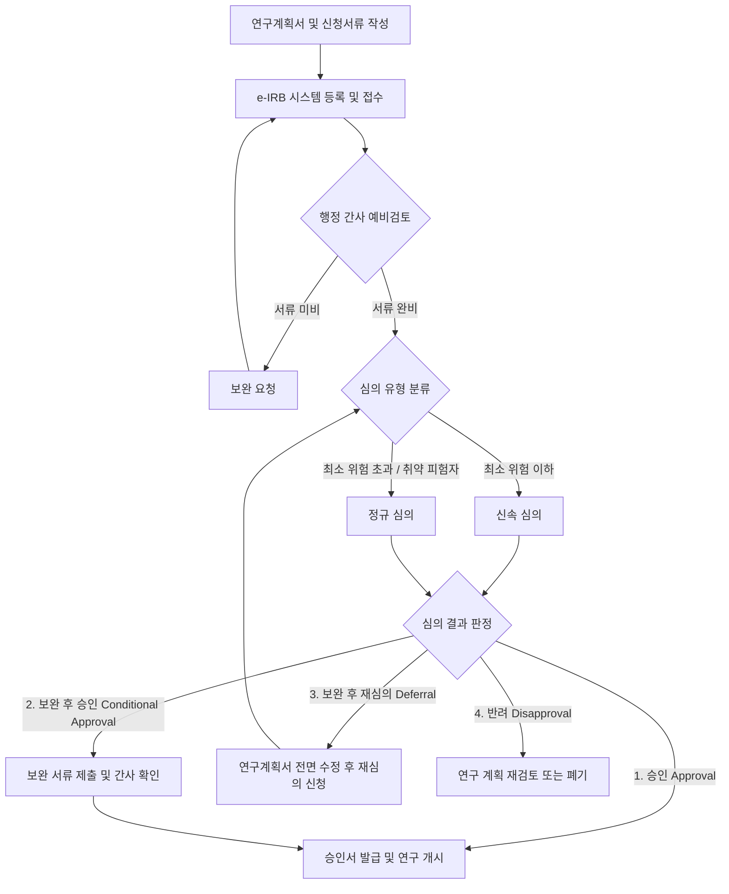

# 제6장 생명윤리 및 규제 준수 가이드라인

본 장은 국가연구개발사업(Bio-R&D) 제안서 작성 시 반드시 확보해야 하는 생명윤리적 정당성 및 규제 준수 방안을 체계적으로 서술한다. 인간대상연구, 동물실험, 생명윤리법 관련 규제 대상 연구에 대한 법적 기준과 심의 절차, 그리고 계획서 작성에 필요한 구체적 산출 공식과 가이드를 제시함으로써 연구계획의 신뢰성과 실현 가능성을 극대화하는 것을 목적으로 한다.

---

## 6.1 인간대상연구 및 IRB(기관생명윤리위원회) 심의 절차

인간대상연구를 수행하는 모든 Bio-R&D 과제는 연구 개시 전 기관생명윤리위원회(Institutional Review Board, 이하 IRB)의 심의 및 승인을 획득해야 함. 이는 피험자의 권리·안전·복지를 보호하고 연구의 윤리적·과학적 타당성을 검증하기 위한 필수적 법적 의무 사항임.

### 6.1.1 인간대상연구의 정의 및 심의 대상

#### 1. 법적 정의 (생명윤리법 제2조 제1호)
- 사람을 대상으로 물리적으로 개입하거나(물리적 개입 연구),
- 의사소통, 대인접촉 등의 방법으로 행동을 관찰·측정하거나(상호작용 연구),
- 개인을 식별할 수 있는 정보를 이용하는 연구(개인정보 이용 연구)로서 보건복지부령으로 정하는 연구를 의미함.

#### 2. 심의 대상 기준
- **인체유래물연구:** 인체로부터 채취하거나 기증받은 검체(조직, 세포, 혈액, 체액, 타액, 머리카락, 손발톱, 소변, 대변 등) 및 이로부터 얻은 유전정보를 직접 분석하는 연구.
- **인간대상연구:** 설문조사, 인터뷰, 행동 관찰, 행동 실험, 뇌파 측정, fMRI 촬영, 웨어러블 디바이스를 이용한 생체신호 수집 연구 등.
- **취약한 연구대상자(Vulnerable Subjects) 포함 연구:** 임신부, 소아·청소년(미성년자), 수형자, 군인, 피고용인, 교육생, 의사결정 능력이 결여된 환자(치매, 혼수 상태 등) 등을 대상으로 하는 연구는 원칙적으로 정규심의 대상이며, 특별한 보호 대책이 계획서 내에 명시되어야 함.

#### 3. 심의 제외(면제) 대상 및 요건 (생명윤리법 시행규칙 제13조)
- 연구대상자 및 공공에 미치는 위험이 미미한 연구로서 다음 중 하나에 해당하는 경우 심의 면제를 신청할 수 있으나, **면제 여부의 최종 결정은 연구자가 아닌 IRB 위원회가 판단**함.
  - **일반대중에게 공개된 데이터 이용 연구:** 국가기관 등이 공공 목적으로 개방한 공공데이터(예: 국민건강보험공단 표본코호트 DB, 질병관리청 국민건강영양조사 데이터 등)로서 개인식별정보가 완전히 제거된 자료를 이용하는 연구.
  - **통상적 교육환경 내 연구:** 교육과정의 평가나 교수법 개선 등을 위해 교실 내에서 통상적인 교육 활동의 일환으로 수행하는 연구.
  - **연구대상자 물리적 개입이 없는 설문·관찰 연구:** 단순 설문조사나 면담 연구 중 개인식별정보를 수집·기록하지 않고, 수집된 정보가 유출되더라도 대상자에게 명예훼손이나 법적 불이익을 줄 가능성이 없는 경우.
  - **인체유래물 기증자 정보 미수집 연구:** 인체유래물은행 등으로부터 분양받은 검체를 사용하되, 기증자의 개인식별정보를 연구자가 전혀 제공받지 않고 역추적할 수 있는 암호키가 배제된 연구.

---

### 6.1.2 IRB 심의 유형 및 절차

#### 1. 심의 유형 분류
- **정규심의 (Full Board Review):**
  - 대상: 피험자에게 최소위험(Minimal Risk)을 초과하는 신체적·심리적·사회적 위험을 야기할 수 있는 연구, 취약한 피험자 대상 연구, 신물질/신의료기기 임상시험 등.
  - 의결 방식: 위원회 정원 과반수 출석 및 출석 위원 과반수 찬성으로 의결.
- **신속심의 (Expedited Review):**
  - 대상: 최소위험 이하의 연구(예: 표준화된 설문지 작성, 비침습적 생체데이터 수집, 기승인된 연구계획의 경미한 변경, 지속심의 등).
  - 의결 방식: IRB 위원장이 지정한 위원(1인 이상)이 심의하여 승인 여부 결정. 단, 신속심의에서 반려 또는 승인 보류 판정이 날 경우 정규심의로 회부됨.

#### 2. IRB 심의 신청 필수 서류
1. **임상연구계획서(Study Protocol):** 연구 목적, 배경, 대상자 선정/제외 기준, 연구 방법, 통계적 분석 방법, 피험자 안전 대책 등 기술.
2. **대상자 설명서 및 동의서(Informed Consent Form):** 피험자가 이해하기 쉬운 용어(고등학생 수준 권장)로 작성된 연구 설명 및 동의 서식.
3. **피험자 모집 문건(Recruitment Materials):** 공고문, 포스터, 온라인 게시글 등 피험자 모집을 위한 모든 매체물.
4. **증례기록서(Case Report Form, CRF) 또는 설문지:** 연구 과정에서 수집되는 데이터 항목 및 양식.
5. **연구책임자 및 공동연구자 이력서 및 생명윤리 교육 이수증(CITI 등):** 최근 1~2년 이내의 이수 내역 필수.
6. **이해상충서약서(Conflict of Interest Statement):** 재정적·비재정적 이해관계 기술.

#### 3. 심의 진행 흐름


---

### 6.1.3 서면동의(Informed Consent) 및 동의면제(Waiver of Consent) 조건

#### 1. 서면동의서 필수 포함 항목 (생명윤리법 제16조)
- 연구의 목적, 배경 및 예상 참여 기간.
- 연구대상자에게 요구되는 구체적인 절차 및 행동 요령.
- 연구 참여로 인해 예상되는 위험, 불편함 및 예방 대책.
- 연구 참여를 통해 얻을 수 있는 직접적/간접적 이득.
- 자발적 참여 의사 표명 및 언제든지 불이익 없이 참여를 철회할 수 있다는 사실.
- 비밀 보장 및 개인정보 보호 방안(비식별화 처리 방식, 데이터 보관 및 폐기 기간).
- 부작용 또는 연구 관련 손상 발생 시 보상 대책 및 연락처.
- 연구책임자 및 기관 IRB 담당자의 인적 사항 및 연락처.

#### 2. 동의면제(Waiver of Consent) 허용 조건
- 연구자 편의에 의한 동의 생략은 원칙적으로 불가능함. 다만, 생명윤리법 제16조 제3항 및 기관별 IRB 가이드라인에 따라 아래의 **3가지 요건을 모두 충족**하는 경우에 한해 IRB 승인 하에 동의 취득을 면제할 수 있음:

$$\text{동의면제 성립 요건} = \text{[요건 1: 불가피성]} \ \wedge \ \text{[요건 2: 최소위험]} \ \wedge \ \text{[요건 3: 공익성 및 피험자 영향 미비]}$$

1. **동의 확보의 불가능성/곤란성:** 연구대상자의 동의를 받는 것이 연구 진행과정에서 사실상 불가능하거나, 동의를 받으려는 시도 자체가 연구대상자를 찾아낼 수 없는 등의 이유로 연구 수행을 원천적으로 불가능하게 만드는 경우 (예: 수년 전 퇴원한 환자의 익명화된 전자의무기록(EMR) 기반 소급적 연구).
2. **위험의 최소성:** 동의를 면제하더라도 연구대상자에게 미치는 신체적·정신적·사회적 위험이 극히 미미한 수준(Minimal Risk) 이하인 경우.
3. **권리 침해 부재:** 동의 면제가 연구대상자의 권리나 복지에 부정적인 영향을 미치지 않으며, 연구를 통해 확보되는 공익적·학술적 가치가 매우 높은 경우.

---

## 6.2 동물실험 및 IACUC(실험동물운영위원회) 프로토콜

모든 동물실험 계획은 실험동물의 보호와 윤리적 취급을 위해 기관실험동물운영위원회(Institutional Animal Care and Use Committee, 이하 IACUC)의 사전 승인을 획득해야 함.

### 6.2.1 동물실험의 기본 원칙 (3R 원칙)

동물실험계획서 작성 시 3R 원칙의 적용 타당성을 구체적인 근거와 함께 제시해야 함.

1. **Replacement (대체):**
  - **절대적 대체(Absolute Replacement):** 무생물적 시스템(컴퓨터 시뮬레이션, 인실리코(In silico) 모델)이나 무척추동물(초파리, 예쁜꼬마선충)을 사용하여 척추동물 실험을 대체하는 방안 검토.
  - **상대적 대체(Relative Replacement):** 고등 동물(예: 원숭이, 개) 대신 하등 척추동물(예: 마우스, 제브라피시)을 사용하거나, 1차 배양 세포(Primary cell), 오가노이드(Organoid) 모델을 선제적으로 수행하여 동물실험 빈도를 줄임.
2. **Reduction (감소):**
  - **적정 동물 수 산출:** 무분별한 과다 사용 또는 검정력이 확보되지 않는 과소 사용을 방지하기 위해 통계적 근거(G*Power 등)를 명시하여 적정 샘플 수 산출.
  - **설계의 최적화:** 반복 측정(Repeated measures design) 도입, 교차 설계(Crossover design) 활용 등으로 동일 목적 달성에 필요한 마리 수 축소.
  - **대조군 공유:** 다수의 처리군을 시험할 때 공통 대조군(Control group)을 설계에 반영하여 전체 사용량 절감.
3. **Refinement (고통 완화):**
  - **고통 등급에 따른 관리:** 실험 절차별 고통 등급(Category B, C, D, E)을 분류하고, 등급 D 이상인 경우 강제적으로 적절한 마취제(Isoflurane, Alfaxalone 등) 및 진통제(Meloxicam, Buprenorphine 등) 사용 계획 수립.
  - **환경 풍부화(Environmental Enrichment):** 사육 상자 내 둥지 재료(Nestlet), 놀이기구(Wheel), 은신처(Red house) 제공으로 정신적 스트레스 완화.
  - **숙련도 확보:** 동물 실험 수행자의 기술 숙련을 통해 보정 및 투여 시 발생하는 물리적 자극 최소화.

---

### 6.2.2 G*Power를 이용한 실험동물 수 산출 및 통계적 근거

연구개발계획서 내 동물 수 산출 근거 작성 시, 단순 경험치("기존 문헌에 따라 군당 8마리로 설정함")가 아닌 통계 프로그램(G*Power)을 기반으로 한 구체적인 입력 파라미터 및 출력 수치를 제시해야 심사의 전문성을 인정받음.

#### 1. 검정력 분석(Power Analysis) 필수 파라미터 정의
- **유의수준 (Significance Level, $\alpha$):** 1종 오류(실제 효과가 없는데 있다고 판정할 확률) 허용 한계. 통상 $0.05$ (5%)로 고정.
- **검정력 (Power, $1-\beta$):** 2종 오류(실제 효과가 있는데 없다고 판정할 확률 $\beta$)를 회피할 확률. 전임상 동물실험의 경우 일반적으로 $0.80$ (80%) ~ $0.90$ (90%) 범위로 설정.
- **효과 크기 (Effect Size):** 비교 대상군 간 평균 차이를 표준편차로 나눈 표준화된 지표. 효과 크기가 클수록 필요한 동물 수는 감소함.

#### 2. G*Power 입력 파라미터 및 산출 시나리오

##### [시나리오 1] 독립표본 t-검정 (Independent Two-group t-test)
- **가설:** 신약 A 투여군이 대조군(Vehicle)에 비해 종양 성장 억제 효과(Tumor Volume 감소)가 우수할 것임.
- **효과 크기(Cohen's $d$) 도출 과정:**
  - 선행 연구 데이터 기준 대조군 평균 종양 체적: $1,250 \text{ mm}^3$ (표준편차 $SD = 300$)
  - 신약 A 투여군의 기대 평균 종양 체적: $800 \text{ mm}^3$ (표준편차 $SD = 250$)
  - 합동 표준편차(Pooled Standard Deviation, $SD_{\text{pooled}}$) 계산:
  
$$SD_{\text{pooled}} = \sqrt{\frac{SD_1^2 + SD_2^2}{2}} = \sqrt{\frac{300^2 + 250^2}{2}} = \sqrt{\frac{90000 + 62500}{2}} = \sqrt{76250} \approx 276.13 \text{ mm}^3$$

  - 효과 크기 $d$ 계산:
  
$$d = \frac{|M_1 - M_2|}{SD_{\text{pooled}}} = \frac{|1250 - 800|}{276.13} = \frac{450}{276.13} \approx 1.63$$

  - **G\*Power 파라미터 입력값:**
    - **Test family:** `t tests`
    - **Statistical test:** `Means: Difference between two independent means (two groups)`
    - **Type of power analysis:** `A priori: Compute required sample size - given alpha, power, and effect size`
    - **Tail(s):** `Two-tailed` (단측 검정이 아닌 보수적 양측 검정 적용)
    - **Effect size d:** `1.63`
    - **$\alpha$ err prob:** `0.05`
    - **Power ($1-\beta$ err prob):** `0.80`
    - **Allocation ratio (N2/N1):** `1` (대조군과 실험군 비율 동일)
  - **G\*Power 출력 결과 및 결론:**
    - **Total sample size:** `16` (군당 `8`마리)
    - **실제 신청 동물 수 산출 (탈락률 반영):** 실험 중 예기치 않은 자연사, 마취 사고 또는 종양 모델 미확립 등 탈락률(Attrition rate, $R = 15\%$)을 반영하여 최종 마리 수 결정.
    
$$N_{\text{final}} = \frac{N_{\text{calculated}}}{1 - R} = \frac{8}{1 - 0.15} = \frac{8}{0.85} \approx 9.41 \rightarrow \text{군당 } 10\text{마리 수립}$$

    - 최종 필요 수량: 대조군 10마리 + 신약 투여군 10마리 = 총 20마리 신청.

##### [시나리오 2] 일원배치 분산분석 (One-way ANOVA)
- **가설:** 네 가지 농도의 화합물 처리군(Normal, Control, Low-dose, High-dose) 간 대사체 농도 평균에 유의미한 차이가 존재할 것임.
- **효과 크기(Cohen's $f$) 설정:**
  - 선행 데이터가 부재한 경우, Cohen의 기준에 의거하여 큰 효과 크기($f = 0.40$)를 적용하여 보수적으로 산출함.
  - **G\*Power 파라미터 입력값:**
    - **Test family:** `F tests`
    - **Statistical test:** `ANOVA: One-way (fixed effects, omnibus, one-way)`
    - **Type of power analysis:** `A priori: Compute required sample size`
    - **Effect size f:** `0.40`
    - **$\alpha$ err prob:** `0.05`
    - **Power ($1-\beta$ err prob):** `0.85` (높은 검정력 요구)
    - **Number of groups:** `4`
  - **G\*Power 출력 결과 및 결론:**
    - **Total sample size:** `76` (군당 `19`마리)
    - **탈락률(10%) 반영 최종 수량:** 군당 $19 / 0.90 \approx 21.1 \rightarrow$ 군당 22마리, 총 88마리 신청.

---

### 6.2.3 인도적 종료시점(Humane Endpoint) 설정 및 안락사 기준

동물실험 수행 중 동물에게 통제 불가능한 극심한 고통이 가해지는 것을 방지하기 위해 구체적인 인도적 종료시점 지표와 안락사 방법을 계획서에 명시해야 함.

#### 1. 고통 및 상태 평가 점수표 (Score Sheet) 작성 기준
- 주 3회(고위험 실험 단계에서는 매일 1회 이상) 아래 지표를 모니터링하여 점수를 기록함.

| 평가 항목 | 관찰 징후 | 부여 점수 |
| :--- | :--- | :--- |
| **체중 변화** | 정상 체중 유지 또는 증가 <br> 원래 체중 대비 10% 미만 감소 <br> 원래 체중 대비 10% 이상 ~ 20% 미만 감소 <br> 원래 체중 대비 20% 이상 감소 (또는 72시간 내 회복 불능 시) | 0점 <br> 1점 <br> 2점 <br> 3점 (즉시 종료) |
| **자세 및 거동** | 정상적 활동성 및 자세 <br> 자극에 대한 반응 지연, 구부정한 자세 <br> 자극에 무반응, 횡와위(옆으로 누워 일어서지 못함) | 0점 <br> 1점 <br> 3점 (즉시 종료) |
| **외관 및 피모** | 깨끗하고 매끄러운 털 상태 <br> 털 세움(Piloerection), 눈곱 발생 <br> 눈 및 코 부위 크로모닥크리오리아(붉은 눈물), 자해 흔적 | 0점 <br> 1점 <br> 2점 |
| **종양의 상태** | 종양 발생 없음 또는 경미한 크기 <br> 종양 최대 직경 20mm 초과 (마우스 기준) <br> 종양 부위 파열, 괴사, 출혈 또는 궤양 발생 | 0점 <br> 3점 (즉시 종료) <br> 3점 (즉시 종료) |

#### 2. 인도적 종료시점 판정 기준
- 누적 평가 점수가 **5점 이상**이거나, 위의 평가 항목 중 **단일 항목에서 3점**이 판정될 경우, 실험을 즉시 중단하고 안락사를 집행함.

#### 3. 안락사(Euthanasia) 집행 가이드라인 (AVMA Guidelines 준수)
- **이산화탄소($\text{CO}_2$) 흡입법:**
  - 사전에 $\text{CO}_2$가 가득 차 있는 챔버에 동물을 넣는 행위는 극도의 공포와 질식통을 유발하므로 절대 금지함.
  - 빈 챔버에 동물을 배치한 후, 챔버 내 잔여 체적의 분당 30%~70% 비율로 $\text{CO}_2$ 가스를 점진적으로 유입해야 함.
  - 호흡 정지 확인 후 최소 2분 이상 가스 유입을 지속함.
- **마취제 과량 투여법:**
  - Pentobarbital 또는 Alfaxalone 등의 마취제를 권장 투여량의 3배 이상 복강 또는 정맥 주사하여 깊은 마취 단계 진입 후 안락사 유도.
- **확실한 사망 확인(Secondary Method) 필수:**
  - 안락사 가스 유입 또는 마취제 투여 후 심박 정지를 확인한 다음, 확실한 사망 상태를 보증하기 위해 **경추탈골(Cervical Dislocation)**, **방혈(Exsanguination)**, 또는 **개흉술(Pneumothorax)** 중 하나를 반드시 2차 처치로 시행해야 함.

---

## 6.3 생명윤리법 준수 및 첨단바이오 기술 연구 가이드라인

유전자치료, 배아 및 줄기세포 연구 등 바이오 의학 첨단 기술 분야 연구는 국가 차원의 엄격한 감독을 받으며, 관련 규정 위반 시 연구 중단 및 형사 처벌의 대상이 될 수 있음.

### 6.3.1 유전자치료 및 유전자 편집 연구 규제

#### 1. 유전자치료 연구 허용 범위 (생명윤리법 제47조)
- 유전자치료 연구(인체 내에서 유전물질을 전달하거나 유전물질이 도입된 세포를 주입하는 연구)는 다음 두 가지 요건을 **동시에 만족**해야 수행할 수 있음:
  1. 유전질환, 암, 후천성면역결핍증(AIDS) 및 기타 생명을 위협하거나 심각한 장애를 유발하는 질환의 치료 목적 연구.
  2. 현재 이용 가능한 치료법이 없거나, 유전자치료법의 효과가 기존 치료법에 비해 현저히 우수할 것으로 예측되는 연구.
- 단, 생식세포, 배아, 태아를 대상으로 하는 유전자치료 및 유전물질 도입 연구는 법적으로 엄격히 금지됨.

#### 2. 유전체 교정(Gene Editing) 오프타깃(Off-target) 평가 의무
- CRISPR-Cas9, Base Editor, Prime Editor 등 유전자 가위 기술을 이용한 치료제 개발 연구는 타깃 유전자 외 다른 유전자 부위가 변이되는 오프타깃 효과를 정량적으로 증명해야 함.
- **필수 평가 프레임워크:**
  - In silico 가이드 RNA 표적 후보 분석 (Cosmid, Cas-OFFinder 등 활용).
  - In vitro 절단 분석법 (Digenome-seq, Circle-seq, GUIDE-seq 등) 기반 실제 변이 발생 후보군 스크리닝.
  - 표적 및 비표적 부위에 대한 차세대 염기서열 분석(Next-Generation Sequencing, NGS) 기반 Amplicon sequencing 결과 제시.

#### 3. 유전자치료기관 신고 및 IRB 검토 절차
- 인간 대상 유전자치료 임상시험을 수행하고자 하는 경우, 의료법 제3조에 따른 의료기관이어야 하며 보건복지부장관에게 **유전자치료기관**으로 신고 등록 완료 상태여야 함.
- 관련 연구계획서는 질병관리청 국가생명윤리심의위원회 또는 해당 기관 IRB의 엄격한 과학적·윤리적 심사를 통과해야 승인됨.

---

### 6.3.2 배아줄기세포 및 역분화줄기세포(iPSC) 연구 규제

#### 1. 배아 및 잔여배아의 이용 제한 (생명윤리법 제29조)
- 인공수정으로 생성된 배아 중 임신 목적으로 사용하고 남은 잔여배아(보존기간 5년 경과)에 한해서만 질병관리청에 등록된 연구 목적의 이용이 허용됨.
- 허용 질환 범위: 다발성 경화증, 헌팅턴병, 알츠하이머병, 척수손상, 황반변성 등 보건복지부령이 정하는 난치병 및 희귀질환에 국한됨.

#### 2. 체세포복제배아 및 단성생식배아 연구
- 체세포핵이식 기술 또는 단성생식 기술을 이용하여 배아를 수립하는 연구는 질병관리청의 사전 **체세포복제배아등연구기관** 승인을 득한 후, 연구계획별로 질병관리청장의 승인을 얻어야 함.

#### 3. 역분화줄기세포(iPSC) 수립 및 관리 규정
- **공여 자동의 취득:** 체세포(피부, 혈액 등) 제공자로부터 줄기세포 수립 및 유전자 분석, 특허권 등 상업적 이용 가능성에 대한 명확한 서면동의서를 확보해야 함.
- **안전성 평가:** 임상 적용 목적의 iPSC 기반 세포치료제 개발 시, 미분화 다능성 세포(Undifferentiated pluripotent stem cells)가 잔존하여 생체 내 기형종(Teratoma)을 유도하는지 여부를 면역결핍 마우스(In vivo tumorigenicity assay)를 통해 평가하고 결과를 제출해야 함.
- **줄기세포주 등록제 준수:** 수립된 배아줄기세포주 및 복제배아줄기세포주는 질병관리청 국립보건연구원 줄기세포주등록제(Korea Stem Cell Registry)에 필수적으로 등록하여 국가 검증 번호를 부여받아야 연구 및 분양이 가능함.

---

## 6.4 규제 준수 체크리스트 (Regulatory Compliance Checklist)

연구제안서 최종 제출 전 아래 의사결정 흐름도 및 체크리스트를 활용하여 윤리적·법적 위험 요소를 자가 검증해야 함.

### 6.4.1 IRB/IACUC 심의 승인 의사결정 및 규제 준수 흐름도

아래 흐름도는 인간대상연구(IRB), 동물실험(IACUC), 그리고 첨단바이오(유전자치료/줄기세포) 연구의 심의 유형 판단 기준과 승인 절차, 그리고 계획 수립 단계에서의 규제 준수 체크리스트 검증 경로를 나타낸다.

```mermaid
flowchart TD
    classDef default fill:#f9f9f9,stroke:#333,stroke-width:1px;
    classDef start fill:#d1ecf1,stroke:#0c5460,stroke-width:2px;
    classDef process fill:#fff,stroke:#007bff,stroke-width:1px;
    classDef decision fill:#fff3cd,stroke:#856404,stroke-width:2px;
    classDef approve fill:#d4edda,stroke:#155724,stroke-width:2px;
    classDef reject fill:#f8d7da,stroke:#721c24,stroke-width:2px;
    classDef checklist fill:#e2e3e5,stroke:#383d41,stroke-width:1px;

    Start([연구 개발 계획 수립]):::start --> DecisionType{연구 대상 분류}:::decision

    %% 인간대상연구 (IRB)
    DecisionType -->|인간 대상 및 인체유래물| PathIRB[IRB 심의 트랙]:::process
    PathIRB --> CheckIRB_Min{최소위험 이하 여부?}:::decision
    CheckIRB_Min -->|Yes| CheckIRB_Exempt{심의 면제 요건 충족?}:::decision
    CheckIRB_Exempt -->|Yes| IRB_Exempt_Req[e-IRB 면제 신청]:::process
    IRB_Exempt_Req --> IRB_Exempt_Review{IRB 위원회 판단}:::decision
    IRB_Exempt_Review -->|면제 확정| IRB_Exempt_Approve([심의면제 승인]):::approve
    
    CheckIRB_Exempt -->|No| IRB_Expedited[신속 심의 대상]:::process
    CheckIRB_Min -->|No (최소위험 초과/취약피험자)| IRB_Full[정규 심의 대상]:::process

    IRB_Expedited --> IRB_Checklist[IRB 제출용 체크리스트 검증]:::checklist
    IRB_Full --> IRB_Checklist
    IRB_Exempt_Review -->|면제 반려| IRB_Checklist

    subgraph IRB_Checklist_Sub [IRB 제출 서류 및 규제 체크리스트]
        IRB_Checklist --> C1[인간대상연구 정의 및 동의 취득 계획]:::checklist
        IRB_Checklist --> C2[대상자 설명서 및 동의서 작성 고등학생 수준]:::checklist
        IRB_Checklist --> C3[개인정보 보호 및 데이터 비식별화/보관 계획]:::checklist
        IRB_Checklist --> C4[취약 피험자 보호 조치 계획 수립]:::checklist
    end

    C1 --> IRB_Submit[e-IRB 심의 신청 제출]:::process
    C2 --> IRB_Submit
    C3 --> IRB_Submit
    C4 --> IRB_Submit
    
    IRB_Submit --> IRB_Admin_Review{행정 간사 예비 검토}:::decision
    IRB_Admin_Review -->|서류 미비| IRB_Admin_Correction[보완 요청]:::process
    IRB_Admin_Correction --> IRB_Submit
    IRB_Admin_Review -->|서류 완비| IRB_Review_Execute{IRB 본심의 신속/정규}:::decision

    IRB_Review_Execute -->|1. 승인 Approval| IRB_Approve([IRB 승인서 발급 및 연구 개시]):::approve
    IRB_Review_Execute -->|2. 조건부 승인| IRB_Conditional[보완 서류 제출 및 간사 승인]:::process
    IRB_Conditional --> IRB_Approve
    IRB_Review_Execute -->|3. 보완 후 재심의| IRB_Deferral[연구계획 수정 및 재심의 신청]:::process
    IRB_Deferral --> IRB_Submit
    IRB_Review_Execute -->|4. 반려 Disapproval| IRB_Reject([연구 계획 재검토/폐기]):::reject

    %% 동물실험 (IACUC)
    DecisionType -->|실험 동물 사용| PathIACUC[IACUC 심의 트랙]:::process
    PathIACUC --> IACUC_Checklist[IACUC 계획서 및 동물수 체크리스트]:::checklist

    subgraph IACUC_Checklist_Sub [IACUC 3R 및 설계 체크리스트]
        IACUC_Checklist --> D1[3R 원칙 적용 Replacement/Reduction/Refinement]:::checklist
        IACUC_Checklist --> D2[G*Power 기반 통계적 동물 수 산출]:::checklist
        IACUC_Checklist --> D3[예상 탈락률 Attrition Rate 반영 최종 수량 계산]:::checklist
        IACUC_Checklist --> D4[고통 등급 B~E 분류 및 마취/진통제 계획]:::checklist
        IACUC_Checklist --> D5[인도적 종료시점 Humane Endpoint 및 안락사 절차]:::checklist
    end

    D1 --> IACUC_Submit[IACUC 프로토콜 제출]:::process
    D2 --> IACUC_Submit
    D3 --> IACUC_Submit
    D4 --> IACUC_Submit
    D5 --> IACUC_Submit
    
    IACUC_Submit --> IACUC_Admin_Review{행정 검토 및 사전 위원 평가}:::decision
    IACUC_Admin_Review -->|미비사항 발생| IACUC_Correction[계획서 보완요청 및 피드백]:::process
    IACUC_Correction --> IACUC_Submit
    IACUC_Admin_Review -->|행정 완비| IACUC_Committee_Review{IACUC 위원회 심의}:::decision

    IACUC_Committee_Review -->|승인 Approval| IACUC_Approve([IACUC 승인서 발급 및 실험 개시]):::approve
    IACUC_Committee_Review -->|수정 승인/보완| IACUC_Conditional[보완 계획 제출 및 승인]:::process
    IACUC_Conditional --> IACUC_Approve
    IACUC_Committee_Review -->|보류/재심의| IACUC_Deferral[3R 원칙/동물 수 재검토 후 재신청]:::process
    IACUC_Deferral --> IACUC_Submit
    IACUC_Committee_Review -->|반려 Disapproval| IACUC_Reject([실험 설계 전면 취소/수정]):::reject

    %% 첨단바이오 기술 추가 연계
    DecisionType -->|유전자치료 및 줄기세포| PathBio[첨단바이오 규제 검토]:::process
    PathBio --> Bio_Checklist[첨단바이오 연구 적합성 체크]:::checklist
    
    subgraph Bio_Checklist_Sub [생명윤리법 제47조 및 관련 규제]
        Bio_Checklist --> B1[생명윤리법 제47조 중증/치료목적 합치성 확인]:::checklist
        Bio_Checklist --> B2[유전자편집 오프타깃 Off-target 분석 및 검증 파이프라인]:::checklist
        Bio_Checklist --> B3[배아/줄기세포주 질병청 국립보건연구원 등록 확인]:::checklist
        Bio_Checklist --> B4[역분화줄기세포 iPSC 공여자 서면동의 및 기형종 형성 평가]:::checklist
    end
    
    B1 --> Bio_Submit{인간대상/동물실험 여부?}:::decision
    B2 --> Bio_Submit
    B3 --> Bio_Submit
    B4 --> Bio_Submit
    
    Bio_Submit -->|인간대상 병행| IRB_Checklist
    Bio_Submit -->|동물실험 병행| IACUC_Checklist
```

### 6.4.2 IRB 심의 신청 전 자가진단 체크리스트

| 검증 항목 | 세부 확인 내용 | 확인 여부 (Y/N/NA) | 관련 근거 및 계획 |
| :--- | :--- | :---: | :--- |
| **연구 정의 적합성** | 본 연구가 생명윤리법상 인간대상연구 또는 인체유래물연구에 해당하는가? | | |
| **심의 면제 해당 여부** | 심의 면제를 신청하는 경우, 법적 면제 사유(시행규칙 제13조)에 부합하는가? | | |
| **취약 피험자 보호** | 미성년자, 임산부 등 취약한 피험자 대상 시 특별 보호조치(법정대리인 동의 등)를 기술하였는가? | | |
| **동의 취득 설계** | 대상자 설명서 및 동의서가 비전문가도 쉽게 이해할 수 있는 한글 용어로 작성되었는가? | | |
| **개인정보 관리** | 연구 과정 및 종료 후 데이터의 비식별화(익명화/가명화) 및 보관(최소 3년~5년)·폐기 계획이 명확한가? | | |

### 6.4.3 IACUC 계획서 작성 및 동물 수 산출 점검 체크리스트

| 검증 항목 | 세부 확인 내용 | 확인 여부 (Y/N/NA) | 관련 근거 및 계획 |
| :--- | :--- | :---: | :--- |
| **3R 원칙의 적용** | 동물 사용을 대체(Replacement)하거나 마리 수를 줄이려는 통계적 노력을 명시했는가? | | |
| **통계적 산출 근거** | G*Power 분석을 통해 산출한 효과 크기(Effect Size), 유의수준, 검정력 등의 수치를 계획서에 기술했는가? | | |
| **탈락률 반영 타당성** | 통계적으로 산출된 마리 수에 실제 예상되는 탈락 비율을 합산하여 최종 동물 수를 계산했는가? | | |
| **고통 등급 지정** | 실험 절차에 부합하는 고통 등급(Category B~E)을 지정하고, 등급 D 이상인 경우 진통·마취 계획을 수립했는가? | | |
| **인도적 종료시점** | 고통 평가 스코어 시트와 함께 안락사(Euthanasia) 기준 및 사망 확인 절차(2차 안락사 등)를 확립했는가? | | |

### 6.4.4 생명윤리법 및 첨단바이오 기술 규제 준수 체크리스트

| 검증 항목 | 세부 확인 내용 | 확인 여부 (Y/N/NA) | 관련 근거 및 계획 |
| :--- | :--- | :---: | :--- |
| **유전자치료 허용성** | 연구 대상 질환이 생명윤리법 제47조에 명시된 중증 질환 및 대체 불가능 질환에 부합하는가? | | |
| **오프타깃 평가** | 유전자 가위 연구 수행 시, 오프타깃 분석 검증 파이프라인(WGS, Amplicon-seq 등)을 설계에 반영했는가? | | |
| **줄기세포 출처 및 등록** | 배아줄기세포 또는 복제배아줄기세포 사용 시 질병관리청에 정식 등록된 세포주를 사용하는가? | | |
| **기증자 동의서 확보** | 역분화줄기세포(iPSC) 수립 시 체세포 기증자로부터 상업적 활용 동의를 포함한 정식 동의서를 취득하는가? | | |
| **안전성 스크리닝** | 세포치료제 전임상 단계에서 기형종(Teratoma) 형성 평가 모델이 시험 설계에 포함되었는가? | | |
