# 제7장 국가연구개발사업 연구개발비 편성 및 최적화 가이드라인

## 1. 개요
### 1.1. 목적 및 배경
* **연구개발비 관리의 신뢰성 및 투명성 제고**: 국가연구개발혁신법(이하 "혁신법") 제정 및 시행에 따라 연구개발비 사용의 자율성을 확대하는 동시에 사후 책무성을 강화하기 위함.
* **예산 편성 오류 및 정산 환수 방지**: 바이오 R&D 분야의 특수성(고가 장비 도입, 장기 비임상/임상 비용, 다양한 참여 주체 등)을 반영하여 법적 기준에 부합하는 예산 편성 가이드라인을 제공함.
* **재무적 효율성 극대화**: 정부지원금 매칭 비율, 학생인건비 통합관리, 간접비 고시 비율 등을 체계적으로 적용하여 연구비 효율성을 최적화함.

### 1.2. 법적 근거
* **국가연구개발혁신법** 제13조(연구개발비의 지급 및 사용 등)
* **국가연구개발혁신법 시행령** 제20조(연구개발비 사용기준) 내지 제26조
* **국가연구개발사업 연구개발비 사용 기준**(과학기술정보통신부 고시)
* **국가연구시설장비 관리 표준지침**

---

## 2. 국가연구개발혁신법 기반 연구개발비 편성 및 통제 기준

### 2.1. 연구개발비의 기본 구성 및 계상원칙
* 연구개발비는 **직접비**와 **간접비**로 구성되며, 정부지원연구개발비와 기관부담연구개발비(민간부담금)의 합산으로 계상함.
* **기간별 계상**: 연구개발비는 연구개발기간(연차별 또는 단계별) 내에 지출이 완료되는 비용을 원칙으로 계상함.
* **신의성실 및 실소요 계상**: 실제 소요되는 비용을 객관적 근거(견적서, 단가표 등)에 기반하여 계상하며, 부풀리거나 허위로 계상하는 것을 금지함.

#### 연구개발비 구성 및 계상원칙 요약 구조도 (R&D Budget Structure & Allocation Tree)

```mermaid
flowchart TD
    Total["총 연구개발비 (Total R&D Budget)"]
    Total --> Direct["직접비 (Direct Costs)"]
    Total --> Indirect["간접비 (Indirect Costs)"]

    %% Direct Costs
    Direct --> Labor["인건비 및 학생인건비"]
    Direct --> Facilities["연구시설 및 장비비"]
    Direct --> Materials["연구재료비 및 시작품비"]
    Direct --> Activities["연구활동비 및 수수료"]
    Direct --> Allowance["연구수당 (Incentive)"]
    Direct --> Outsourcing["위탁연구개발비 (Outsourcing)"]

    %% Labor details
    Labor --> Lab1["내외부 인건비: 참여율 합산 100% 한도"]
    Labor --> Lab2["학생인건비 월 한도: 학사 130만 / 석사 220만 / 박사 300만"]

    %% Facilities details
    Facilities --> Fac1["과제 종료 2개월 전 검수/완료 필수"]
    Facilities --> Fac2["3천만원 이상: 30일 이내 ZEUS 등록 의무"]
    Facilities --> Fac3["1억원 이상: NFEC 사전 심의 및 승인 필요"]

    %% Materials details
    Materials --> Mat1["자체 제작 시작품: 실소요 재료비만 인정"]

    %% Activities details
    Activities --> Act1["여비, 회의비, 수수료, 전문가활용비 등"]
    Activities --> Act2["영리기관(과세): 부가가치세(VAT) 직접비 집행 불가 (환급 대상)"]

    %% Allowance details (Limits)
    Allowance --> Allow1["수정 직접비의 20% 이내 계상"]
    Allowance --> Allow2["단독 수령 한도: 1인 최대 70% 이하"]
    Allowance --> Allow3["협약 당시 책정 금액 증액 불가"]

    %% Outsourcing details (Limits)
    Outsourcing --> Out1["한도: 직접비(위탁비 제외)의 40% 이하"]
    Outsourcing --> Out2["초과 시: 전문기관 사전 승인 필수"]

    %% Indirect Costs Details
    Indirect --> Ind1["구성: 인력지원비, 연구지원비, 성과활용비"]
    Indirect --> Ind2["계상: (직접비 - 위탁비) * 고시간접비율"]
    Indirect --> Ind3["영리기관(기업): 5~10% 수준 한도 규정 적용"]

    %% Styling
    classDef budget fill:#e6f7ff,stroke:#1890ff,stroke-width:2px,color:#002766;
    classDef direct fill:#f9f0ff,stroke:#722ed1,stroke-width:2px,color:#22075e;
    classDef indirect fill:#fcffe6,stroke:#a0d911,stroke-width:2px,color:#254000;
    classDef category fill:#f5f5f5,stroke:#d9d9d9,stroke-width:1.5px,color:#262626;
    classDef limit fill:#fff1f0,stroke:#ff4d4f,stroke-width:1.5px,color:#5c0011;
    classDef detail fill:#ffffff,stroke:#e8e8e8,stroke-width:1px,color:#595959;

    class Total budget;
    class Direct direct;
    class Indirect indirect;
    class Labor,Facilities,Materials,Activities category;
    class Allowance,Outsourcing limit;
    class Lab1,Lab2,Fac1,Fac2,Fac3,Mat1,Act1,Act2,Allow1,Allow2,Allow3,Out1,Out2,Ind1,Ind2,Ind3 detail;
```


### 2.2. 직접비(Direct Costs) 편성 상세 기준
직접비는 연구개발과제를 수행하는 데 직접 소요되는 비용으로, 용도별 세부 항목은 다음과 같음.

```
[직접비 구성 체계]
├── 인건비 (내부인건비, 외부인건비)
├── 학생인건비 (통합관리기관 또는 일반 계상기관)
├── 연구시설·장비비 (구입비, 설치비, 유지·보수비, 임차료 등)
├── 연구재료비 (시약·재료 구입비, 시험제품·시작품 제작비)
├── 연구활동비 (여비, 수수료, 수당, 기술도입비, 특허출원료 등)
├── 연구수당 (과제 참여 연구원 대상 인센티브)
└── 위탁연구개발비 (외부 전문기관 수행 용역 비용)
```

#### 2.2.1. 인건비 및 학생인건비
* **내부인건비**: 연구개발기관에 소속되어 본 과제에 참여하는 연구원에게 지급하는 급여.
* **외부인건비**: 소속 기관은 없으나 계약을 통해 과제에 참여하는 외부 연구원에게 지급하는 급여.
* **학생인건비**: 대학, 특정연구기관 등에서 학위과정 중에 있는 학생 연구원에게 지급하는 비용 (3절에서 상술).

#### 2.2.2. 연구시설·장비비
* **범위**: 연구시설·장비 구입비, 설치비, 임차료, 유지·보수비 및 이전비.
* **편성 제한**: 연구개발과제 종료일 2개월 전까지 구입·설치 및 검수가 완료되어야 직접비로 인정됨. 다만, 재난재해 등 예외적인 사유가 있는 경우 전문기관 승인을 득해야 함.

#### 2.2.3. 연구재료비 및 시작품 제작비
* 시약, 바이오 원료, 소모성 부품 구입비 등.
* 외부 기관과의 계약을 통한 시험제품·시작품·파이럿 설비 제작 비용 편성 가능. 단, 자체 제작 시에는 실소요 재료비만 인정됨.

#### 2.2.4. 연구활동비
* **여비**: 소속 기관 자체 기준에 따르며, 여비 기준이 없는 경우 공무원 여비 규정을 준용하여 실소요 비용 편성.
* **수수료 및 논문게재료**: 학회 등록비, 논문 게재료, 특허 출원·등록료(과제 수행 기간 내에 발생한 비용에 한함).
* **소모품비 및 회의비**: 회의용 다과 및 식대(참석자 서명부 필수 제출), 사무용 소모품비.
* **수당(연구수당 제외)**: 외부 전문가 활용비, 번역료, 통역료 등.

#### 2.2.5. 연구수당
* **개념**: 연구책임자 및 참여연구원의 연구성과에 대한 보상금.
* **편성 한도**: **수정 직접비의 20% 이내**에서 계상함.
  * *수정 직접비 = 직접비 - (연구지원인력 인건비 + 연구수당 + 위탁연구개발비)*
* **지급 제한**:
  * 특정 1인에게 연구수당 총액의 **70%를 초과**하여 지급할 수 없음 (연구책임자 독식 방지).
  * 협약 체결 당시의 연구수당 금액을 초과하여 증액할 수 없으며, 감액은 자유로움.
  * 연구계획서 대비 기여도 평가를 시행하고 평가 기록을 보관해야 함.

#### 2.2.6. 위탁연구개발비 (Consortium/Sub-contract Limit)
* **정의**: 연구개발과제의 일부를 외부 전문기관에 위탁하여 수행하는 데 소요되는 비용.
* **편성 제한**: **직접비(위탁연구개발비 제외)의 40%를 초과할 수 없음**.
  * *계산식: 위탁연구개발비 ≤ (직접비 - 위탁연구개발비) × 40%*
  * 즉, 총 직접비 중 위탁연구개발비의 비중은 최대 28.57% 수준으로 통제됨.
* **예외**: 바이오 분야 임상시험(CRO 위탁), 특수 시험분석 등 불가피한 사유로 전문기관이 사전에 승인한 경우에는 40% 초과 편성이 허용될 수 있음.

| 항목 | 계상 기준 및 한도 | 통제 및 정산 요건 |
| :--- | :--- | :--- |
| **내·외부인건비** | 참여율에 따른 실지급액 기준 계상 | 타 과제 참여율 합산 100% 초과 금지 |
| **연구장비비** | 실구입가(부가세 포함 또는 제외 여부 확인) | 과제 종료 2개월 전 도입 및 검수 완료 |
| **연구수당** | 수정 직접비의 20% 이내 | 단독 70% 초과 지급 불가, 협약 금액 증액 불가 |
| **위탁연구개발비** | 직접비(위탁비 제외)의 40% 이내 | 전문기관 사전 승인 시 예외 인정 가능 |

---

### 2.3. 간접비(Indirect Costs) 편성 및 관리 기준

#### 2.3.1. 간접비의 정의 및 계상 원칙
* 연구개발수행기관이 연구개발과제를 수행하는 데 공통적으로 소요되지만, 개별 과제에 직접 귀속시키기 어려운 비용.
* 인력지원비(연구지원인력 인건비), 연구지원비(기관 공통 연구지원비), 성과활용지원비(특허 관리비, 기술이전 경비) 등으로 구성됨.

#### 2.3.2. 간접비 고시 비율
* 정부는 매년 연구기관별 간접비 계상기준 비율(간접비율)을 실태조사 후 고시함.
* **계상 공식**: **직접비(위탁연구개발비 제외) × 고시 간접비율**
* **기관 유형별 간접비 적용 경향**:
  * **대학**: 20% ~ 30% 내외 (학생인건비 통합관리 여부, 연구지원 수준에 따라 차등).
  * **정부출연연구기관**: 20% ~ 28% 수준.
  * **영리법인(대/중견/중소기업)**: 대기업은 통상 5% 이하, 중소기업은 5% ~ 10% 수준으로 제한적으로 인정(간접비 고시 비율이 없거나 낮은 경우 최대 10% 이내 범위에서 규정으로 정함).

#### 2.3.3. 간접비 편성 시 유의사항
* **정액 계상 원칙**: 고시된 비율 이하로 연구기관이 자율 선택 가능하나, 대학 및 출연연은 고시 비율대로 전액 계상함이 일반적임.
* **사용 제한**: 간접비는 연구개발비 통합계좌에 예치하여 기관 총괄적으로 관리하며, 개별 연구원이 개인 용도로 직접 집행할 수 없음. 영리기관의 경우 법인카드 연회비, 연구실 안전관리비 등 사용 용도가 엄격하게 제한됨.

---

### 2.4. 공동연구개발비 및 위탁연구개발비 비교
연구과제 컨소시엄 구성 시 공동연구기관과 위탁연구기관의 지위 및 예산 편성 구조를 명확히 구분해야 함.

```
[연구개발 컨소시엄 구조]
                 ┌────────────────────────────────┐
                 │    주관연구개발기관 (과제 총괄)   │
                 └───────────────┬────────────────┘
                                 │
         ┌───────────────────────┴───────────────────────┐
         ▼                                               ▼
┌────────────────────────────────┐               ┌────────────────────────────────┐
│   공동연구개발기관 (독립 주체)   │               │   위탁연구개발기관 (종속 주체)   │
├────────────────────────────────┤               ├────────────────────────────────┤
│ - 연구비 개별 직접 수령 및 정산   │               │ - 주관기관으로부터 연구비 지급   │
│ - 직접비 + 간접비 자체 계상     │               │ - 간접비 계상 한도 제한 (10%이하)│
│ - 민간부담금 매칭 의무 있음     │               │ - 직접비 대비 40% 한도 룰 적용   │
└────────────────────────────────┘               └────────────────────────────────┘
```

| 구분 | 공동연구개발비 (Co-R&D) | 위탁연구개발비 (Sub-R&D) |
| :--- | :--- | :--- |
| **계약 주체** | 전문기관 - 주관기관 - 공동기관 (3자 또는 다자 협약) | 주관기관 - 위탁기관 간 용역 계약 (전문기관 승인) |
| **R&D 지분** | 핵심 연구 영역 분담, 성과물 공동 소유 | 보조적/일부 시험 분석, 결과물 주관기관 귀속 |
| **예산 한도** | 특별한 제한 없음 (역할 분담에 따라 설정) | 주관기관 직접비(위탁비 제외)의 40% 이내 |
| **간접비 계상** | 공동기관 고시 비율 적용 가능 | 위탁비 내 간접비는 직접비의 10% 이내로 제한 |
| **정산 의무** | 전문기관 시스템을 통한 개별 정산 | 주관기관이 취합하여 전문기관에 최종 정산 보고 |

---

## 3. 학생인건비 계상기준 및 ZEUS 장비 등록 조건

### 3.1. 학생인건비 계상기준
대학, 특정연구기관 및 전문대학원에서 연구개발과제에 참여하는 학생 연구원(학사, 석사, 박사 과정생)에게 지급하는 인건비.

#### 3.1.1. 과정별 계상 기준 단가 (월 기준액, 참여율 100% 적용 시)
학생인건비는 국가연구개발사업 연구개발비 사용 기준에 따라 다음의 월별 기준 금액에 참여율을 곱하여 계산함.

* **학사과정생**: 월 **1,300,000원**
* **석사과정생**: 월 **2,200,000원**
* **박사과정생**: 월 **3,000,000원**
* **박사후연구원(Post-Doc)**: 외부연구원 신분으로 참여하며, 해당 기관의 급여 규정에 따라 인건비로 편성함 (학생인건비 적용 대상 아님).

#### 3.1.2. 참여율 설정 및 지급 방식
* **참여율 한도**: 학생 연구원의 총 참여율은 타 과제를 모두 합산하여 **100%를 초과할 수 없음**.
* **지급 방식**: 학생 본인의 명의 계좌로 매월 직접 이체되어야 하며, 연구책임자 또는 타인이 학생의 통장을 공동 관리하거나 회수하여 재배분하는 행위(R&D 카르텔 및 횡령)는 엄격히 금지되며 즉시 환수 및 제재 처분 대상임.

#### 3.1.3. 학생인건비 통합관리제도 (Pooling System)
* **정의**: 대학 및 특정연구기관에서 과제 단위가 아닌 연구책임자 단위 또는 학과/기관 단위로 학생인건비를 통합하여 관리하는 제도.
* **장점**: 과제가 종료되더라도 학생인건비의 연속성을 보장할 수 있어 학생 연구원의 안정적인 연구 환경 조성이 가능함.
* **사용 기준**: 통합관리기관으로 지정된 대학의 경우, 당해 연도 사용 후 남은 학생인건비 잔액은 전문기관에 반납하지 않고 다음 연도로 이월하여 사용 가능함.

---

### 3.2. ZEUS(장비활용종합포털) 등록 및 심의 조건
국가연구개발 예산으로 취득하는 연구장비의 중복 구축 방지와 효율적 활용을 위해 과학기술정보통신부는 국가연구시설장비 관리 표준지침에 따른 등록 제도를 운영함.

```
[연구장비 취득 금액에 따른 의무 절차]
┌─────────────────────────────────────────────────────────────────┐
│ ① 3천만 원 미만: 기관 자체 규정에 따라 구매 및 자산 등록          │
└───────────────────────────────┬─────────────────────────────────┘
                                │ (금액 상승)
                                ▼
┌─────────────────────────────────────────────────────────────────┐
│ ② 3천만 원 이상 (부가세 포함):                                    │
│   - 취득 후 30일 이내에 ZEUS(장비활용종합포털)에 국가연구장비등록     │
│   - 국가연구시설장비포털(NFEC) 등록번호 및 장비 2차원 바코드 부착   │
└───────────────────────────────┬─────────────────────────────────┘
                                │ (금액 상승)
                                ▼
┌─────────────────────────────────────────────────────────────────┐
│ ③ 1억 원 이상 (부가세 포함):                                     │
│   - 구매 전 과기부 국가연구시설장비심의위원회(NFEC) 사전 심의 필수   │
│   - 중복성 심의 통과 후에만 과제 예산 내 장비비 집행 가능           │
└─────────────────────────────────────────────────────────────────┘
```

#### 3.2.1. ZEUS 장비 등록 절차 및 기준
1. **대상**: 건당 **3,000만 원 이상**(부가가치세 및 도입 부대비용 포함)의 연구장비 및 시설.
2. **등록 기한**: 연구장비의 검수 완료 후 **30일 이내**에 ZEUS 포털(www.zeus.go.kr)에 등록을 완료해야 함.
3. **제출 정보**: 장비명, 모델명, 제작사, 성능, 사양, 획득방법, 재원, 담당자 정보, 설치 위치 등.
4. **증빙 관리**: ZEUS 등록 후 발급되는 **국가연구장비등록증** 및 장비에 부착할 **바코드(RFID 태그 포함)**를 수령하여 장비 실물에 부착 관리하여야 함. 정산 시 등록증 제출 필수.

#### 3.2.2. 1억 원 이상 고가 장비 사전 심의
* **의무 사항**: 부가가치세를 포함한 취득가액이 **1억 원 이상**인 경우, 협약 전 또는 과제 계획 변경 전 **국가연구시설장비심의위원회(NFEC)**의 심의를 거쳐 승인을 받아야 함.
* **주요 심의 항목**:
  * 도입의 타당성 및 필요성
  * 기존 장비와의 중복성 여부
  * 장비 활용 계획 및 운영 인력 확보 방안
  * 공동 활용 가능성 및 개방 여부

#### 3.2.3. 미이행 시 제재 조치
* ZEUS 미등록 및 심의 미필 장비의 집행 금액은 **전액 정산 환수** 조치됨.
* 향후 국가연구개발사업 참여제한(최대 5년) 등 행정처분이 부과될 수 있음.

---

## 4. 기업 규모별 매칭펀드 구성 및 부가가치세(VAT) 처리 실무

### 4.1. 정부지원금 매칭 비율 및 민간부담금 구성 기준
혁신법 시행령 제19조(연구개발비의 부담) 별표 1에 의거, 연구개발기관 중 영리기관(기업)의 참여 형태에 따라 정부지원연구개발비의 지원 한도와 기관부담연구개발비(민간부담금)의 부담 비율이 엄격히 규정됨.

#### 4.1.1. 기업 규모별 지원 및 부담 비율 (기본 조건)
아래 표는 혁신법 기준 영리기관의 연차별 예산 구성 비율을 나타냄.

| 기업 구분 | 정부지원연구개발비 지원 한도 (최대) | 기관부담연구개발비 부담 비율 (최소) | 민간부담금 중 현금 부담 비율 (최소) |
| :--- | :--- | :--- | :--- |
| **대기업** | 총 연구개발비의 **50% 이하** | 총 연구개발비의 **50% 이상** | 기관부담연구개발비의 **10% 이상** |
| **중견기업** | 총 연구개발비의 **70% 이하** | 총 연구개발비의 **30% 이상** | 기관부담연구개발비의 **10% 이상** |
| **중소기업** | 총 연구개발비의 **75% 이하** | 총 연구개발비의 **25% 이상** | 기관부담연구개발비의 **10% 이상** |
| **그 외(비영리 등)**| 총 연구개발비의 **100% 가능** | 없음 (의무 면제) | 해당 없음 |

> [!NOTE]
> 국가적 재난 대응(코로나19, 경제 위기 극복 등)을 위해 한시적으로 중소·중견기업의 매칭 비율이 완화(예: 중소기업 정부지원비율 80% 상향, 현금 부담 비율 10% 미만 등) 조치될 수 있으므로, 당해 연도 공고문(RFP)의 특별 지침을 상시 확인해야 함.

#### 4.1.2. 민간부담금 현물(In-kind) 계상 범위
기관부담 연구개발비 중 현금 이외의 방법으로 부담하는 부분(현물)은 다음과 같은 항목으로 계상할 수 있음.
* **참여연구원의 인건비**: 해당 영리기관 소속 연구원의 본 과제 참여율에 따른 기존 인건비(현금 인건비 지급 대상이 아닌 경우에 한함).
* **보유 장비 및 시약**: 영리기관이 기존에 보유하고 있던 연구장비(구입일 기준 5년 이내, 구입가의 20% 이내 금액 계상) 및 시약, 재료.
* **연구 공간 임차료**: 과제 수행을 위해 직접 사용하는 영리기관 소속 연구 공간의 공정 가치 임차비.

---

### 4.2. 부가가치세(VAT) 처리 및 매입세액 공제 실무

#### 4.2.1. 부가가치세 처리 기본 원칙
* **원칙**: 국가연구개발사업비로 집행하는 직접비 중 물품 구매, 용역 계약 등으로 발생하는 부가가치세는 **연구개발비 직접비로 집행할 수 없음이 원칙임**.
* **이유**: 영리법인(기업)은 사업자로서 과세사업을 영위할 때 국가연구개발사업 수행 과정에서 지출한 부가가치세를 세무서로부터 **매입세액 환급(공제)**을 받기 때문임. 국가 예산의 이중 수혜를 방지하기 위해 공급가액(Supply Value)만을 연구비로 인정함.

```
[영리기관(과세사업자)의 연구비 부가세 처리 매커니즘]
1. 물품 구매 (세금계산서 수취): 공급가액 1,000만 원 + 부가세 100만 원
2. 연구비 카드/계좌 집행: 공급가액 1,000만 원만 R&D 직접비 계좌에서 집행
3. 부가세 100만 원 처리: 기업 자체 운영자금(예: 법인 통장)에서 선지급
4. 분기/반기 부가세 신고: 세무서에 매입세액 공제 신청하여 100만 원 환급 완료
5. 결과: 최종 R&D 직접비 정산액은 1,000만 원으로 확정 (100만 원은 자체 환급으로 상쇄)
```

#### 4.2.2. 부가가치세 집행이 예외적으로 허용되는 경우 (면세/비영리기관)
부가가치세 매입세액 공제(환급)를 받지 못하는 기관의 경우, 부가가치세를 포함한 총 금액을 연구개발비로 집행할 수 있음.
1. **비영리기관 (대학, 출연연, 국공립연구기관 등)**:
   * 국가연구개발과제가 과세사업(수익사업)에 해당하지 않아 부가가치세 매입세액을 환급받을 수 없는 비과세 대상인 경우 부가세 포함 집행 가능.
2. **면세사업자 (영리법인 중 교육, 보건의료 일부 등 면세 업종)**:
   * 부가가치세법상 면세사업자로 등록되어 매입세액 환급이 원천적으로 불가능한 경우.
3. **간이과세자**:
   * 환급 대상에서 제외되는 영리법인.

#### 4.2.3. 과세 유형별 부가가치세 편성 및 집행 실무 요약

| 기관 과세 유형 | 연구비 편성 방식 (예산 수립 단계) | 집행 및 정산 시 처리 방식 |
| :--- | :--- | :--- |
| **일반과세자 (영리기업)** | **공급가액만 계상** (부가세 제외) | 공급가액만 R&D 계좌에서 이체. 부가세는 자사 예산으로 지출 후 분기 세무 신고 시 환급 처리. |
| **면세사업자 (영리/비영리)** | **공급가액 + 부가세** 전체 계상 | 부가세 포함 금액을 R&D 계좌에서 지출 및 정산 증빙 제출. |
| **비영리법인 (대학 등)** | **공급가액 + 부가세** 전체 계상 | 부가세 포함 금액을 R&D 계좌에서 지출 및 정산 증빙 제출. 단, 해당 과제로 특허 양도 등 수익이 발생하는 경우 과세 전환 검토 필요. |

---

## 5. 바이오 R&D 특화 예산 편성 전략 및 최적화 기법

### 5.1. 바이오 R&D 과제 예산 구성의 특수성
* **장비 도입 집중**: 바이오시밀러, 세포·유전자 치료제 연구의 경우 고가의 분석 장비(질량분석기, FACS 등) 도입 필요성이 큼. 이에 따라 3.2절에 명시된 NFEC 심의 일정을 감안하여 1차년도 초기에 장비 예산을 편성하는 전략이 요구됨.
* **임상 및 비임상 외주(CRO) 비중**: 전임상 효능 평가 및 GLP 독성 시험은 전형적으로 외부 위탁 용역으로 진행됨. 2.2.6절의 **위탁연구개발비 40% 한도 룰**에 걸려 예산 편성에 차질이 발생하는 경우가 빈번함.
  * *최적화 방안*: 위탁연구개발 형태가 아닌, 공동연구개발기관(Co-R&D)으로 컨소시엄을 개편하여 독자적인 직접비를 확보하게 하거나, 단순 시험분석료(연구활동비 내 수수료 항목)로 처리할 수 있는 범위를 명확히 규정하여 분산 편성함.

### 5.2. 정산 환수 방지를 위한 예산 통제 체크리스트
1. **연구장비 도입 기한**: 과제 종료일 기준 2개월 이전에 세금계산서 발행 및 ZEUS 등록이 완료되는 일정인가?
2. **참여율 누적 한도**: 대학 소속 학생 연구원이나 기업 연구원의 과제 참여율 합산이 100% 이내인가?
3. **간접비 상한선**: 주관 및 공동기관의 고시 간접비율을 초과하여 계상하지 않았는가?
4. **민간부담 현물 입증**: 현물로 등록한 보유 장비의 감가상각 내역 및 구입일 기준 5년 미만 증빙을 확보하였는가?
5. **영리법인 VAT**: 영리기관 예산 편성 시 재료비 및 장비 구입비에서 10% 부가가치세를 차감한 공급가액으로 편성하였는가?
