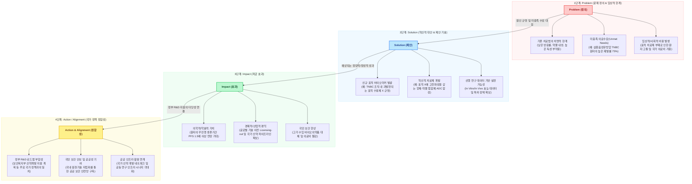

# 제8장. 바이오 R&D 국책과제 제안서 작성 및 시각화 기법

## 1. 개조식 및 명사형 종결어미 기반의 편집식 제안서 작성법

### 1.1. 개조식(Itemization) 작성의 기본 원칙
* **정보의 위계(Hierarchy) 명확화**
  * 국책과제 평가위원의 가독성 극대화를 위해 정보의 종속 관계에 따른 명확한 인덴트(들여쓰기) 규칙 준수 필요.
  * 표준 위계 기호 체계를 수립하여 제안서 전체에 걸쳐 일관되게 적용함.
  * 위계별 깊이(Depth) 설정 기준:
    * 1수준 (대분류): Ⅰ, Ⅱ, Ⅲ, ... (14pt, Bold, 줄간격 160%)
    * 2수준 (중분류): 1, 2, 3, ... (12pt, Bold, 들여쓰기 없음)
    * 3수준 (소분류): 가, 나, 다, ... (11pt, Regular, 들여쓰기 2포인트 또는 1칸)
    * 4수준 (세부사항): o, - (10pt, Regular, 들여쓰기 4포인트 또는 2칸)
* **단일 아이템의 단문 구성 원칙**
  * 하나의 글머리기호에는 하나의 핵심 사실(Single Fact) 또는 논리적 연결성만 기술함.
  * 복잡한 복문이나 중문은 가급적 지양하고, 접속사(및, 또한, 그러나)의 사용을 최소화하여 단문 중심으로 분할 작성함.
  * 인과관계 기술 시 '원인 분석 -> 해결 방안' 또는 '현황 -> 문제점 -> 대책'의 흐름이 한눈에 보이도록 문장을 분할 배치함.
* **시각적 공백 및 레이아웃 관리**
  * 텍스트 밀도가 과도하게 높을 경우 평가위원의 피로도가 급증하므로, 단락 간 공백(Paragraph spacing)을 적절히 확보함.
  * 표(Table)와 그림(Figure) 전후에는 반드시 최소 0.5줄 수준의 여백을 두어 텍스트와 시각자료가 엉키지 않도록 방지함.

### 1.2. 명사형 종결어미(-함, -임, -음) 적용 및 문체 표준
* **종결어미의 일관성 및 표준 규격**
  * 문장의 끝맺음은 반드시 명사형 종결어미로 통일하며, 구어체(~한다, ~합니다) 및 혼용을 엄격히 배격함.
  * 과거형 진술(개발 완료함, 규명함), 현재형 진술(수행함, 분석함), 미래형/목표 진술(확보 예정임, 구축하고자 함)을 명확히 구분하여 표기함.
* **서술형 문장의 개조식 명사형 변환 방법론**
  * 주어와 목적어를 명확히 배치한 후, 서술어를 명사화하거나 '명사+동사원형 명사화(-함, -구축)' 구조로 압축함.
  * 변환 공식: `[주체] + [목적 대상] + [수행 행동(동사)]` -> `[주체]의 [목적 대상] [행동 명사형]`
  * 구체적 변환 프로세스:
    * (서술형) "당사는 표적 단백질 A를 억제하여 암세포의 증식을 막는 저분자 화합물을 합성하고자 합니다."
    * (개조식) "표적 단백질 A 억제를 통한 암세포 증식 제어용 저분자 화합물 합성"
* **문체 오류 수정 가이드라인 (사례 대조군)**

| 구분 | 부적절한 표기 (서술형 / 구어체 혼용) | 올바른 개조식 표기 (명사형 종결 표준) | 비고 |
| :--- | :--- | :--- | :--- |
| **목표 기술** | 본 연구에서는 신규 펩타이드를 발굴하여 효능을 입증하려고 함 | 신규 펩타이드 발굴 및 생체 내(in vivo) 유효성 입증 | 명확한 명사화 완료 |
| **추진 현황** | 작년도에 동물 모델을 확립했고 현재 스크리닝 중이다 | 질환 동물 모델 구축 완료 및 후보 물질 스크리닝 진행 중 | 시제 및 진행 상황 분리 |
| **기대 효과** | 시장 진입이 빨라져서 매출이 발생할 것으로 예상됨 | 조기 시장 진입을 통한 신규 매출원 확보 및 수익성 제고 | 경제적 파급효과 구체화 |

### 1.3. 가독성 극대화를 위한 레이아웃 및 서식 설계
* **글머리기호(Bullet points) 사용 가이드라인**
  * 불릿 기호는 최대 3단계까지만 중첩하여 사용하며, 4단계 이상 들어가는 세부 항목은 표(Table)로 전환하여 정리함.
  * 번호 매기기(1, 2, 3...)는 단계적 절차(Process)나 우선순위(Priority)가 존재할 때만 한정하여 사용함. 단순 나열형 정보에는 일반 불릿 기호(◼︎, ◻︎, -)를 배치함.
* **강조(Formatting) 서식의 표준화**
  * 본문 텍스트 중 핵심 용어(키워드) 및 목표 수치에만 제한적으로 볼드(Bold) 서식을 적용함.
  * 한 문장에 3개 이상의 개별 단어에 볼드를 적용하거나 전체 밑줄을 긋는 행위는 시각적 공해를 유발하므로 금지함.
  * 형광펜 및 다색 글꼴 사용을 지양하고, 강조 색상은 기관 표준 색상(예: Navy 또는 Deep Blue) 1종으로 단일화함.

---

## 2. 복잡한 생물학적 작용기전(MoA) 시각화 및 마일스톤 간트차트 설계 규칙

### 2.1. Mechanism of Action (MoA) 시각화 설계 원칙
* **추상화 수준(Abstraction Level) 정의**
  * 평가위원이 30초 이내에 약물의 작용 원리를 이해할 수 있도록 복잡한 세포 내 단백질 상호작용 경로를 핵심 노드(Node) 중심으로 단순화함.
  * 주변부 신호전달 경로(Pathway)는 흐리게 처리(Backgrounding)하고, 제안 기술이 직접 작용하는 타겟과 매개 경로만 강한 대비(Contrast)로 강조함.
* **핵심 바이오마커 및 약물 작용점 표시 표준**
  * 약물의 결합 부위(Binding Site)는 화살표가 아닌 결합 모티브(예: Lock-and-key 형태)로 명시적 표현.
  * 활성화(Activation)는 실선 화살표($\rightarrow$), 억제(Inhibition)는 끝이 막힌 선($\dashv$)으로 국제 표준 생물학 기호를 엄격히 준수함.
  * 세포막(Cell Membrane), 세포질(Cytoplasm), 세포핵(Nucleus) 경계를 명확히 구획하여 약물이 투과 또는 결합하는 공간적 해상도를 제공함.

```
[ASCII Mockup: Receptor-Targeted Drug Mechanism of Action (MoA)]

  Extracellular Space
=======================================[ Cell Membrane ]=======================================
                         [Receptor Y] (Dimeric complex)
                              |  \  <-- Drug Candidate (Nanoparticle / Antibody) binds here
                              |   \
  Cytoplasm                   v    v
                       [Protein Kinase A] (Phosphorylation)
                              |
                              | (Phos-tag cascade / Signal amplification)
                              v
                       [Transcription Factor Z]
                              |
                              | (Nuclear Translocation)
==============================v========[ Nuclear Membrane ]====================================
  Nucleus                     |
                       [Target Gene Exon 3-5]
                              |
                              v (Transcription Control)
                       Downregulation of Oncogenic mRNA
```

* **MoA 도식화 설계의 Good vs Bad 대조 규칙**
  * *Bad*: 교과서 이미지를 그대로 캡처하여 붙여넣어 해상도가 떨어지고, 우리 과제와 무관한 단백질들이 노이즈로 작용하여 시선을 분산시키는 경우.
  * *Good*: 당해 연구의 후보물질이 작용하는 표적 단백질 및 그로 인한 최종 하류(Downstream) 표현형 변화만 도식 내에 명확히 표기하고 제안 과제 명칭을 매핑함.

### 2.2. 연구개발 마일스톤 및 간트차트(Gantt Chart) 설계 규칙
* **연차별 R&D 흐름의 Gantt Chart 구조화**
  * 과제 전체 기간 동안 수행되는 연구개발 내용을 WBS(Work Breakdown Structure) 관점에서 대과제-중과제로 나누어 종축에 배열함.
  * 횡축은 월(Month) 또는 분기(Quarter) 단위로 분할하여 시간적 선후 관계를 표현함.
  * 각 태스크는 단순 병렬 배치가 아닌, 선행 연구결과(Input)가 후행 연구(Output)의 시작 조건이 되는 연관성 링크(Dependency Link)를 인지할 수 있도록 구성함.
* **Critical Milestone 및 Go/No-Go 의사결정점 표시**
  * 과제의 성패를 가르는 중차대한 마일스톤(예: 동물 모델 효능 검증 완료, 비임상 GLP 독성 시험 개시)은 마일스톤 기호(◆)로 간트차트 상에 뚜렷이 표시함.
  * 특정 시점에서 실험 데이터 결과에 따라 연구 방향을 전환하거나 중단하는 Go/No-Go 결정 시점(Gate)을 붉은색 점선 세로선으로 명시하여 리스크 관리 계획을 보여줌.

```
[ASCII Gantt Chart: 3-Year Bio-R&D Milestone & Go/No-Go Decision Gate]

R&D Task Items              |      Year 1      |      Year 2      |      Year 3      | Deliverable / Milestone
----------------------------------------------------------------------------------------------------------------
1. Candidate Optimization   |                  |                  |                  |
 1.1 In silico screening    |======            |                  |                  | Screening database
 1.2 Peptide synthesis      |  ======          |                  |                  | Synthetic peptides (10+ kinds)
 1.3 In vitro efficacy test |    ========      |                  |                  | IC50 data sheet
----------------------------+------------------+------------------+------------------+----------------------------------
2. In Vivo Validation       |                  |                  |                  |
 2.1 Disease model setup    |         =======  |                  |                  | Standard disease animal model
 2.2 Efficacy evaluation    |                ==|======            |                  | Tumor volume reduction data
 [Decision Gate: Go/No-Go]  |                  |   | (Gate 1)*    |                  | *Check tumor inhibition > 50%
----------------------------+------------------+---+--------------+------------------+----------------------------------
3. Non-clinical Assessment  |                  |   |              |                  |
 3.1 PK/PD profiling        |                  |   ======         |                  | Absorption & distribution profile
 3.2 Dose-range finding     |                  |       ======     |                  | MTD (Maximum Tolerated Dose)
 3.3 GLP Toxicity start     |                  |             =====|=========         | ◆ Tox study protocol & report
----------------------------+------------------+------------------+------------------+----------------------------------
4. Process Development      |                  |                  |                  |
 4.1 Cell line generation   |                  |         =======  |                  | High-yield producer cell line
 4.2 Scale-up purification  |                  |                  |===========       | Standard Operating Procedure (SOP)
```

---

## 3. 제안서 제1장 '기술개발의 필요성' 구성 논리 및 설득 프레임워크

### 3.1. 기술개발 필요성(Necessity of Development)의 3대 핵심축
* **축 1: 미충족 의료수요(Unmet Medical Needs) 및 시장/산업적 한계 분석**
  * 현재 임상 현장에서 직면한 치료법의 한계(낮은 약물 반응률, 내성 발생, 심각한 부작용 등)를 구체적인 통계적 수치 및 환자 고통 지표를 근거로 제시함.
  * 기존 치료제 시장의 규모와 미충족 수요가 해결되지 않아 발생하는 사회적 비용(의료비 증가, 경제 활동 인구 소실 등)을 정량적으로 입증함.
* **축 2: 독창성 및 기존 기술 대비 차별성**
  * 타 연구자 및 기존 상용화 기술과의 명확한 비교를 통해 본 제안 기술의 독보적 플랫폼 구조나 신규 바이오마커 작용 기전을 차별화 포인트로 제시함.
  * 특허 장벽 분석 결과를 일부 인용하여 특허 침해 가능성이 낮고 독점적 권리 확보가 가능함을 강조함.
* **축 3: 국가 R&D 지원의 타당성 및 공공성**
  * 희귀/난치성 질환 치료제 개발 등 시장 실패 가능성이 높아 민간 투자가 꺼려지나, 국민 보건 안보 및 생명권 보장을 위해 정부의 공적 자금 투입이 필수적임을 호소함.
  * 국가 바이오산업 육성 기본 계획 등 정부 정책 로드맵과의 일관된 정합성을 주장함.

### 3.2. 논리적 완결성을 확보하는 4단계 설득 프레임워크 (P-S-I-A)
* **1단계: Problem (문제 정의 및 임상적 한계)**
  * 특정 질병군에서 기존 표준 치료법이 가진 치명적 한계(예: 재발률 70% 이상, 3차 치료제 부재 등)를 정의함.
  * 신뢰도 높은 최신 임상 가이드라인(NCCN 등) 및 역학 자료를 기반으로 문제의 심각성을 부각함.
* **2단계: Solution (혁신적 대안 및 제안 기술)**
  * 당사가 제안하는 신규 바이오마커 기반 표적 치료제 또는 약물 전달 기술이 상기 문제를 어떻게 원천적으로 해결할 수 있는지 논리적 메커니즘을 밝힘.
  * 기확보한 선행 연구 데이터(In vitro 효능 등)를 짧고 강렬한 요약 그래프로 첨부하여 실현 가능성을 방증함.
* **3단계: Impact (파급 효과)**
  * 기술개발 성공 시 환자의 5년 생존율 향상, 의료비 40% 절감 등 직관적이고 구체적인 경제적, 의학적 파급 효과를 예측하여 제시함.
  * 국내 바이오 원천기술 확보를 통한 글로벌 기술 이전(Licensing-out) 및 외화 획득 효과를 기술함.
* **4단계: Alignment (국가 정책 정합성)**
  * 정부의 3대 신산업(바이오헬스 등) 집중 육성 정책과의 부합성을 적시함.
  * 공공 인프라 활용 및 국가 신약 개발 네트워크 기여 방안을 제언하여 과제 선정의 당위성을 완결함.


