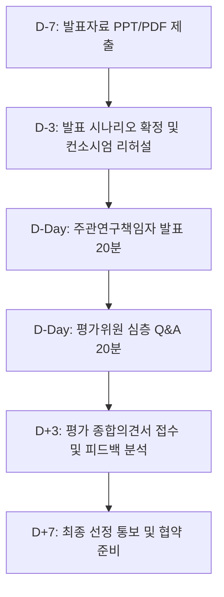
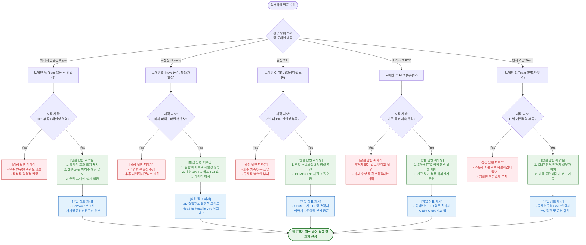

# 제9장 서면·발표 평가 대응 및 선정 후 협약 관리

본 장은 국가연구개발사업(Bio-R&D)의 서면 및 발표 평가 단계에서의 효과적인 방어 전략과 자주 발생하는 평가위원의 지적 패턴 분석을 통한 질의응답(Q&A) 대응 방안, 그리고 과제 선정 이후 협약 체결 및 연차 마일스톤 관리 실무를 체계적으로 기술한다. 제안된 연구계획의 탁월성이 평가 과정에서 훼손되지 않도록 논리적 방어 체계를 구축하고, 과제 수주 후 행정적·규제적 리스크 없이 안정적인 연구비 집행 및 연구 관리를 수행하는 것을 목적으로 함.

---

## 9.1 서면 및 발표 평가 프로세스와 방어 시나리오

### 9.1.1 서면평가(기술성 평가) 프로세스 및 주요 탈락 요인

서면평가는 공고된 과제제안서(RFP)와 제출된 연구개발계획서 간의 기술적 정합성을 확인하고, 제안 기술의 참신성 및 연구팀의 수행 역량을 계량화된 지표로 1차 스크리닝하는 단계임. 통상 연구개발 과제 선정 예산의 2~3배수를 선별하는 목적으로 활용됨.

#### 1. 서면평가 배점 구조 및 평가 지표 (표준 모형)
정부 부처(과기정통부, 복지부, 산업부 등) 및 연구관리 전문기관(한국연구재단, 한국보건산업진흥원, 한국산업기술기획평가원 등)에 따라 다소 상이하나, 일반적으로 아래와 같은 배점 구조를 취함.

$$\text{서면평가 종합점수}(100) = \text{연구역량 및 인프라}(20) + \text{RFP 부합도 및 필요성}(30) + \text{연구개발 방법 및 추진체계}(30) + \text{성과지표 및 마일스톤 타당성}(20)$$

- **연구역량 및 인프라 (20%):** 주관 연구책임자(PI) 및 공동연구진의 최근 3~5년간 논문(JCR 상위 비율), 특허 등록 실적, 과제 수행 경험 및 핵심 장비 보유 현황.
- **RFP 부합도 및 필요성 (30%):** 제안 기술의 타겟 질환 및 기술 범위가 RFP 요건을 100% 충족하는지 여부, 해결하고자 하는 미충족 의료 수요(Unmet Medical Needs)의 임상적·산업적 중대성.
- **연구개발 방법 및 추진체계 (30%):** 가설 검증을 위한 실험 설계의 과학적 엄밀성(Rigor), 선행 데이터의 신뢰성, 세부 기관 간의 명확한 역할 분담.
- **성과지표 및 마일스톤 타당성 (20%):** 정량적 성과목표(특허, 논문, 기술이전, IND 신청 등)의 도전성 및 연차별 Go/No-Go 판단 기준의 객관성.

#### 2. 서면평가 주요 탈락 요인 분석 및 대응법
- **요건 불부합 및 범위 초과:** RFP가 규정한 모달리티(Modality, 예: ADC)를 임의로 변경하여 제안하거나, TRL 단계를 초과하는 상용화 단계를 제안하는 경우 행정 요건 검토에서 즉시 탈락 처리됨. 반드시 RFP 키워드를 제안서 본문 내에 직렬 구조로 매핑하여 대응해야 함.
- **선행 연구 데이터의 Rigor(엄밀성) 부재:** "후보물질 도출 완료" 등 정성적 서술만 나열하고, 구체적인 결합 특성($K_D$, $IC_{50}$), 반복 실험 수($N$), 통계적 유의성(p-value)을 명시하지 않은 경우 선행 기술의 신뢰성 미달로 판정되어 탈락함.
- **추진체계의 파편화 및 불명확성:** 컨소시엄 구성 시 공동연구기관 간의 데이터 및 시료 전달 경로가 모호하고 중복 연구로 판단될 경우, 추진체계 미흡으로 감점됨. 주관기관과 공동기관 간의 역할 분담을 직렬 및 병렬 흐름도로 표현하여 연구의 유기적 연계성을 증명해야 함.

---

### 9.1.2 발표(대면)평가 운영 방식 및 진행 타임라인

발표평가는 서면평가를 통과한 과제 제안자들을 대상으로 구두 발표 및 심층 질의응답을 거쳐 최종 선정 과제를 결정하는 단계로, 주관 연구책임자(PI)의 발표력과 순발력 있는 방어 능력이 당락의 90% 이상을 좌우함.



#### 1. 세부 진행 절차 및 운영 룰
- **발표 진행:** 발표는 주관 연구책임자(PI) 본인이 직접 수행하는 것이 원칙임. 대리 발표는 국가연구개발혁신법 및 과제 관리 규정에 따라 원천 금지되거나 심각한 감점(또는 부적격 처리) 사유임.
- **시간 제한 (Strict Time Limit):** 통상 20분 발표, 20분 질의응답으로 구성됨. 발표 시간이 초과될 경우 평가위원장이 발표를 강제로 종료시키며, 미발표된 슬라이드 분량은 평가에서 배제되므로 슬라이드 분량 및 시간 안배가 생명임.
- **배석 인원 통제:** 주관기관 PI 외에 공동연구기관 세부 책임자(보통 2~3인 이내)까지만 배석이 허용되며, 기업 참여 과제의 경우 기업 대표 또는 연구소장 1인이 배석하여 질의응답을 보조할 수 있음.

---

### 9.1.3 평가 위원 유형별 성향 분석 및 주안점

발표평가위원단은 5~7인으로 구성되며, 학계, 산업계, 규제 및 임상 전문가가 혼합되어 배치됨. 평가위원의 백그라운드에 따라 질문의 의도와 평가지표가 상이하므로 다차원 포지셔닝 방어가 필수적임.

#### 1. 학술 중심 평가위원 (대학 교수, 국책연구소 책임연구원)
- **주요 관심사:** 가설의 과학적 독창성, 분자생물학적 작용 기전(MoA), 타겟 단백질의 상위/하위 신호전달 경로 영향, 사용된 대조군(Negative/Positive Control)의 적절성.
- **평가 성향:** 상용화 가능성보다는 연구 방법의 엄밀성과 기초 과학적 완성도를 중시함.
- **방어 전략:** 타겟 결합 특이성을 입증하는 In vitro 결합 상수 데이터, 세포 수준에서의 MoA 규명 그래프, 통계 처리 기법(ANOVA 등)의 타당성을 논리적으로 설명함.

#### 2. 산업 및 사업화 중심 평가위원 (바이오 기업 임원, VC 파트너, 기술이전 BD 전문가)
- **주요 관심사:** 특허 침해 리스크(FTO 분석 결과), 제조공정 고도화(CMC) 가능성, 후보물질 생산 수율(Expression level, g/L), 타겟 세그먼트 내 시장 규모 및 라이선스 아웃(L/O) 대상 제약사 확보 여부.
- **평가 성향:** 학술적 참신성보다는 "실제 제품화되어 환자에게 쓰이거나 기업에 기술이전이 가능한가"에 초점을 맞춤.
- **방어 전략:** 3개국(US, EP, KR) FTO 특허 맵 및 청구범위(Claim Chart) 비교 표를 제시하고, 자체 발굴한 신규 서열/링커 특허 출원 현황을 기반으로 독점적 IP 권리 확보를 증명함.

#### 3. 임상 및 규제 중심 평가위원 (대학병원 의사(MD/PhD), 식약처 출신 규제과학 전문가)
- **주요 관심사:** 미충족 의료 수요(Unmet Medical Needs)의 실제 임상 현장에서의 타당성, 환자 유래 오가노이드/환자 검체(PDX) 모델 검증 여부, 비임상 GLP 독성 시험 설계의 식약처 가이드라인 정합성, 임상 IND 신청 가능성.
- **평가 성향:** 실험실 수준(In vitro)의 데이터는 신뢰하지 않으며, 실제 임상 치료 현장에서의 효능 및 약물 안전성(Toxicity, Tolerability)을 엄격히 검증함.
- **방어 전략:** 현 표준 치료제(SOC) 대비 In vivo 종양성장억제율(TGI) 우위 데이터, 마우스 체중 변화(Body Weight loss < 10%) 자료, 임상 승인 기관(식약처/FDA) 사전 질의 상담 이력을 제시함.

---

### 9.1.4 발표 자료(PPT) 슬라이드 구성 및 시각화 프레임워크

발표 자료는 복잡한 텍스트를 최소화하고, 평가위원이 3초 이내에 핵심 논리를 파악할 수 있도록 도식화와 개조식 구조를 극대화하여 설계해야 함. 전체 분량은 20~25장 내외로 구성하며, 본문 12~15장, 백업 장표 10장 수준이 이상적임.

#### 1. 표준 발표 장표 구성 템플릿 (15장 모델)
- **Slide 1 (표지):** 과제명, 주관/참여기관명, 주관연구책임자명.
- **Slide 2 (Executive Summary):** 1장 요약 장표. 최종 목표치, 핵심 선행 데이터 요약, 차별성 3가지를 도식화하여 서두에 배치.
- **Slide 3 (연구 필요성):** 임상 현장의 한계(Unmet Needs) 및 기존 표준치료제(SOC)의 내성/독성 문제 제기.
- **Slide 4 (제안 기술 개요):** 당사 제안 물질의 구조, 작용 기전(MoA) 모식도.
- **Slide 5 (선행 데이터 I - In vitro):** 결합 상수($K_D$), Dose-dependent 세포 사멸 효능($IC_{50}$), Target 특이성(Selectivity).
- **Slide 6 (선행 데이터 II - In vivo):** 질환 동물 모델(Xenograft 등)에서의 종양성장억제율(TGI), 약물 안전성(마우스 체중 유지 및 생존율).
- **Slide 7 (연구 목표 및 내용):** 연차별 연구개발 범위 및 최종 성과지표(KPI) 테이블.
- **Slide 8 (추진 전략 및 마일스톤):** TRL 단계별 상승 경로, 연차별 Go/No-Go 의사결정 체계(Decision Tree).
- **Slide 9 (IP 및 규제 대응):** FTO 분석 결과, 자체 특허 포트폴리오, IRB/IACUC 승인 현황 및 GLP 독성 CRO 계약서.
- **Slide 10 (임상 및 사업화 로드맵):** 대상 환자군 Stratification 전략, CMC 생산 공정(CDMO 연계 계획), L/O 타겟 기업 네트워킹 현황.
- **Slide 11 (추진 체계 및 인프라):** 연구 컨소시엄 역할 분담 계통도, 연구책임자 역량(대표 실적 3건).
- **Slide 12 (예산 편성):** 총 연구비 분배 구조, 고가 장비 및 위탁 연구비의 타당성 소명.
- **Slide 13 (결어):** 본 과제 수주를 통해 달성할 국가적·산업적 기대효과 및 비전 제시.

#### 2. 장표 시각화 가이드라인
- **데이터 중심 배치:** 본문 슬라이드 상단에는 핵심 메시지를 1줄로 요약하고, 중앙에는 raw data 그래프 또는 핵심 모식도를 배치하며, 하단에는 실험 조건(장비명, N수, 통계 분석법)을 명시함.
- **색상 통일 및 강조:** 기본 톤은 차분한 네이비/그레이를 사용하되, 강조하고자 하는 핵심 수치 및 차별적 데이터에만 고대비 색상(예: 주황색 또는 청록색)을 적용하여 시선의 분산을 방지함.

---

### 9.1.5 리허설 및 모의 평가 방어 시나리오 구축법

리허설 단계는 단순한 슬라이드 읽기가 아닌, 돌발 질문 및 압박 질문 상황에서의 감정 제어와 정확한 수치 기반 답변 능력을 기르는 훈련 과정임.

#### 1. 컨소시엄 합동 모의 발표 평가 운영
- **평가단 구성:** 내부 연구원 및 외부 자문단(평가 위원 유경험자 위주) 3~5인을 모의 평가위원으로 위촉함.
- **규정 적용:** 20분 발표 제한 타임아웃 타이머를 작동시켜 시간 초과 시 강제로 중단하는 연습 수행.
- **질의 세션:** 의도적으로 적대적이거나 꼬리물기 식 질문을 던져 피발표자의 태도 및 답변의 일관성을 검증함.

#### 2. 백업 슬라이드(Backup Slides) 라이브러리 구축
- 질문에 구두로만 답변하는 것보다 관련 증빙 장표를 화면에 띄우는 것이 평가위원에게 압도적인 신뢰감을 제공함.
- **필수 백업 장표 목록:**
  - 선행 In vivo 데이터의 원본 이미지(Western blot 원본 band, IHC 면역염색 원본 슬라이드 등).
  - 통계적 마리 수 산출을 위한 G*Power 세부 파라미터 리포트 화면.
  - 특허법인이 발행한 공식 FTO 검토 분석서 원문 캡처본.
  - CRO 및 CDMO 견적서 및 세부 Task 정의서.
  - 원천 기술 특허의 청구범위(Claims) 비교 차트.

---

## 9.2 평가위원 지적 패턴 및 Q&A 대응 템플릿 모델

발표평가 현장에서 평가위원의 돌발적이거나 날카로운 질문에 직면했을 때, 당황하지 않고 최적의 논리로 답변하여 감점을 방어하고 가산점을 획득하기 위한 의사결정 및 대응 라우팅 맵은 다음과 같다.



---

### 9.2.1 과학적 엄밀성 부족(Lack of Rigor) 지적 및 극복 방안

#### 1. 다빈도 지적 유형
- "선행 연구 데이터의 샘플 수($N$)가 최소 3회 이상 반복되지 않은 것으로 보이며, 에러바(Error bar)가 너무 커 데이터의 유의성을 확증하기 어려움."
- "동물 모델에서 약물의 MoA를 증명하기 위한 음성 대조군(Negative Control, Vehicle) 및 기존 표준치료제(Positive Control)와의 비교 연구가 결여되어 있음."

#### 2. 구체적 극복 및 방어 논리
- **통계적 유의성 입증:** 선행 시험의 $N$수가 부족함을 정직하게 인정하되, 본 과제에서는 통계적 검정력(Power $1-\beta = 0.80$, 유의수준 $\alpha = 0.05$)을 확보하기 위한 동물 수 산정 공식(G*Power 활용)을 계획서에 선제 반영했음을 입증함.
- **대조군 설계 보완:** 본 과제 1차년도 1단계 실험에서 표준치료제(예: Trastuzumab) 및 Vehicle 투여군을 독립 변수로 배치한 헤드투헤드(Head-to-Head) 비교 평가를 설계 완료했음을 소명함.

---

### 9.2.2 독창성 및 차별성 결여(Low Novelty / Differentiation) 지적 및 극복 방안

#### 1. 다빈도 지적 유형
- "제안한 항체 치료제는 글로벌 제약사가 개발한 물질과 타겟(Receptor)이 동일하여 퍼스트인클래스(First-in-Class)로서의 가치가 없으며, 특허 등록이 불가능할 것으로 우려됨."
- "단순한 약물 전달체(LNP 등)의 조합 변경 수준의 연구로 보여, 기술적 난이도가 낮고 독창성이 결여됨."

#### 2. 구체적 극복 및 방어 논리
- **에피토프 및 도메인 차별화 입증:** 동일 타겟 단백질이라 하더라도 결합하는 **세부 에피토프(Epitope, 예: Extracellular Domain II vs IV)의 차이**를 입증함. 이를 통해 기존 약물의 내성 유도 돌연변이를 회피할 수 있는 차별적 작용 기전(MoA)을 보유함을 3D 모델링 및 선행 SPR 결합 데이터로 입증함.
- **물리화학적 우월성 제시:** 단순 조합 변경이 아닌, 접합 효율 및 체내 반감기(Half-life)를 2배 이상 향상시키는 신규 비천연 아미노산 도입 또는 특이적 절단 링커 기술(Ala-Ala-Asn 링커 등)의 독창적 설계를 도식화하여 소명함.

---

### 9.2.3 마일스톤 및 기술성숙도(TRL) 현실성 결여 지적 및 극복 방안

#### 1. 다빈도 지적 유형
- "3년이라는 짧은 연구 기간 내에 선행 최적화 단계(TRL 3)에서 비임상 독성(GLP) 시험을 거쳐 임상 1상 IND 신청(TRL 5)까지 가겠다는 계획은 비현실적임."
- "연차별 성과지표에 Go/No-Go 기준이 정성적으로만 설정되어 있어, 실패 시 대안 경로가 불명확함."

#### 2. 구체적 극복 및 방어 논리
- **병렬 추진 타임라인 제시:** 마일스톤의 선행 단계인 후보물질 최적화와 생산 공정(CMC) 개발을 직렬이 아닌 **병렬(Parallel processing) 방식으로 추진**하여 대기 시간을 최소화하는 계획을 증명함.
- **백업 파이프라인 명시:** 최종 후보물질 도출 단계에서 단일 후보가 아닌 복수의 리드 후보군(Lead Candidates, 최소 3종)을 동시 도출하여, 1순위 후보물질이 독성 또는 생산 수율 문제로 탈락할 경우 즉시 2순위 후보물질로 대체 진입하는 백업 시나리오 및 Go/No-Go 판정 매트릭스를 명시함.

---

### 9.2.4 예산 및 연구개발비 편성 부적절성 지적 및 극복 방안

#### 1. 다빈도 지적 유형
- "위탁연구비가 전체 직접비의 상당 부분을 차지하여 주관기관의 자체 연구 비중이 너무 낮으며, 고가의 질량분석기 장비 도입 단가가 시세보다 과도하게 책정됨."
- "학생인건비 계상율이 과도하여 실제 소모품 구매 및 실험비가 부족할 것으로 우려됨."

#### 2. 구체적 극복 및 방어 논리
- **위탁연구비 법적 한도 소명:** 위탁연구개발비가 국가연구개발혁신법 기준인 **직접비(위탁연구개발비, 지식재산창출활동비, 간접비 제외)의 40% 이내**임을 정확한 산출식으로 계산하여 입증함. 또한 전문 CRO에 위탁하는 비임상 독성 시험의 필수성을 단가 견적서와 함께 제시함.
- **장비 도입 및 인건비 타당성 입증:** ZEUS(국가연구시설장비진흥센터) 심의 요건인 3천만 원 이상 장비에 대해 사전 적합성 검토를 완료했음을 소명하고, 학생연구원 참여율 및 인건비 통합관리제 규정에 맞춘 적법 계상임을 증명함.

---

### 9.2.5 연구원 및 인적 인프라 역량 우려 지적 및 극복 방안

#### 1. 다빈도 지적 유형
- "주관 연구책임자(PI)의 최근 연구 실적이 주로 기초 연구에 치우쳐 있어, 개발 과제인 본 과제의 상용화 단계 및 규제 대응을 리드하기에 역량이 부족해 보임."
- "연구진 내에 임상 인허가(RA) 또는 사업화(기술이전) 경험이 있는 전문가가 결여되어 있어 과제 성공 시 실질적인 상용화 연계가 어려울 것 같음."

#### 2. 구체적 극복 및 방어 논리
- **컨소시엄 및 자문단 보완 소명:** 주관 책임자의 강점인 타겟 규명 역량에 더해, 비임상·임상 전문 CRO를 위탁연구기관으로 참여시키고 식약처 출신 허가 전문가 및 바이오 전문 BD(Business Development) 컨설턴트를 공식 자문단으로 위촉하여 매 분기 독성/인허가 분과 위원회를 운영할 계획임을 증명함.
- **공동연구원의 상용화 실적 제시:** 공동연구자로 참여하는 병원 임상시험센터 교수 및 참여기업 연구소장의 과거 IND 승인 및 기술이전 성공 실적(트랙 레코드)을 슬라이드로 제시하여 인적 역량 공백이 완벽히 보완되었음을 소명함.

---

### 9.2.6 종합 Q&A 대응 매트릭스 테이블

| 지적 영역 (Domain) | 평가위원 질문 (Question) | 질문 의도 (Intent) | 감점 요인 답변 (Poor Response) | 감점 사유 (Reason) | 만점 대비 답변 (Best Response) | 증빙자료 및 백업 슬라이드 |
| :--- | :--- | :--- | :--- | :--- | :--- | :--- |
| **과학적 엄밀성<br>(Rigor)** | "선행 In vivo 종양 억제 효능의 $N$수가 군당 5마리로 너무 적어 재현성이 의심되는데 이 데이터를 신뢰할 수 있는가?" | 데이터의 통계적 유의성 및 재현성 확보 여부 검증 | "우리 연구실 연구원의 오랜 실험 숙련도로 진행했기 때문에 데이터는 확실하며 본 과제 시 마리 수를 늘리겠음." | 정성적 변명에 의존하고 객관적 통계 계산 근거 제시 실패 | "예비 실험 데이터 기준 대조군 대비 약물 투여군의 종양 부피 차이가 명확하여 Cohen's $d$ 값은 1.63임. 본 과제 진입 시 $1-\beta=0.80$, $\alpha=0.05$ 기준 검정력 확보를 위해 G*Power로 산출된 필요 마리 수는 군당 8마리이며, 탈락률 20%를 반영하여 최종 **군당 10마리, 총 40마리로 설계 완료**하였음." | • [백업 3번 슬라이드]<br>G*Power 입력 파라미터 및 출력 결과 보고서 화면<br>• [백업 4번 슬라이드]<br>In vivo 개체별 Tumor Growth Curve 원본 데이터 |
| **독창성<br>(Novelty)** | "경쟁사인 A사도 동일 타겟 항체를 임상 개발 중인데, 본 후보물질이 그들 대비 가지는 독창적 차별성은 무엇인가?" | 타 기술 대비 기술적/특허적 우위 및 회피 가능성 스크리닝 | "우리 물질은 독창적인 스크리닝 기술로 도출하여 약효가 더 뛰어날 것으로 보이며, 향후 차별화하겠음." | 구체적인 구조적/기전적 수치 데이터 제시 부재로 신뢰성 손실 | "A사 항체는 Receptor의 결합 부위 중 Domain IV에 결합하여 Ligand 차단만을 유도하나, 당사 후보물질은 **Domain II의 특이 에피토프에 결합하여 이량체화(Dimerization)를 원천 차단**함. 이로 인해 A사 항체에 내성을 보이는 JIMT-1 세포주 이식 동물 모델($N=10$)에서 **TGI 78%($p < 0.01$)의 현격한 효능 우위**를 확인하였음." | • [백업 6번 슬라이드]<br>Domain II/IV 결합 구조 결정학 모식도<br>• [백업 7번 슬라이드]<br>JIMT-1 내성 마우스 모델 Head-to-Head 비교 그래프 |
| **일정 타당성<br>(TRL)** | "3년 내에 비임상 독성 및 공정 개발을 마친 후 IND 신청까지 완료하겠다는 계획은 리스크가 큰데 대안이 있는가?" | 인허가 지연 행정 리스크 및 후보물질 자체 리스크 관리 계획 평가 | "CRO와 CDMO 업체에 비용을 추가 지불하여 일정을 최대한 단축하고 밤낮으로 연구하겠음." | 인허가 행정 절차와 리스크 발생 가능성에 대한 이해 부족 | "일정 리스크를 해지하기 위해 **1) 1차년도 내에 주 타겟 후보물질 외에 백업 물질 2종을 확보**하여 유효성 실패에 대비하고, **2) CDMO 업체인 B사 및 비임상 CRO인 C사와 Task 사전 조율 및 예비 견적서(백업 슬라이드 제시)를 이미 확보**하여 외주 대기 기간을 제로화하였음. 또한 식약처 사전상담제도를 1차년도부터 병렬 활용할 예정임." | • [백업 9번 슬라이드]<br>CDMO B사와의 LOI(의향서) 및 견적서<br>• [백업 10번 슬라이드]<br>식약처 사전 상담 신청 공문 및 타임라인 |
| **IP 리스크<br>(FTO)** | "개발하고자 하는 타겟 및 구조가 기존 선행 특허의 청구항 권리 범위에 저촉될 가능성은 없는가?" | 상용화 단계에서의 특허 침해 소송 및 개발 중단 리스크 검증 | "현재까지는 침해할 만한 특허가 없는 것으로 알고 있으며 과제 수행 과정에서 특허를 확보하겠음." | 예비 특허 검색 및 분석 미수행 사실 노출로 사업성 감점 | "과제 기획 단계에서 특허법인 D사와 공동으로 KR/US/EP 3개국 대상 FTO 예비 분석을 완료하였음. 경쟁사 핵심 특허인 US-XXXX-B2의 청구범위는 Val-Cit 링커 구조를 필수 구성으로 지정하고 있으나, 당사 기술은 **신규 펩타이드 절단형 Ala-Ala-Asn 링커를 적용하여 특허 청구범위를 문언 및 균등 범위에서 원천 회피(Design-around) 완료**하였음." | • [백업 12번 슬라이드]<br>특허법인 D사의 FTO 예비 분석 검토 결과 요약서<br>• [백업 13번 슬라이드]<br>자체 출원 완료된 특허 청구항 비교 맵 (Claim Chart) |
| **추진 인프라<br>(Team)** | "주관 연구책임자의 상용화 관련 비임상 CMC 개발 경험이 부족한데 과제 수행 능력을 어떻게 신뢰하는가?" | 컨소시엄 내부의 전문성 보완 여부 및 PI의 거버넌스 역량 검증 | "공동 연구진들과 적극적으로 소통하고 전문가들의 자문을 지속적으로 받아 해결하도록 하겠음." | 구체적이고 계약적인 보완 장치 제시 실패 | "비임상 CMC 및 GLP 독성 개발 경험을 보완하기 위해, 공동1 연구원으로 참여하는 **E 대학병원의 세포치료제 생산 센터(GMP 보유) 및 공동2 전문 기업의 인허가 전문 본부장(과거 IND 승인 3건 실적 보유)을 핵심 실무 책임자로 배치**하였음. 또한 과제 개시 즉시 매월 공동 연구원 전원이 참여하는 **통합 데이터 보드 회의(PMC)를 조직**하여 실시간 진도를 통제할 것임." | • [백업 15번 슬라이드]<br>공동연구원 핵심 인프라 증명(GMP 인증서)<br>• [백업 16번 슬라이드]<br>과제 통합 관리 위원회(PMC) 정관 및 운영 규칙 |

---

## 9.3 선정 후 협약 체결, 계약 프로세스 및 1차년도 마일스톤 방어

### 9.3.1 최종 선정 통보 및 수정 연구개발계획서(정정서) 작성 실무

과제 선정 통보를 받은 직후 주관기관 PI는 평가위원회의 종합의견서에 기재된 조건부 수정 요구사항을 반영하고, 삭감된 예산에 맞춰 연구개발계획서를 공식적으로 수정하여 제출해야 함. 이를 **수정연구개발계획서(정정서)**라 함.

#### 1. 평가의견 반영 대비표 작성 규칙
정정서의 첫 페이지에는 반드시 아래와 같은 '평가의견 반영 대비표'를 작성하여 첨부해야 함. 이는 연구관리 전문기관의 간사가 협약 승인을 결정하는 핵심 근거 서류가 됨.

| 순번 | 평가위원 지적 및 수정 보완 요구사항 | 연구개발계획서 반영 내용 | 관련 페이지 |
| :---: | :--- | :--- | :---: |
| 1 | "1차년도 마우스 유효성 평가 시 동물 수 산출에 대한 통계학적 근거를 소명할 것." | 본문 6.2.2절에 G*Power 통계 검정력 분석 파라미터 및 군당 10마리 산출 수식을 상세 기술함. | p. 45 |
| 2 | "공동2기관의 독성 평가 위탁 비용의 견적 근거를 구체화하여 예산을 조정할 것." | 비임상 독성 CRO인 A사로부터 발행받은 GLP 단회 독성 시험 예비 견적서(부가세 포함 8천만 원)를 예산 첨부문서로 추가하고 예산 편성을 정정함. | 예산서 p. 8 |

#### 2. 예산 삭감 대응 및 정비
정부 R&D 과제는 최종 선정 시 최초 신청 대비 10%~20%의 예산 삭감이 빈번히 발생함.
- **예산 정비 우선순위:**
  - `1순위 감축:` 주관기관의 간접비 계상액(고시된 최소 비율로 하향 조정).
  - `2순위 감축:` 여비, 학회 등록비, 범용성 전산 소모품비 등 비필수 직접비.
  - `3순위 유지:` 핵심 후보물질 검증용 특수 시약비, 비임상 GLP 독성 위탁 비용, 필수 참여연구원 인건비(핵심 마일스톤 달성에 필요한 직접비는 원칙적으로 보존).

---

### 9.3.2 국가연구개발사업 협약 체결 절차 및 RCMS 등록

협약 체결은 주관 연구기관의 장, 공동 연구기관의 장, 그리고 전문기관의 장 간의 법적 계약 과정임.

```
[최종 선정 통보] ➔ [정정 연구계획서 제출 및 승인] ➔ [IRIS 시스템 협약서 서명] ➔ [과제 전용 RCMS 계좌 개설] ➔ [정부출연금 1차분 입금 및 집행 개시]
```

#### 1. 범부처통합연구지원시스템(IRIS)을 통한 전자 협약
- 주관책임자 및 공동책임자는 IRIS 시스템에 국가연구자 번호를 확인하고 로그인함.
- 기관별 공인인증서(전자서명)를 활용하여 3자(주관-공동-전문기관) 간 협약 체결을 온라인으로 완료함.

#### 2. RCMS(실시간연구비통합관리시스템) 등록 및 통장 개설
- **과제 전용 계좌 개설:**
  - 협약 완료 후, 지정 은행(신한, 우리, 기업은행 등 RCMS 연계 은행)에 방문하여 타 계좌와 혼용되지 않는 **'R&D 과제 전용 통장(직접비 통장)'** 및 **'간접비 통장'**을 신규 개설함.
  - 해당 통장과 연결된 **'연구비 카드'**를 발급받아 등록함.
- **RCMS 예산 맵핑:**
  - RCMS에 수정연구개발계획서상의 연차별 직접비 예산 내역을 세부 비목(인건비, 학생인건비, 연구장비·재료비, 연구활동비, 연구수당, 위탁연구개발비) 단위로 1원 단위까지 일치하게 등록함.
  - 등록 오류 시 연구비 집행 승인이 지연되거나 불인정 처리될 수 있으므로 정밀한 검증이 필요함.

---

### 9.3.3 공동연구개발계획서 및 기업 매칭 계약서 체결(IP 권리 배분 포함)

다기관 컨소시엄으로 과제를 수행하는 경우, 추후 특허 분쟁 및 기술료 분쟁을 방지하기 위해 선정 즉시 공동연구기관 간의 **공동연구계획 및 IP 권리 배분 계약**을 체결해야 함.

#### 1. 공동연구 계약서(Consortium Agreement)의 필수 포함 조항
- **연구개발 성과물(지식재산권)의 귀속:**
  - 각 당사자가 독자적으로 수행하여 얻은 성과물은 개발 당사자의 단독 소유로 함.
  - 양 당사자가 공동으로 수행하여 창출한 성과물은 양자의 기여도(투입 인력 비율 및 연구비 지분율)에 따라 **공동 소유(Joint Ownership)**로 등록함. 단, 공동 출원 비용 및 등록 유지를 위한 관납료 분배 비율을 명시해야 함.
- **실시권(Licensing Right) 부여:**
  - 참여기업이 연구성과물을 상용화하고자 할 경우, 타 공동연구기관의 지분에 대해 **'우선협상권(Right of First Refusal)'** 또는 **'독점적 실시권(Exclusive License)'**을 가짐을 명문화함.
- **비밀유지 의무(Non-disclosure):**
  - 과제 수행 중 제공되는 상대방의 미공개 선행 물질 및 데이터에 대해 과제 종료 후 최소 5년간 비밀을 유지할 것을 명시함.

#### 2. 기업 매칭 매커니즘 (민간부담금 기준 준수)
참여기업이 있는 과제는 국가연구개발혁신법 시행령 별표에 규정된 기업 규모별 민간부담금 매칭 비율을 충족해야 함.

$$\text{참여기업 민간부담금} \ge \text{정부출연금 대비 고시 비율}$$

- **중소기업 기준:** 총 연구비의 25% 이상 매칭 필수 (그중 현금 매칭 비율은 민간부담금의 10% 이상).
- **중견기업 기준:** 총 연구비의 30% 이상 매칭 필수 (현금 매칭 비율은 민간부담금의 15% 이상).
- **대기업 기준:** 총 연구비의 50% 이상 매칭 필수 (현금 매칭 비율은 민간부담금의 20% 이상).

---

### 9.3.4 연차평가(1차년도 성과 평가) 대비 및 마일스톤 방어 전략

1차년도 연구가 종료되기 1개월 전, 전문기관의 주관 하에 1차년도 연구 실적 및 2차년도 계획의 타당성을 평가하는 **연차평가(또는 단계평가)**가 진행됨. 여기서 성과가 부진할 경우 과제 중단(No-Go) 조치가 내려질 수 있으므로 마일스톤 방어가 필수적임.

#### 1. 정량적 핵심 성과지표(KPI) 증빙자료 매칭
계획서 상에 약속한 1차년도 최종 성과 목표치와 실제 달성치를 1:1로 매핑하여 명확한 물증을 제시해야 함.
- **증빙 매칭 가이드:**
  - *특허 출원 지표:* 특허청 발행 출원번호통지서 및 명세서 전문 첨부.
  - *후보물질 도출 지표:* 결합 특성을 증명하는 SPR/BLI 분석 장비 날인이 포함된 원본 성적서 또는 제3자 위탁 검증 기관의 시험 결과 보고서.
  - *비임상 시료 확보:* CMC 생산 세포주의 클론 선택 완료 보고서 및 10L 배양 수율(g/L) 측정 로그 데이터.

#### 2. Go/No-Go 판정 프로세스의 객관화 및 이행 소명
연차보고서 작성 시 1차년도 협약서에 기재된 Go/No-Go 의사결정 경로를 성실히 이행했음을 입증해야 함.

$$\text{Go} = (K_D \le 5.0 \times 10^{-9} \text{ M}) \ \wedge \ (\text{In vitro Tumor Cell Viability } IC_{50} \le 10 \ \mu\text{M}) \ \wedge \ (\text{Expression Yield } \ge 0.5 \text{ g/L})$$

- 만약 주 후보물질이 상기 기준 중 하나를 만족하지 못했을 경우(No-Go 판정), 계획서에 미리 설정해 둔 백업 후보물질(Backup Candidate)의 스크리닝 및 최적화 경로로 즉각 전환하여 보완을 수행하고 있음을 소명해야 과제 유지(Go) 승인을 획득할 수 있음.

---

### 9.3.5 진도 점검 및 특별 점검(부적격/과제 중단 리스크) 관리 방안

연구개발비 집행의 오용이나 연구 진척 지연이 발생할 경우 전문기관에 의해 특별 점검이 발의될 수 있으며, 최악의 경우 과제 강제 중단 및 참여 제한 등의 제재를 받을 수 있음.

#### 1. 특별 점검의 주요 발의 사유
- 주관/공동연구기관 간의 심각한 갈등으로 과제 수행이 불가능한 경우.
- 연구개발비 사용 실태 조사 결과, 횡령이나 유용 등 심각한 연구 부정 혐의가 인지된 경우.
- 연차별 정량 실적(KPI) 달성률이 50% 미만으로 극히 부진한 경우.

#### 2. 성실실패(Honest Failure) 판정 획득을 위한 연구 이력 관리
연구개발의 속성상 실패 가능성이 상존하므로, 목표 달성에 실패하더라도 **'성실히 연구를 수행하였음'**을 법적으로 소명하여 제재 조치(연구비 환수 및 참여 제한)를 회피해야 함.
- **연구 성실성 증빙 필수 관리 항목:**
  - **전자연구노트(Electronic Research Notebook, ERN):** 시점 증명(Timestamp)이 완료된 일일 연구기록. 원본 실험 데이터의 생성 날짜와 가공 과정이 투명하게 연대기순으로 기록되어 있어야 함.
  - **공식 회의록 및 전문가 자문 이력:** 과제 수행 중 발생한 기술적 난제 극복을 위해 개최한 외부 자문 회의록(회의 일시, 참석자 서명, 자문 의견서) 및 워크숍 보고서.
  - **장비 가동 및 시약 구매 이력:** RCMS에 승인된 재료비 집행 영수증과 해당 시약이 실제 실험(연구노트 기록)에 사용된 양의 매칭 여부.
- 상기 3개 항목이 상호 간의 모순 없이 정밀하게 일치할 경우, 과제 평가위원회는 최종 실패 과제에 대해 **'성실 수행(성실실패)'** 판정을 내리며, 이 경우 주관기관 및 연구책임자에게 부과되는 법적 불이익이 면제됨.
