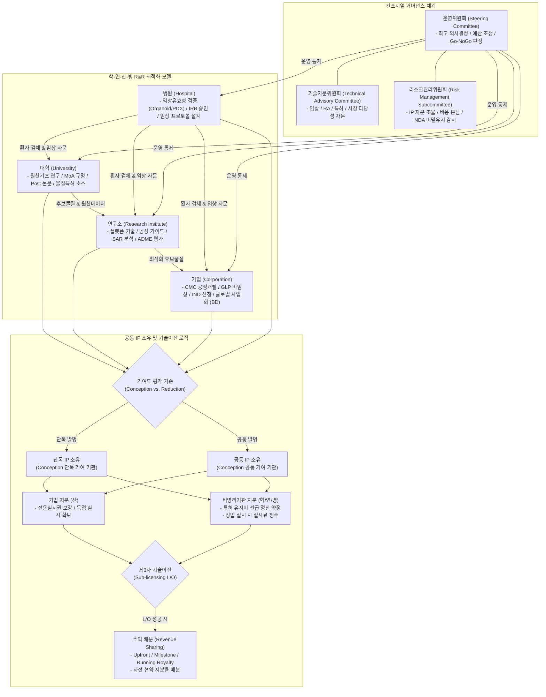
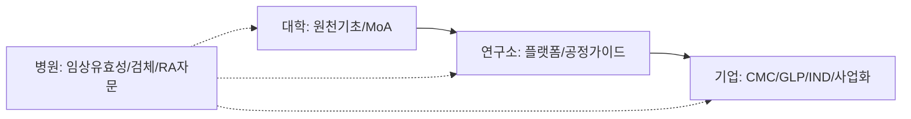

# 제10장 다기관 컨소시엄 거버넌스 및 성과 공유·지식재산권(IP) 관리

본 장은 국가연구개발사업(Bio-R&D) 수행 시 필수적으로 요구되는 다기관 컨소시엄의 구성원(학·연·산·병) 간 역할 분담(R&R) 최적화 모델과 연구 성과의 합리적 공유, 공동 지식재산권(IP) 소유 및 기술이전 계약 수립 가이드라인을 상세히 다룬다. 또한, 거버넌스 실패로 인한 분쟁 예방을 위해 실제 성공/실패 사례를 분석하고 표준 감사 체크리스트를 제시하여, 대형 국책과제의 법적·행정적 리스크를 선제적으로 제어하는 것을 목적으로 함.

### 10.0 컨소시엄 거버넌스 및 IP 관리 종합 프레임워크



---

## 10.1 학-연-산-병 초융합 컨소시엄 R&R 최적화 및 오케스트레이션 모델

### 10.1.1 다기관 컨소시엄 구성의 필요성과 구조적 특성

바이오 헬스케어 분야의 R&D는 기초연구(Target Identification)부터 비임상, 임상, 인허가 및 상용화에 이르는 전 주기가 고도의 전문성과 막대한 비용을 요하므로 단일 기관 단독 수행이 불가능에 가까움. 정부의 바이오 신약 및 의료기기 관련 대형 국책과제(예: 국가신약개발사업, 범부처재생의료기술개발사업 등)는 주관-공동-위탁 기관 간의 초융합 컨소시엄 구성을 필수 요건으로 지정하고 있음.

#### 1. 주체별 미션과 동기적 불일치(Incentive Mismatch) 구조
컨소시엄 참여 주체들은 각자의 고유한 설립 목적에 따라 상이한 이해관계를 지님. 거버넌스 설계의 출발점은 이러한 불일치를 인정하고 조화시키는 데 있음.

- **대학(학):** 학술적 탁월성 증명 및 논문(JCR 상위) 게재, 학생 인력 양성, 원천 IP 출원.
- **연구소(연):** 정부 임무형 원천 기술 확보, 대형 플랫폼 특허 구축, 기술이전 실적 달성.
- **기업(산):** 시장 진입 장벽 구축(FTO 확보), 제품 파이프라인 상용화 속도 극대화, 매출 발생 및 투자 유치(VC).
- **병원(병):** 임상 현장의 미충족 수요 해결, 환자 유래 시료 및 검체 데이터 확보, 임상적 유효성 및 안전성 검증.

---

### 10.1.2 기관 유형별 역할 분담(R&R) 최적화 가이드라인

효과적인 연구 개발 추진을 위해 기술성숙도(TRL, Technology Readiness Level) 및 가치사슬(Value Chain)에 기반한 R&R 설계가 필수적임.



#### 1. 대학(University)의 최적 R&R
- **주요 역할:** 타겟 발굴 및 신규 작용 기전(MoA, Mechanism of Action) 규명, *In vitro* 수준의 타겟 결합 특이성 검증, 오프-타겟(Off-target) 독성 예측 연구.
- **산출물:** 기초 효능 데이터(Kd, IC50), 개념 입증(PoC) 논문, 물질 특허의 핵심 청구범위(Claim) 소스.

#### 2. 연구소(Research Institute)의 최적 R&R
- **주요 역할:** 타겟 스크리닝 플랫폼 제공, 후보물질 최적화(Lead Optimization) 기술 지원, 생체 외/내(In vitro/In vivo) 예비 독성 및 ADME 평가 수행.
- **산출물:** 구조-활성 관계(SAR) 데이터시트, 공정 개발 기초 레시피, 시험 분석 프로토콜 표준화 지침.

#### 3. 기업(Corporation)의 최적 R&R
- **주요 역할:** CMC(Chemical, Manufacturing, and Controls) 기반 공정 개발(MCB/WCB 구축, 생산 수율 확보), 제형 연구(Formulation), GLP 비임상 독성 시험 대행(CRO 관리), 임상시험계획승인신청(IND Filing), FTO(Freedom to Operate) 분석 및 비즈니스 개발(BD).
- **산출물:** 기준 및 시험방법(기시법) 확립서, 비임상 GLP 최종 보고서, IND 승인서, 기술소개서(Teaser/Non-Confidential Information).

#### 4. 병원(Hospital)의 최적 R&R
- **주요 역할:** 환자 유래 검체(조직, 혈액 등) 제공 및 오가노이드/PDX(Patient-Derived Xenograft) 모델을 활용한 임상 유효성 평가, 동반진단 바이오마커 공동 개발, 임상 프로토콜 설계 및 인허가(RA) 임상 컨설팅.
- **산출물:** 의학 연구윤리심의위원회(IRB) 승인서, 환자 유래 데이터 유효성 검증 보고서, 임상시험 프로토콜 초안.

---

### 10.1.3 컨소시엄 오케스트레이션 및 거버넌스 운영 모델

다기관 컨소시엄의 성패는 개별 연구의 합산이 아닌, 기관 간 데이터와 물질(Material)의 실시간 오케스트레이션에 달려 있음. 이를 체계적으로 지원할 거버넌스 기구 및 규칙을 계획서 단계부터 수립해야 함.

#### 1. 다단계 의사결정 거버넌스 체계 구축
단일 주관연구책임자의 독단적 의사결정을 방지하고, 갈등 발생 시 공식적인 중재 절차를 거치도록 3단계 위원회 구조를 제안서에 반영함.

##### 가. 운영위원회 (Steering Committee)
- **구성:** 주관연구책임자(위원장), 세부 과제 책임자(공동연구책임자) 전원, 외부 바이오 전문 PM 1인.
- **역할:** 컨소시엄 내 최고 의사결정 기구. 연차별 예산 조정, 과제 마일스톤 달성 여부 판정, Go/No-Go 최종 승인.

##### 나. 기술자문위원회 (Technical Advisory Committee)
- **구성:** 학계 권위자, CDMO/CRO 전문가, 특허 변리사, 식약처 출신 RA 전문가 등 외부 전문가 5인 이내.
- **역할:** 분기별 기술 진도 점검, 비임상/임상 진입 시 규제 리스크 스크리닝, 기술이전(L/O) 시장 타당성 자문.

##### 다. 리스크관리위원회 (Risk Management Subcommittee)
- **구성:** 주관기관 산학협력단 법무 담당자, 특허 담당 변리사, 컨소시엄 간사.
- **역할:** 기관 간 IP 지분 분쟁 조율, 공동 연구비 부정 집행 예방 모니터링, 비밀유지계약(NDA) 위반 사항 실사.

#### 2. 데이터 및 시료 전달 프로토콜 표준화
연구 효율성을 극대화하기 위해 원자재 및 시료 교환을 위한 MTA(Material Transfer Agreement)를 통합 관리하며, 연구 데이터는 보안이 유지되는 중앙 클라우드 저장소(LIMS 연계)에 등재하도록 규정함.

---

### 10.1.4 다기관 협력 시 발생하는 R&R 갈등 요소 및 조정 메커니즘

컨소시엄 운영 중 빈번히 발생하는 갈등 상황을 선제적으로 시나리오화하여 대응책을 마련해 두어야 함.

#### 1. 논문 발표(Academic Publication) vs. 특허 확보 및 비즈니스 기밀(Trade Secret) 유지 갈등
- **갈등 양상:** 대학/병원은 실적 달성 및 학위 논문 심사를 위해 빠른 학회 발표와 논문 게재를 원하나, 주관기업은 특허 출원 전 공지(Public Disclosure)로 인한 신규성 상실 리스크 및 경쟁사 노출을 우려함.
- **조정 메커니즘:** "컨소시엄 표준 출판 지침" 제정. 모든 학술 발표는 사전에 운영위원회에 서면 통지해야 하며, 주관기업 및 특허 대리인은 통지 접수 후 30일 이내에 특허 출원을 완료하거나 출판 유예(최대 90일)를 요청할 수 있도록 명문화함.

#### 2. 연구비 분배 및 과제 기여도 평가 갈등
- **갈등 양상:** 특정 세부 기관의 연구 진도가 늦어지거나 예비 실험 실패로 마일스톤 달성이 지연될 때, 주관기관이 해당 기관의 예산을 삭감하거나 다른 기관으로 이관하려 할 때 발생.
- **조정 메커니즘:** 주관연구책임자가 독단적으로 예산을 삭감하지 못하도록 하되, 연차 평가 시 운영위원회에서 Go/No-Go 지표 기준(예: 목표 유효물질 선별 기준 미달성 등)에 의거하여 정량적으로 평가 후 재배분할 수 있는 기준을 사전 협약서(Consortium Agreement)의 별표로 지정함.

---

## 10.2 성과 공유, 기술이전 모델 및 공동 지식재산권(IP) 소유 계약 가이드라인

### 10.2.1 국가연구개발사업 성과 소유 구조 (국가연구개발혁신법 기준)

정부 지원 바이오 R&D 성과는 「국가연구개발혁신법」 제16조에 따라 관리됨.

#### 1. 연구개발성과의 소유 주체
- **원칙:** 연구개발성과는 연구개발과제를 수행한 연구개발기관이 소유하는 것을 원칙으로 함. (개인 연구자 소유는 원천 금지되며, 소속 기관인 대학 산학협력단, 연구소 법인, 기업 법인, 병원 산학협력단/법인이 소유함).
- **공동 소유:** 복수의 연구개발기관이 공동으로 연구개발성과를 창출한 경우, 해당 성과는 공동 창출 기관들의 공동 소유로 함. 다만, 기여도 및 지분율에 대해 서면 계약으로 달리 정할 수 있음.
- **위탁연구개발기관의 성과:** 위탁기관이 창출한 연구성과는 위탁을 의뢰한 주관/공동연구개발기관에 귀속되는 것이 일반적이나, 계약서상에 달리 약정하여 위탁기관 소유로 둘 수도 있음.

---

### 10.2.2 지식재산권(IP) 귀속 및 지분율 분배 모델

공동 연구개발 과정에서 도출되는 물질, 제형, 용도 특허 등에 대한 소유권 및 지분 배분은 향후 기술이전(L/O) 계약 체결 시 수익 분배와 직접 연계되므로 극도로 세밀하게 설계되어야 함.

#### 1. 특허 기여도 산정의 기준: Conception vs. Reduction to Practice
미국 및 한국 특허법 판례에 기초하여, 단순한 실험 대행 및 데이터 측정(Reduction to Practice)은 공동 발명자로 인정받기 어려우며, 기술의 핵심적 해결 방안 및 기술적 핵심 아이디어를 제시하고 구체화한 자(Conception of Invention)만이 발명자 및 IP 소유 지분을 주장할 수 있음.

- **예시:** 대학(A)이 신규 화합물의 스캐폴드(Scaffold) 구조를 설계하고 합성(Conception)하였고, 병원(B)이 이를 단순히 환자 샘플에서 효능 테스트하여 그래프 데이터만 전달(Reduction)한 경우, 특허의 발명자는 대학(A) 소속 연구자가 되며 소유권 역시 대학(A)에 귀속됨. 병원(B)은 공동 발명자로 등재되기 어렵고, 대신 기여도에 따라 성과 공유 계약을 통해 별도의 수익 배분(Revenue Sharing)을 요구해야 함.

#### 2. 주요 IP 배분 및 비용 분담 모델 비교

| 모델명 | 주요 특징 | 장점 | 단점 | 적용 권장 범위 |
| :--- | :--- | :--- | :--- | :--- |
| **기여도 중심 모델**<br>(Contribution-based) | 발명에 기여한 실질 기여도(Conception 비율)를 기준으로 특허 지분을 공동 배분함. (예: 학 70%, 산 30%) | 특허법적 원칙에 부합하며 발명자의 권리를 확실하게 보호함. | 기여도 정량화가 어려워 주관적 주장에 의한 분쟁 가능성 상실. | 기초 원천 기술 개발 단계 및 신물질 특허 확보 단계. |
| **비용 분담 모델**<br>(Cost-sharing) | 특허 출원, 등록 및 해외 진입 비용(PCT 등)을 분담하는 비율로 지분을 설정함. | 비용 지출 주체와 소유 주체가 일치하여 깔끔한 행정 처리가 가능함. | 예산이 부족한 대학/병원이 지분 경쟁에서 배제될 위험 있음. | 후속 개량 특허 개발 및 글로벌 국가별 진입(National Phase) 단계. |
| **역할 분담 모델**<br>(Sole-ownership with Option) | 특허는 실제 발명한 기관(학/연/병) 단독 소유로 하되, 참여 기업(산)에게 우선협상권(Option to License)을 부여함. | 특허 공유로 인한 기술이전 복잡성을 원천 배제하여 빠른 상용화 유도. | 기업 입장에서 초기 지분 소유권 부재로 투자 매력도가 저하될 수 있음. | 플랫폼 기술 제공 대학과 상용화 검증 기업 간의 초기 협력. |

#### 3. 공동 특허(Joint Patent) 관리 및 비용 분담 표준안
- **출원 및 등록 관리:** 지분율이 가장 높은 기관(보통 주관기관 또는 주도 기관)이 출원 절차를 주도(Prosecution Control)하며, 상대 기관의 사전 서면 동의를 얻어 특허 사무소를 지정함.
- **비용의 선행 분담:** 공동 특허 출원 및 유지비는 지분율에 비례하여 공동 부담하는 것을 원칙으로 하되, 비영리기관(대학/병원)의 재정 여건을 고려하여 주관기업이 비용의 전액 또는 상당 부분을 우선 부담하고 기술이전 시 해당 비용을 선(先) 공제(Direct Cost Deduct)하는 방식을 계약서에 명시함.

---

### 10.2.3 기술이전(Technology Transfer) 및 로열티 배분 모델

컨소시엄 연구개발 성과를 참여 기업이 독점 실시하거나 제3자에게 기술수출(L/O)하는 경우, 발생하는 수익에 대한 배분 구조를 사전에 규정해야 함.

#### 1. 참여 기업에 대한 기술이전 방식 및 실시권의 범위
- **우선매수권/우선협상권(Right of First Refusal / First Negotiation):** 국책과제 종료 후 혹은 개발 과정 중 도출된 성과 특허에 대해, 참여 기업은 비영리기관(학/연/병)의 지분에 대해 타 기업보다 우선하여 라이선스 계약을 체결할 수 있는 권리를 보유함.
- **독점권(Exclusive License) 보장:** 바이오 신약 분야의 특성상 수천억 원의 후속 임상 투자가 필요하므로, 참여 기업에게는 통상실시권이 아닌 전용실시권(또는 독점적 통상실시권) 허여를 보장해야 함.

#### 2. 기술료(Royalty) 구조 설계
수익금 배분 방식은 크게 아래와 같은 3대 축으로 설계하며, 마일스톤 달성 난이도에 따른 연동제를 적용함.

```
실시료 총액 = 선급기술료 (Upfront) + 단계별 기술료 (Milestones) + 경상실시료 (Running Royalty)
```

- **선급기술료 (Upfront Payment):** 계약 체결 시 즉시 지급하는 일시금. 미보증금(Non-refundable) 성격으로 설정.
- **단계별 기술료 (Milestone Payment):** 개발 단계(비임상 완료, 임상 1/2/3상 진입 및 완료, 품목허가 승인) 및 상업적 단계(누적 매출액 1,000억 달러 돌파 등) 달성 시 지급하는 금액.
- **경상실시료 (Running Royalty):** 순매출액(Net Sales)의 일정 비율(보통 1~5%)을 매년 분기별 또는 반기별로 사후 정산하여 지급함.

#### 3. 다기관 공유 IP의 제3자 기술이전(Sub-licensing) 권한 규정
공동 소유 특허를 제3의 글로벌 제약사에 라이선스 아웃(Sub-license)하는 경우, 각 공동 소유자는 민법 및 특허법상 다른 공유자의 동의 없이는 특허권을 양도하거나 실시권을 허여할 수 없게 되어 있음(특허법 제99조 제3항 및 제4항).
- **해결 방안:** 공동 지식재산권 관리 계약서(Joint IP Agreement) 내에 **"글로벌 기술 이전을 목적으로 하는 경우, 비영리 공유기관은 기업 소유자에게 제3자 Sub-licensing 권한을 사전 위임하며, 기업은 이로 인해 유입되는 기술료 수입을 본 계약의 배분 지분율에 따라 정산하여 배분한다"**는 특약 조항을 반드시 삽입해야 기술수출 딜(Deal)이 무산되는 것을 방지할 수 있음.

---

### 10.2.4 공동 IP 소유 및 관리 계약서(Joint IP Agreement) 표준 작성 가이드라인

성공적인 협약을 위해 반드시 포함되어야 할 핵심 조항과 독소조항을 비교 분석함.

#### 1. 필수 반영 핵심 조항 설계 권고안

##### 가. Background IP vs. Foreground IP 구분
- **Background IP (기존 IP):** 과제 시작 전 각 기관이 독자적으로 보유하고 있던 특허 및 영업비밀. 이는 상대방에게 무상 양도되지 않으며, 본 과제 수행 목적으로만 무상 실시를 허용함.
- **Foreground IP (신규 IP):** 본 과제 수행 결과물로 도출된 새로운 특허 및 성과물. 기여도에 따라 단독 혹은 공동 소유 처리함.

##### 나. 개별 실시권의 통제 (Control of Individual Exploitation)
- 특허 공유 시, 공유자는 법적으로 자신이 직접 실시하는 데 타 공유자의 동의를 얻을 필요가 없음. 만약 이를 방치하면, 공동 소유 기업이 단독으로 제품을 판매하여 매출을 올리면서도 대학/병원에 한 푼의 실시료도 주지 않는 사태가 발생할 수 있음.
- **표준 약정:** **"공동 소유자라 하더라도 상업적 실시를 하고자 하는 경우, 타 소유자(특히 비영리기관)에게 합리적인 수준의 실시료를 지급하기로 하는 별도의 상업적 실시 계약을 체결해야 한다"**는 조항을 두어야 함.

#### 2. 주요 독소조항(Poison Pills) 유형 및 대안적 수정문구

- **독소조항 예시 (1):**
  > "본 과제를 통해 발생하는 모든 연구개발성과는 기여도에 관계없이 주관연구개발기관인 (주)바이오에이의 소유로 한다."
  - *해결 방안:* 이는 국가연구개발혁신법상 성과 소유 기본 원칙에 정면으로 위배되어 법적 무효화 가능성이 큼. 공동 창출한 성과는 기여 기관 공동 소유로 수정하되, (주)바이오에이에게 전용실시권을 우선 부여하는 독점 조항으로 대체 협의해야 함.

- **독소조항 예시 (2):**
  > "공동 소유 특허의 출원 및 유지 비용은 비영리기관이 자사 지분율만큼 매달 정산하여 주관기업에 즉시 지급한다."
  - *해결 방안:* 대학 산학협력단이나 병원은 매달 즉각적인 비용 집행 예산이 부족하여 특허 포기 사태로 이어질 수 있음. **"비용은 주관기업이 전액 선급(Advance)하되, 향후 해당 특허의 기술료 수입이 최초 발생할 때 비영리기관의 배분 몫에서 실비 정산하여 우선 공제한다"**로 수정함.

---

## 10.3 Bio-R&D 국가연구개발사업 성공 사례 및 표준 오류 분석

### 10.3.1 바이오 국책과제 성공적 컨소시엄 거버넌스 사례 분석

#### 1. A대학교-B국책연구소-C바이오텍-D대학병원 컨소시엄 (난치성 뇌질환 항체신약 개발 과제)
- **배경:** 범부처 전주기 신약개발사업으로부터 3년간 총 50억 원의 연구비를 지원받아 개시된 과제임.
- **거버넌스 구조:**
  - A대학교(원천 항체 도출 및 신규 타겟 기전 발굴)
  - B국책연구소(항체 최적화, 수율 극대화 및 친화도 성숙(Affinity Maturation) 지원)
  - C바이오텍(CMC 공정 확립 및 GLP 독성 시험 관리, 전체 프로젝트 총괄 PMO 운영)
  - D대학병원(환자 유래 오가노이드 모델 검증 및 환자 검체 기반 바이오마커 발굴)
- **주요 성공 요인:**
  - **MTA 선제적 서명 및 실시간 물질 관리:** 과제 개시 후 1개월 이내에 4자 간 포괄적 MTA 및 자료 공유 협약을 체결하여 시료 이동 경로를 투명화함.
  - **합동 마일스톤 리뷰 세션:** 매월 1회 세부 책임자들이 전원 참석하는 데이터 리뷰 세션을 갖고, 고가의 In vivo 실험 진입 전 Go/No-Go 통과 기준(예: In vitro 결합력 Kd < 1nM 이하 달성 시에만 동물실험 착수)을 엄격히 적용함.
  - **기술수출 성공:** 과제 수행 2년 차에 C바이오텍 주도로 글로벌 제약사로의 3,000억 원 규모 라이선스 아웃(L/O) 계약을 성사시킴. 이때 사전에 정해둔 Joint IP Agreement에 따라 A대학, B연구소, D병원으로의 로열티 분배(7:1:1:1 비율)가 갈등 없이 원활히 정산됨.

---

### 10.3.2 다기관 컨소시엄 대표 실패 유형 및 사후 분석(Post-Mortem)

#### 1. [실패 사례 A] 대학의 조기 학술 발표로 인한 글로벌 특허 거절 및 신규성 상실
- **개요:** 국가 R&D 과제 수행 중 참여 대학 연구팀이 주관기업과의 사전 상의 없이 타겟 결합 신규 펩타이드 서열이 포함된 초록(Abstract)을 국제 학회에 발표함.
- **문제점:** 발표일로부터 6개월 후 주관기업이 글로벌 특허(PCT)를 출원하였으나, 심사 과정에서 대학 연구팀의 자가 선행공지(Prior Art) 자료가 발견되어 특허의 신규성(Novelty) 결여로 거절 결정됨.
- **사후 분석(Post-Mortem):** 학술 실적 압박에 시달리는 대학 연구원들의 특허법 인식 부재와 컨소시엄 내 출판 사전 통제 프로세스의 부재가 원인임. 제안서 및 초기 협약서 상에 "학회 초록 제출 최소 45일 전 주관기업 특허 담당자의 승인을 득해야 한다"는 조항을 의무화하지 않아 발생한 리스크임.

#### 2. [실패 사례 B] 위탁기관의 데이터 소유권 주장 및 원재료 이전 거부로 인한 개발 중단
- **개요:** 참여 병원(공동연구개발기관)의 위탁을 받아 동물 실험을 대행한 대학 소속 연구센터(위탁연구개발기관)가, 후보물질 투여 동물의 뇌 조직 슬라이스 및 원천 분석 raw data가 자신들의 자산이라 주장하며 이전을 거부함.
- **문제점:** 위탁 계약서상에 데이터 귀속 조항이 미비하여 발생한 분쟁으로, 이로 인해 비임상 시험 최종 패키징이 8개월간 지연되었고 과제 평가에서 '불성실 수행(중단)' 판정을 받음.
- **사후 분석(Post-Mortem):** 위탁 R&D 계약 체결 시 흔히 간과하는 성과물 귀속(Foreground IP 및 Data Ownership) 조항의 누락이 원인임. 위탁기관의 R&D 산출물은 전액 연구비 지급 주체인 의뢰기관(공동/주관기관)으로 즉시 무상 이전되어야 함을 용역계약서 수준으로 강제했어야 함.

#### 3. [실패 사례 C] 주관기업의 부도로 인한 국책과제 조기 종료 및 예산 유실
- **개요:** 임상 1상 진입을 앞두고 주관연구기관인 참여 벤처기업이 투자 유치 실패로 부도 처리되어 과제 수행 불능 상태에 빠짐.
- **문제점:** 정부 출연금 계좌가 가압류 대상에 포함되었으며, 컨소시엄에 참여 중이던 대학교 및 병원의 남은 연차 연구비가 함께 동결되어 진행 중이던 동물 실험이 중단되고 폐사 처리됨.
- **사후 분석(Post-Mortem):** 주관기관의 재무 리스크를 모니터링하는 위기 관리 체계가 작동하지 않음. 주관기업 부도 발생 시 신속하게 공동연구개발기관(예: 타 바이오텍 또는 참여 대학 산학협력단)으로 주관 권한을 승계하는 "컨소시엄 승계 비상 대책(Succession Plan)" 및 정부 연구비 계좌의 독립성 보호를 위한 혁신법상 압류 금지 규정 적용 청구가 조기에 이루어지지 못함.

---

### 10.3.3 컨소시엄 거버넌스 및 IP 리스크 자가 진단 및 감사 체크리스트 (Audit Checklist)

과제 개시 전 및 수행 단계별로 점검해야 할 종합 체크리스트는 다음과 같음.

```
[자가 진단 리스크 등급 가이드]
- Red (심각): 필수 항목 중 2개 이상 미충족 (즉시 보완 및 법무 검토 필요)
- Yellow (주의): 권장 항목 중 3개 이상 미충족 (차기 연차 도래 전 보완 필요)
- Green (안전): 모든 필수 항목 충족 및 권장 항목 대부분 준수
```

#### 1. 과제 기획 및 계약(협약) 단계 체크리스트

| 점검 영역 | 점검 항목 (Checklist Item) | 구분 | 준수 여부 (Y/N) | 비고 / 소명 내용 |
| :--- | :--- | :--- | :---: | :--- |
| **기본 계약** | 참여 기관 간 권리·의무를 규정한 공동연구협약서(Consortium Agreement)가 부처 협약 전 체결되었는가? | **필수** | | |
| **IP 소유** | 신규 창출 IP(Foreground IP)의 소유 기준을 '기여도' 혹은 '비용분담' 기준으로 명문화하였는가? | **필수** | | |
| **비용 분담** | 해외 특허 출원 및 PCT 진입 비용에 대해 기관별 분담 비율 혹은 주관기업의 선급 및 정산 방식이 명시되었는가? | **필수** | | |
| **기존 IP** | 각 기관이 과제 개시 전 보유한 Background IP 목록을 명시하고, 과제 수행 목적 외 상업적 이용을 배제하였는가? | 권장 | | |
| **출판 통제** | 논문 발표 전 상대 기관 검토 및 특허 출원 완료를 위해 최소 30~45일의 사전 통지 의무 조항을 두었는가? | **필수** | | |

#### 2. 과제 수행 및 진도 관리 단계 체크리스트

| 점검 영역 | 점검 항목 (Checklist Item) | 구분 | 준수 여부 (Y/N) | 비고 / 소명 내용 |
| :--- | :--- | :--- | :---: | :--- |
| **의사결정** | 주관연구책임자가 독단적으로 과제 방향을 바꾸지 못하게 하는 운영위원회(Steering Committee)가 실질 작동하는가? | **필수** | | 분기별 최소 1회 개최 필수 |
| **물질 이전** | 기관 간 시료 배포 시 마다 서명된 물질이전계약서(MTA)를 발급하고 대장을 관리하는가? | **필수** | | 세부 기관 간 교차 검증 |
| **데이터 보안** | 연구 raw data 및 특허성 있는 실험 결과의 무단 유출 방지를 위한 통합 데이터 보안 가이드라인이 있는가? | 권장 | | |
| **진도 관리** | 연차별 Go/No-Go 결정을 위한 정량적 평가지표가 제안서 내에 객관적 수치로 명시되어 있는가? | **필수** | | 마일스톤 관리와 연계 |

#### 3. 과제 종료 및 성과 확산 단계 체크리스트

| 점검 영역 | 점검 항목 (Checklist Item) | 구분 | 준수 여부 (Y/N) | 비고 / 소명 내용 |
| :--- | :--- | :--- | :---: | :--- |
| **우선권 보장** | 참여 기업에게 비영리기관 소유 지분에 대한 독점적 우선협상권(Right of First Negotiation)이 명시되어 있는가? | **필수** | | 과제 종료 후 최소 1~2년 효력 |
| **수익 배분** | 제3자 기술이전(L/O) 성공 시, 공동 소유자 간의 분배 비율과 분배 금액의 정산 절차(Auditing Right 포함)가 수립되었는가? | **필수** | | 서브라이선싱 권한 사전 동의 포함 |
| **실시료 정산** | 참여 기업이 공유 특허를 직접 실시할 경우 비영리 공유기관에 지급할 실시료(Royalty) 산정 공식이 명시되었는가? | **필수** | | |
| **분쟁 해결** | 특허권 및 기술료 배분 관련 분쟁 발생 시 관할 법원(혹은 대한상사중재원 중재)을 합의해 두었는가? | 권장 | | |
